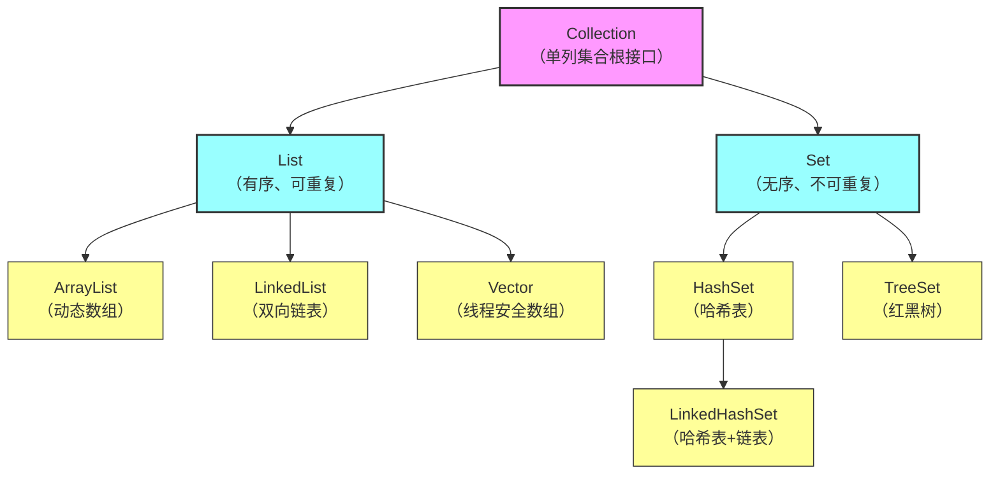

# Collection 接口（单列集合根接口）
```
	├─ List 接口（有序、可重复）
	│  ├─ ArrayList（实现类）：动态数组，查询快、增删慢
	│  ├─ LinkedList（实现类）：双向链表，增删快、查询慢
	│  └─ Vector（实现类）：动态数组，线程安全、性能差
	└─ Set 接口（无序、不可重复）
	   ├─ HashSet（实现类）：哈希表，无序去重
	   ├─ TreeSet（实现类）：红黑树，排序去重
	   └─ LinkedHashSet（实现类）：哈希表+链表，有序去重
```

# Collection
![[08-1.png]]
- Collection是单列集合的祖宗接口，它的功能是全部单列集合都可以继承使用的

- Collectio是一个接口，不能直接创建它的对象，只能创建实现类的对象

>[!WARNING]
> contains方法在底层依赖equals方法
> 
>    如果是自定义对象，那么必须在JavaBean重写equals方法


## 遍历

### 迭代器遍历
- `Iterator<E> iterator()` 返回迭代器对象，默认指向当前集合的0索引

- `boolean hasNext()` 判断当前位置是否有元素

- `E next()` 获取当前位置元素，并将迭代器对象移向下一个位置
```Java
	Iterator<String> it = list.iterator();
	while(it.hasNext()){
		String str = it.next();
		System.out.println(str);
	}
```

>[!NOTE]
> - 报错NoSuchElementException
> - 迭代器遍历完毕，指针不会复位（第二次遍历集合需重新获取iterator）
> - 迭代器遍历时，不能用集合的方法进行增加或者删除 ，只能用it.remove()
### 增强for遍历
- 底层就是一个迭代器    
- 修改增强for中的变量，不会改变集合中原本的数据
 
```Java
	Collection<String> coll = new ArrayList<>();
	for(String s : coll){
		System.out.println(s);
	}
```

### lambda表达式遍历

```Java
	coll.forEach(s -> System.out.println(s));
```

---
## List
- 元素有序，可重复，有索引

![[08-2.png]]
### add/remove
```Java
	List<String> L = new ArrayList<>();  
	L.add("aaa");  
	L.add("bbb");  
	L.add("ccc");  
	  
	L.add(1,"ddd");//在指定位置插入元素，原位置以后的元素依次往后移
	//aaa ddd bbb ccc
	
	String remove = L.remove(0);//aaa
	boolean remove = L.remove("aaa");//true
```

>[!NOTE]
>当List存储对象为Integer时，使用remove(1),会优先删除索引为1的元素
>由于 `int` 是基本数据类型，编译器会优先匹配参数类型最精确的方法
>
>解决方法：
>- 手动装箱`list.remove(Integer.valueOf(1));`
>- 向上转型`list.remove((Object) 1);`
### set/get
- `set(int index,E element)` 修改索引处的元素，返回修改前的元素

- `get(int index)`返回索引上的元素


### 遍历方式
- 迭代器遍历
- 增强for遍历
- lambda表达式遍历
- 普通for循环遍历
- 列表迭代器遍历

#### 列表迭代器遍历
- `ListIterator<E> extends Iterator<E>`
##### 列表迭代器方法
 - `add<E e>`
 - `hasNext()`
 - `next()`
 - `remove()`
 - `hasPrevious()`与`hasNext()`相反
 - `previous()`与`next()`相反

- 在遍历的过程中可以添加元素
- ```Java
	ListIterator<String> it = L.listIterator();  
	while(it.hasNext()){  
    if("aaa".equals(it.next())){  
        it.add("qqq");  
    }
    //aaa qqq bbb ccc
}
  ```
![[08-3.png]]
