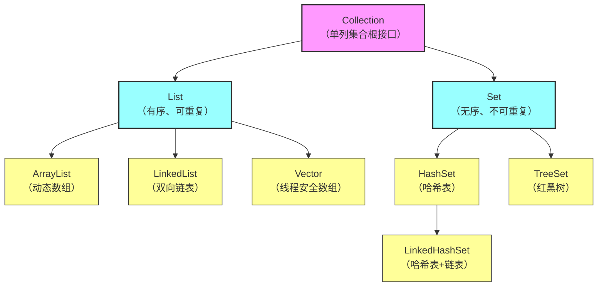

# Collection 接口（单列集合根接口）
```
	├─ List 接口（有序、可重复）
	│  ├─ ArrayList（实现类）：动态数组，查询快、增删慢
	│  ├─ LinkedList（实现类）：双向链表，增删快、查询慢
	│  └─ Vector（实现类）：动态数组，线程安全、性能差
	└─ Set 接口（无序、不可重复）
	   ├─ HashSet（实现类）：哈希表，无序去重
	   ├─ TreeSet（实现类）：红黑树，排序去重
	   └─ LinkedHashSet（实现类）：哈希表+链表，有序去重
```

## Collection
![[08-1.png]]
- Collection是单列集合的祖宗接口，它的功能是全部单列集合都可以继承使用的

- Collectio是一个接口，不能直接创建它的对象，只能创建实现类的对象

###  List
- 元素有序，可重复，有索引 


### Set
- 元素无序，不重复，无索引