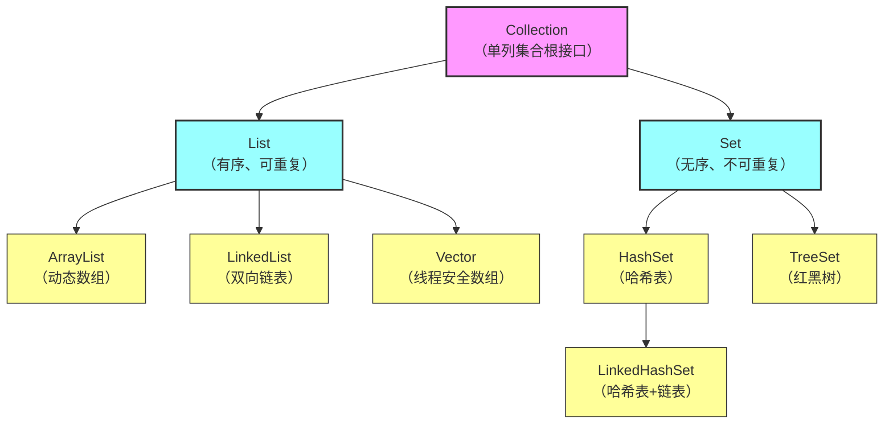
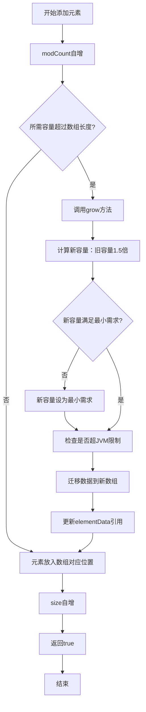

# Collection 接口（单列集合根接口）
```
	├─ List 接口（有序、可重复）
	│  ├─ ArrayList（实现类）：动态数组，查询快、增删慢
	│  ├─ LinkedList（实现类）：双向链表，增删快、查询慢
	│  └─ Vector（实现类）：动态数组，线程安全、性能差
	└─ Set 接口（无序、不可重复）
	   ├─ HashSet（实现类）：哈希表，无序去重
	   ├─ TreeSet（实现类）：红黑树，排序去重
	   └─ LinkedHashSet（实现类）：哈希表+链表，有序去重
```

# Collection
![[08-1.png]]
- Collection是单列集合的祖宗接口，它的功能是全部单列集合都可以继承使用的

- Collectio是一个接口，不能直接创建它的对象，只能创建实现类的对象

>[!WARNING]
> contains方法在底层依赖equals方法
> 
>    如果是自定义对象，那么必须在JavaBean重写equals方法


## 遍历

### 迭代器遍历
- `Iterator<E> iterator()` 返回迭代器对象，默认指向当前集合的0索引

- `boolean hasNext()` 判断当前位置是否有元素

- `E next()` 获取当前位置元素，并将迭代器对象移向下一个位置
```Java
	Iterator<String> it = list.iterator();
	while(it.hasNext()){
		String str = it.next();
		System.out.println(str);
	}
```

>[!NOTE]
> - 报错NoSuchElementException
> - 迭代器遍历完毕，指针不会复位（第二次遍历集合需重新获取iterator）
> - 迭代器遍历时，不能用集合的方法进行增加或者删除 ，只能用it.remove()
### 增强for遍历
- 底层就是一个迭代器    
- 修改增强for中的变量，不会改变集合中原本的数据
 
```Java
	Collection<String> coll = new ArrayList<>();
	for(String s : coll){
		System.out.println(s);
	}
```

### lambda表达式遍历

```Java
	coll.forEach(s -> System.out.println(s));
```

---
## List
- 元素有序，可重复，有索引

![[08-2.png]]
### add/remove
```Java
	List<String> L = new ArrayList<>();  
	L.add("aaa");  
	L.add("bbb");  
	L.add("ccc");  
	  
	L.add(1,"ddd");//在指定位置插入元素，原位置以后的元素依次往后移
	//aaa ddd bbb ccc
	
	String remove = L.remove(0);//aaa
	boolean remove = L.remove("aaa");//true
```

>[!NOTE]
>当List存储对象为Integer时，使用remove(1),会优先删除索引为1的元素
>由于 `int` 是基本数据类型，编译器会优先匹配参数类型最精确的方法
>
>解决方法：
>- 手动装箱`list.remove(Integer.valueOf(1));`
>- 向上转型`list.remove((Object) 1);`
### set/get
- `set(int index,E element)` 修改索引处的元素，返回修改前的元素

- `get(int index)`返回索引上的元素


### 遍历方式
- 迭代器遍历
- 增强for遍历
- lambda表达式遍历
- 普通for循环遍历
- 列表迭代器遍历

#### 列表迭代器遍历
- `ListIterator<E> extends Iterator<E>`
##### 列表迭代器方法
 - `add<E e>`
 - `hasNext()`
 - `next()`
 - `remove()`
 - `hasPrevious()`与`hasNext()`相反
 - `previous()`与`next()`相反

- 在遍历的过程中可以添加元素
- ```Java
	ListIterator<String> it = L.listIterator();  
	while(it.hasNext()){  
    if("aaa".equals(it.next())){  
        it.add("qqq");  
    }
    //aaa qqq bbb ccc
}
  ```
![[08-3.png]]

### ArrayList底层原理
- 底层是数组结构的
- 利用空参创建的集合，在底层创建一个默认长度为0得分数组
- 添加第一个元素，底层会创建一个新的==长度为10==的数组（elementData），初始化为null
- 存满时，会扩容==1.5倍==（向下取整）
- 如果一次添加多个元素，1.5倍放不下，则新创建数组的长度以实际为准。
![[08-4.png]]
```Java
public boolean add(E e) {  
    modCount++;  
    add(e, elementData, size);
    return true;  
}

private void add(E e, Object[] elementData, int s) {  
    if (s == elementData.length)  
        elementData = grow();  
    elementData[s] = e;  
    size = s + 1;  
}

private Object[] grow() {  
    return grow(size + 1);  
}
```
>[!NOTE]
>- 对于`if (oldCapacity > 0 || elementData != DEFAULTCAPACITY_EMPTY_ELEMENTDATA)`
>- `oldCapacity > 0` 负责处理**已经长大的数组**； 
>- `elementData != DEFAULTCAPACITY_EMPTY_ELEMENTDATA` 负责处理**被用户手动指定为 0 的数组**。 
>- 只有这两个条件都不满足（即：既是 0 又是默认空数组），才会触发“初始 10”的逻辑。
```Java
private Object[] grow(int minCapacity) {  
    int oldCapacity = elementData.length;  
    if (oldCapacity > 0 || elementData != DEFAULTCAPACITY_EMPTY_ELEMENTDATA) {
        int newCapacity = ArraysSupport.newLength(oldCapacity,  
	            minCapacity - oldCapacity, /* minimum growth */  
		        oldCapacity >> 1        /*默认新增容量*/);  
        return elementData = Arrays.copyOf(elementData, newCapacity);
    } else {  
        return elementData = new Object[Math.max(DEFAULT_CAPACITY, minCapacity)];  
    }  
}

public static int newLength(int oldLength, int minGrowth, int prefGrowth) {  
    // 由于内嵌原因未勾选前提条件
    // assert oldLength >= 0    // assert minGrowth > 0  
    int prefLength = oldLength + Math.max(minGrowth, prefGrowth); // 可能会溢出来 
    if (0 < prefLength && prefLength <= SOFT_MAX_ARRAY_LENGTH) {  
        return prefLength;  
    } else {  
	        // 用另一个方法冷处理代码
        return hugeLength(oldLength, minGrowth);  
    }  
}
```




### LinkedList集合
- 底层数据结构是双链表，查询慢，增删快，但是如果操作的是首尾元素，速度也是极快
![[08-5.png]]

![[08-6.png]]

### Iterator迭代器
![[08-7.png]]

- **`modCount` (Modification Count)**： 属于 `ArrayList` 对象。只要列表结构发生变化（`add`, `remove`, `clear` 等），这个计数器就会 **+1**。

- **`expectedModCount`**： 属于 `Itr`（迭代器）对象内部。在创建迭代器的那一刻，它会把当时的 `modCount` “拍照”存下来：`expectedModCount = modCount`

---
## Set
- 添加的元素<span style="color: #dc3545;">无序，不重复，无索引</span>
- Set接口中的方法基本上与Collection一致（remove方法只能根据对象删除，不能根据索引删）
### HashSet 哈希表
- JDK8之前：数组+链表
- JDK8之后：数组+链表+红黑树
#### 哈希值
- `应该存入的位置 int index = (数组长度 - 1) & 哈希值`
- 该方法定义在Object类中，所有对象都可以调用，默认使用地址值进行计算
- 一般情况下，会重写hashCode方法，利用对象内部的属性值计算哈希值
#### 对象哈希值的特点
- 如果没有重写hashCode方法，不同对象计算出的哈希值是不同的
- 如果已经重写hashCode方法，不同对象只要属性值相同，计算出的哈希值就是一样的
- 在小部分情况下，不同属性值或者不同的地址值计算出来的哈希值也有可能一样（哈希冲突）
```Java
	System.out.println("abc".hashCode());  //96354
	System.out.println("acD".hashCode());  //96354

```
#### 底层原理
- 先创建一个默认长度为16，默认 加载因子 为0.75的数组table
- 加载因子：存入第 16 * 0.75 = 12 个元素时，会触发扩容
- **0.75** 是在频繁扩容的开销与查询延迟之间找到的黄金平衡点。
- 根据元素的哈希值跟数组长度计算出应存入的位置
- <span style="color: #dc3545;">判断当前的位置是否为null</span>
- ```Java
	if null -> 存入
	else    -> 调用equals方法比较属性值
	
	if true -> 不存
	else    -> 存入数组，形成链表 
	JDK8以前：新元素存入数组，老元素挂在新元素下面
	JDK8之后：新元素直接挂在老元素下面
   ```

**JDK8以后，当链表长度超过8，而且数组长度大于等于64时，自动转换为红黑树**

**如果集合中存储的是自定义对象，必须要重写hashCode () 和equals () 方法**(默认比较用的是地址值)
#### HashSet的三个特点
##### HashSet为什么存和取的顺序不一样？

- `HashSet` 存取顺序不一致，是因为它根据元素内容的 **Hash 值**经计算后直接存放在内部数组的随机位置，而非按时间先后排队；
- 读取时则是按数组下标从头到尾扫描，所以输出顺序取决于**元素在内存中的分布位置**，而非**输入顺序**

##### HashSet为什么没有索引？

- `HashSet` 没有索引是因为它采用**哈希表**结构，元素是根据内容计算出的哈希值“随机”散落在数组位置上的，中间存在大量空位且位置会随扩容改变，这种**非连续、非固定**的存储方式使得通过物理位置（索引）定位元素变得毫无意义

##### HashSet是利用什么机制保证数据去重的？

- `HashSet` 通过 **`hashCode()`** 快速定位存储位置，若位置冲突再利用 **`equals()`** 进行内容“肉搏”比对，只有当两个方法都判定相同时，才会触发去重机制拒绝存入。

---
#### LinkedHashSet
- <span style="color: #dc3545;">有序</span>，不重复，无索引
- 这里的有序指的是保证存储和去除的元素顺序一致
- 原理：底层数据机构依然是哈希表，知识每个元素有额外多了一个==双链表==的机制记录存储的数据
- 如果要求去重且存取有序，则选择LinkedHashSet
### TreeSet
- <span style="color: #dc3545;">可排序</span>，不重复，无索引
-  可排序：按照元素的默认规则（由小到大）排序
- TreeSet集合底层是基于<span style="color: #dc3545;">红黑树的数据结构</span>实现排序的，增删改查性能都较好
#### TreeSet默认的规则
- 对于数值类型：`Integer`，`Double`，默认按照从小到大的顺序进行排序
- 对于字符、字符串类型：按照字符在ASCII码表中的数字升序进行排序

---

# 泛型
- 可以在编译阶段约束操作的数据类型，并进行检查
- 格式：<数据类型>
- 泛型只能支持引用数据类型
- ==统一数据类型==，把运行时期的问题提前到了编译期间，避免了强制类型转化可能出现的异常
- ==Java中的泛型是伪泛型==

***注意！***
- 泛型中不能写基本数据类型
- 指定泛型的具体类型后，传递数据时，可以传入该类类型或者其**子类类型**
- 如果不写泛型，类型默认是Object

## 泛型类
```Java
public class MyArrayList<E>{  
    Object[] obj = new Object[10];  
    int size;  
    public boolean add(E e){  
        obj[size++] = e;  
        return true;  
    }  
    public E  get(int index){  
        return (E)obj[index]; //存入ArrayList的数据都会变成Object
    }  
    @Override  
    public String toString(){  
        return Arrays.toString(obj);  
    }  
}
	//此处的E可以理解为变量，但是不是用来记录数据的，是用来记录数据类型的,一般用：K、T、V、E

```

## 泛型方法
- 方法中形参不确定时
	- 1.使用类名后面定义的泛型 -> 所有方法都能用
	- 2.在方法申明上定义自己的泛型 -> 只有本方法能用
```Java
public <T> boid show(T t){
	|此处的E可以理解为变量，但是不是用来记录数据的，是用来记录数据类型的,一般用：K、T、V、E|
}

public class ListUtil{  
    private ListUtil() {}  
    /*  
    *   参数一：集合  
    *   参数二：要添加的元素  
    * */  
    public static<E> void addAll(ArrayList<E> list,E...e){  
        for (E element : e) {  
            list.add(element);  
        }  
    }  
}
```

---

## 泛型接口

### 实现类给出具体类型
```Java
public class MyArrayList implements List<String> {
}
```
### 实现类延续泛型，创建对象时再确定
```Java
public class MyArrayList<E> implements List<E> {
}
```


## 泛型的继承和通配符
- ==泛型不具备继承性，但数据具备继承性==
```Java 
	通配符
	<? extends E> 表示可以传递E或者E所有的子类类型
	
	<? super E> 表示可以传递E或者E所有的父类类型
```

