# Collection 接口（单列集合根接口）
```
	├─ List 接口（有序、可重复）
	│  ├─ ArrayList（实现类）：动态数组，查询快、增删慢
	│  ├─ LinkedList（实现类）：双向链表，增删快、查询慢
	│  └─ Vector（实现类）：动态数组，线程安全、性能差
	└─ Set 接口（无序、不可重复）
	   ├─ HashSet（实现类）：哈希表，无序去重
	   ├─ TreeSet（实现类）：红黑树，排序去重
	   └─ LinkedHashSet（实现类）：哈希表+链表，有序去重
```
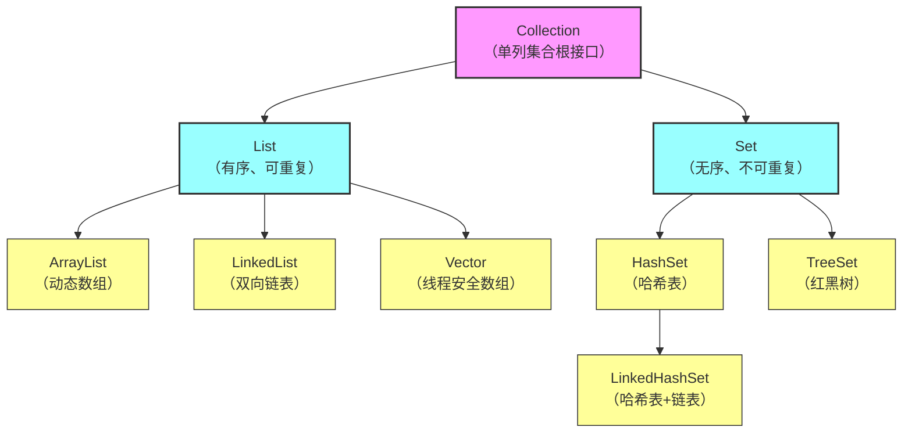
```mermaid
flowchart TD
    A[Collection<br/>（单列集合根接口）] --> B[List<br/>（有序、可重复）]
    A --> C[Set<br/>（无序、不可重复）]
    
    B --> B1[ArrayList<br/>（动态数组）]
    B --> B2[LinkedList<br/>（双向链表）]
    B --> B3[Vector<br/>（线程安全数组）]
    
    C --> C1[HashSet<br/>（哈希表）]
    C --> C2[TreeSet<br/>（红黑树）]
    C1 --> C3[LinkedHashSet<br/>（哈希表+链表）]
    
    %% 样式优化
    A:::root
    B:::subInterface
    C:::subInterface
    B1:::impl
    B2:::impl
    B3:::impl
    C1:::impl
    C2:::impl
    C3:::impl
    classDef root fill:#f9f,stroke:#333,stroke-width:2px
    classDef subInterface fill:#9ff,stroke:#333,stroke-width:2px
    classDef impl fill:#ff9,stroke:#333,stroke-width:1px
```
# Collection
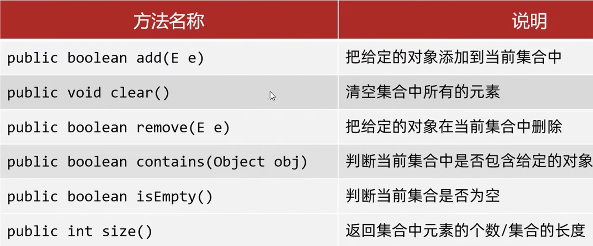
- Collection是单列集合的祖宗接口，它的功能是全部单列集合都可以继承使用的

- Collectio是一个接口，不能直接创建它的对象，只能创建实现类的对象

>[!WARNING]
> contains方法在底层依赖equals方法
> 
>    如果是自定义对象，那么必须在JavaBean重写equals方法


## 遍历

### 迭代器遍历
- `Iterator<E> iterator()` 返回迭代器对象，默认指向当前集合的0索引

- `boolean hasNext()` 判断当前位置是否有元素

- `E next()` 获取当前位置元素，并将迭代器对象移向下一个位置
```Java
	Iterator<String> it = list.iterator();
	while(it.hasNext()){
		String str = it.next();
		System.out.println(str);
	}
```

>[!NOTE]
> - 报错NoSuchElementException
> - 迭代器遍历完毕，指针不会复位（第二次遍历集合需重新获取iterator）
> - 迭代器遍历时，不能用集合的方法进行增加或者删除 ，只能用it.remove()
### 增强for遍历
- 底层就是一个迭代器    
- 修改增强for中的变量，不会改变集合中原本的数据

```Java
	Collection<String> coll = new ArrayList<>();
	for(String s : coll){
		System.out.println(s);
	}
```

### lambda表达式遍历

```Java
	coll.forEach(s -> System.out.println(s));
```

---
## List
- 元素有序，可重复，有索引

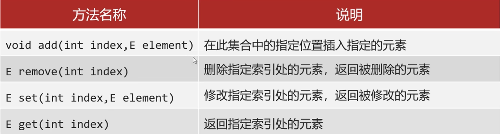
### add/remove
```Java
	List<String> L = new ArrayList<>();  
	L.add("aaa");  
	L.add("bbb");  
	L.add("ccc");  
	  
	L.add(1,"ddd");//在指定位置插入元素，原位置以后的元素依次往后移
	//aaa ddd bbb ccc
	
	String remove = L.remove(0);//aaa
	boolean remove = L.remove("aaa");//true
```

>[!NOTE]
>当List存储对象为Integer时，使用remove(1),会优先删除索引为1的元素
>由于 `int` 是基本数据类型，编译器会优先匹配参数类型最精确的方法
>
>解决方法：
>- 手动装箱`list.remove(Integer.valueOf(1));`
>- 向上转型`list.remove((Object) 1);`
### set/get
- `set(int index,E element)` 修改索引处的元素，返回修改前的元素

- `get(int index)`返回索引上的元素


### 遍历方式
- 迭代器遍历
- 增强for遍历
- lambda表达式遍历
- 普通for循环遍历
- 列表迭代器遍历

#### 列表迭代器遍历
- `ListIterator<E> extends Iterator<E>`
##### 列表迭代器方法
 - `add<E e>`
 - `hasNext()`
 - `next()`
 - `remove()`
 - `hasPrevious()`与`hasNext()`相反
 - `previous()`与`next()`相反

- 在遍历的过程中可以添加元素
- ```Java
	ListIterator<String> it = L.listIterator();  
	while(it.hasNext()){  
    if("aaa".equals(it.next())){  
        it.add("qqq");  
    }
    //aaa qqq bbb ccc
	}
  ```

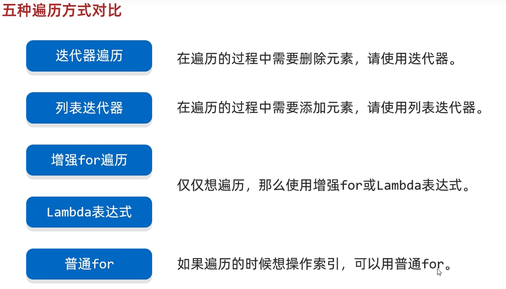

### ArrayList底层原理
- 底层是数组结构的
- 利用空参创建的集合，在底层创建一个默认长度为0得分数组
- 添加第一个元素，底层会创建一个新的==长度为10==的数组（elementData），初始化为null
- 存满时，会扩容==1.5倍==（向下取整）
- 如果一次添加多个元素，1.5倍放不下，则新创建数组的长度以实际为准。

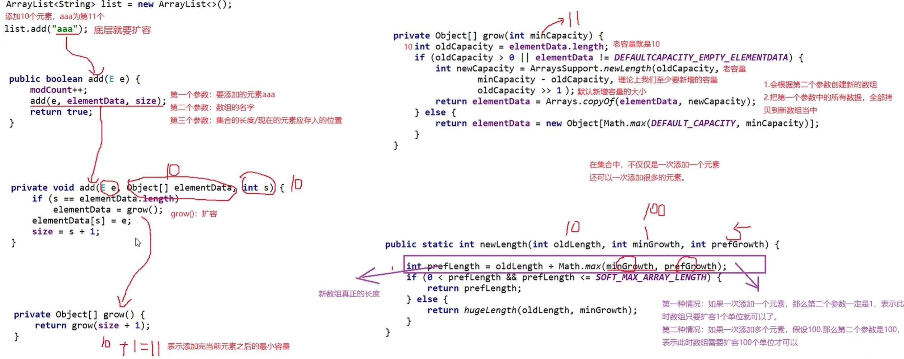

```Java
public boolean add(E e) {  
    modCount++;  
    add(e, elementData, size);
    return true;  
}

private void add(E e, Object[] elementData, int s) {  
    if (s == elementData.length)  
        elementData = grow();  
    elementData[s] = e;  
    size = s + 1;  
}

private Object[] grow() {  
    return grow(size + 1);  
}
```
>[!NOTE]
>- 对于`if (oldCapacity > 0 || elementData != DEFAULTCAPACITY_EMPTY_ELEMENTDATA)`
>- `oldCapacity > 0` 负责处理**已经长大的数组**； 
>- `elementData != DEFAULTCAPACITY_EMPTY_ELEMENTDATA` 负责处理**被用户手动指定为 0 的数组**。 
>- 只有这两个条件都不满足（即：既是 0 又是默认空数组），才会触发“初始 10”的逻辑。
```Java
private Object[] grow(int minCapacity) {  
    int oldCapacity = elementData.length;  
    if (oldCapacity > 0 || elementData != DEFAULTCAPACITY_EMPTY_ELEMENTDATA) {
        int newCapacity = ArraysSupport.newLength(oldCapacity,  
	            minCapacity - oldCapacity, /* minimum growth */  
		        oldCapacity >> 1        /*默认新增容量*/);  
        return elementData = Arrays.copyOf(elementData, newCapacity);
    } else {  
        return elementData = new Object[Math.max(DEFAULT_CAPACITY, minCapacity)];  
    }  
}

public static int newLength(int oldLength, int minGrowth, int prefGrowth) {  
    // 由于内嵌原因未勾选前提条件
    // assert oldLength >= 0    // assert minGrowth > 0  
    int prefLength = oldLength + Math.max(minGrowth, prefGrowth); // 可能会溢出来 
    if (0 < prefLength && prefLength <= SOFT_MAX_ARRAY_LENGTH) {  
        return prefLength;  
    } else {  
	        // 用另一个方法冷处理代码
        return hugeLength(oldLength, minGrowth);  
    }  
}
```


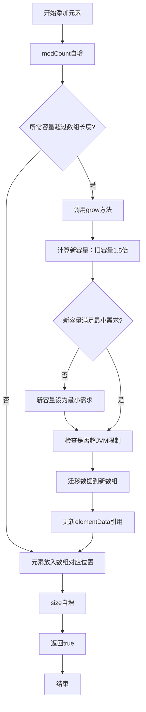
```mermaid
graph TD
    A[开始添加元素] --> B[modCount自增]
    B --> C{所需容量超过数组长度?}
    
    %% 扩容分支
    C -- 是 --> D[调用grow方法]
    D --> E[计算新容量：旧容量1.5倍]
    E --> F{新容量满足最小需求?}
    F -- 否 --> G[新容量设为最小需求]
    G --> H[检查是否超JVM限制]
    F -- 是 --> H
    H --> I[迁移数据到新数组]
    I --> J[更新elementData引用]
    
    %% 插入分支
    C -- 否 --> K[元素放入数组对应位置]
    J --> K
    K --> L[size自增]
    L --> M[返回true]
    M --> N[结束]
```

### LinkedList集合
- 底层数据结构是双链表，查询慢，增删快，但是如果操作的是首尾元素，速度也是极快
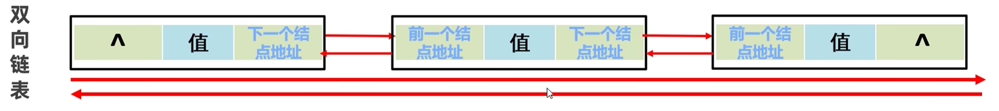

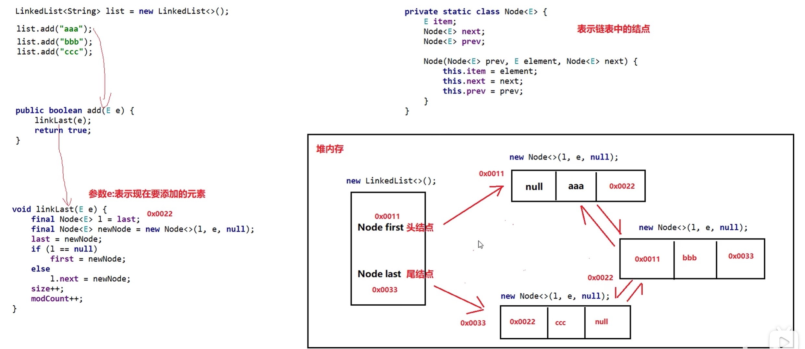

### Iterator迭代器
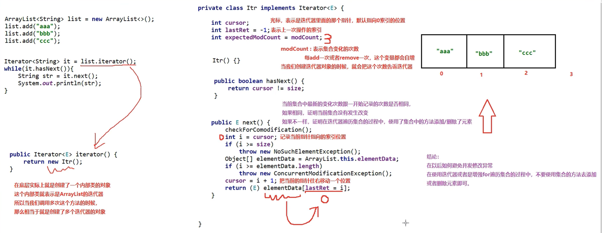

- **`modCount` (Modification Count)**： 属于 `ArrayList` 对象。只要列表结构发生变化（`add`, `remove`, `clear` 等），这个计数器就会 **+1**。

- **`expectedModCount`**： 属于 `Itr`（迭代器）对象内部。在创建迭代器的那一刻，它会把当时的 `modCount` “拍照”存下来：`expectedModCount = modCount`

---
## Set
- 添加的元素<span style="color: #dc3545;">无序，不重复，无索引</span>
- Set接口中的方法基本上与Collection一致（remove方法只能根据对象删除，不能根据索引删）
### HashSet 哈希表
- JDK8之前：数组+链表
- JDK8之后：数组+链表+红黑树
#### 哈希值
- `应该存入的位置 int index = (数组长度 - 1) & 哈希值`
- 该方法定义在Object类中，所有对象都可以调用，默认使用地址值进行计算
- 一般情况下，会重写hashCode方法，利用对象内部的属性值计算哈希值
#### 对象哈希值的特点
- 如果没有重写hashCode方法，不同对象计算出的哈希值是不同的
- 如果已经重写hashCode方法，不同对象只要属性值相同，计算出的哈希值就是一样的
- 在小部分情况下，不同属性值或者不同的地址值计算出来的哈希值也有可能一样（哈希冲突）
```Java
	System.out.println("abc".hashCode());  //96354
	System.out.println("acD".hashCode());  //96354

```
#### 底层原理
- 先创建一个默认长度为16，默认 加载因子 为0.75的数组table
- 加载因子：存入第 16 * 0.75 = 12 个元素时，会触发扩容
- **0.75** 是在频繁扩容的开销与查询延迟之间找到的黄金平衡点。
- 根据元素的哈希值跟数组长度计算出应存入的位置
- <span style="color: #dc3545;">判断当前的位置是否为null</span>
- ```Java
	if null -> 存入
	else    -> 调用equals方法比较属性值
	
	if true -> 不存
	else    -> 存入数组，形成链表 
	JDK8以前：新元素存入数组，老元素挂在新元素下面
	JDK8之后：新元素直接挂在老元素下面
  ```

**JDK8以后，当链表长度超过8，而且数组长度大于等于64时，自动转换为红黑树**

**如果集合中存储的是自定义对象，必须要重写hashCode () 和equals () 方法**(默认比较用的是地址值)
#### HashSet的三个特点
##### HashSet为什么存和取的顺序不一样？

- `HashSet` 存取顺序不一致，是因为它根据元素内容的 **Hash 值**经计算后直接存放在内部数组的随机位置，而非按时间先后排队；
- 读取时则是按数组下标从头到尾扫描，所以输出顺序取决于**元素在内存中的分布位置**，而非**输入顺序**

##### HashSet为什么没有索引？

- `HashSet` 没有索引是因为它采用**哈希表**结构，元素是根据内容计算出的哈希值“随机”散落在数组位置上的，中间存在大量空位且位置会随扩容改变，这种**非连续、非固定**的存储方式使得通过物理位置（索引）定位元素变得毫无意义

##### HashSet是利用什么机制保证数据去重的？

- `HashSet` 通过 **`hashCode()`** 快速定位存储位置，若位置冲突再利用 **`equals()`** 进行内容“肉搏”比对，只有当两个方法都判定相同时，才会触发去重机制拒绝存入。

---
### LinkedHashSet
- <span style="color: #dc3545;">有序</span>，不重复，无索引
- 这里的有序指的是保证存储和去除的元素顺序一致
- 原理：底层数据机构依然是哈希表，知识每个元素有额外多了一个==双链表==的机制记录存储的数据
- 如果要求去重且存取有序，则选择LinkedHashSet
### TreeSet
- <span style="color: #dc3545;">可排序</span>，不重复，无索引
-  可排序：按照元素的默认规则（由小到大）排序
- TreeSet集合底层是基于<span style="color: #dc3545;">红黑树的数据结构</span>实现排序的，增删改查性能都较好
#### TreeSet默认的规则
- 对于数值类型：`Integer`，`Double`，默认按照从小到大的顺序进行排序
- 对于字符、字符串类型：按照字符在ASCII码表中的数字升序进行排序 
```Java
@Override  
public int compareTo(Student o) {  
    return this.getAge()-o.getAge();  
}
	this:表示当前要添加的元素
	o   :表示已经在红黑树存在的元素
返回值：
	负数：认为要添加的元素是小的，存左边
	正数：认为要添加的元素是大的，存右边
	0：要添加的元素已存在，舍弃
```

#### TreeSet的两种比较方式
##### 方式一
- 默认排序/自然排序：JavaBean类实现Comparable接口指定比较规则
##### 方式二
- 比较器排序：创建TreeSet对象的时候，传递比较器Comparator制定规则
##### 使用规则
- 默认使用第一种，如果第一种不能满足当前需求，就使用第二种
## List与Set的使用场景
- 如果想要集合中的元素***可重复**：
	- 用**ArrayList**集合，==基于数组的==（用的最多）

- 如果想要集合中的元素***可重复***，而且当前的<span style="color: #dc3545;">增删操作明显多于查询</span>：
	- 用**LinkedList**集合，==基于链表的==
	
- 如果想对集合中的***元素去重***：
	- 用**HashSet**，==基于哈希表的==（用的最多）

- 如果相对集合的***元素去重***，而且<span style="color: #dc3545;">保证存取顺序</span>
	- 用**LinkedHashList**集合，==基于哈希表和双链表，效率低于HashSet==


---

# 泛型
- 可以在编译阶段约束操作的数据类型，并进行检查
- 格式：<数据类型>
- 泛型只能支持引用数据类型
- ==统一数据类型==，把运行时期的问题提前到了编译期间，避免了强制类型转化可能出现的异常
- ==Java中的泛型是伪泛型==

***注意！***
- 泛型中不能写基本数据类型
- 指定泛型的具体类型后，传递数据时，可以传入该类类型或者其**子类类型**
- 如果不写泛型，类型默认是Object

## 泛型类
```Java
public class MyArrayList<E>{  
    Object[] obj = new Object[10];  
    int size;  
    public boolean add(E e){  
        obj[size++] = e;  
        return true;  
    }  
    public E  get(int index){  
        return (E)obj[index]; //存入ArrayList的数据都会变成Object
    }  
    @Override  
    public String toString(){  
        return Arrays.toString(obj);  
    }  
}
	//此处的E可以理解为变量，但是不是用来记录数据的，是用来记录数据类型的,一般用：K、T、V、E

```

## 泛型方法
- 方法中形参不确定时
	- 1.使用类名后面定义的泛型 -> 所有方法都能用
	- 2.在方法申明上定义自己的泛型 -> 只有本方法能用
```Java
public <T> boid show(T t){
	|此处的E可以理解为变量，但是不是用来记录数据的，是用来记录数据类型的,一般用：K、T、V、E|
}

public class ListUtil{  
    private ListUtil() {}  
    /*  
    *   参数一：集合  
    *   参数二：要添加的元素  
    * */  
    public static<E> void addAll(ArrayList<E> list,E...e){  
        for (E element : e) {  
            list.add(element);  
        }  
    }  
}
```

---

## 泛型接口

### 实现类给出具体类型
```Java
public class MyArrayList implements List<String> {
}
```
### 实现类延续泛型，创建对象时再确定
```Java
public class MyArrayList<E> implements List<E> {
}
```


## 泛型的继承和通配符
- ==泛型不具备继承性，但数据具备继承性==
```Java 
	通配符
	<? extends E> 表示可以传递E或者E所有的子类类型
	
	<? super E> 表示可以传递E或者E所有的父类类型
```

---


# Map
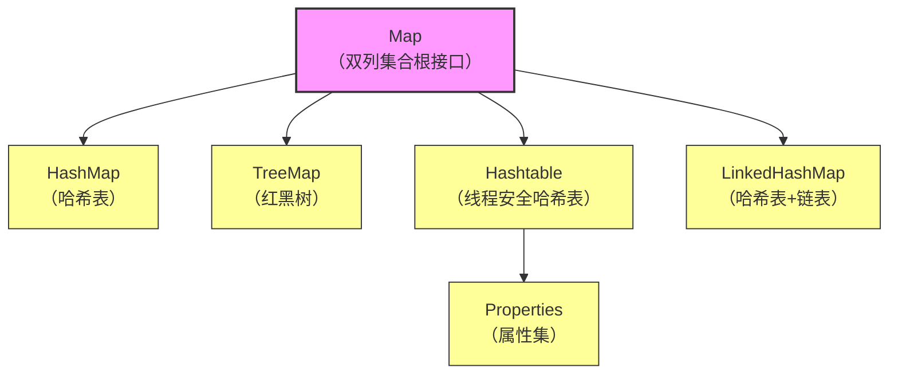
```mermaid
flowchart TD
    A[Map<br/>（双列集合根接口）] --> B[HashMap<br/>（哈希表）]
    A --> C[TreeMap<br/>（红黑树）]
    A --> D[Hashtable<br/>（线程安全哈希表）]
    A --> E[LinkedHashMap<br/>（哈希表+链表）]
    
    D --> D1[Properties<br/>（属性集）]
    
    %% 保持和Collection流程图一致的样式
    A:::root
    B:::impl
    C:::impl
    D:::impl
    E:::impl
    D1:::impl
    classDef root fill:#f9f,stroke:#333,stroke-width:2px
    classDef subInterface fill:#9ff,stroke:#333,stroke-width:2px
    classDef impl fill:#ff9,stroke:#333,stroke-width:1px
```
## 常见API
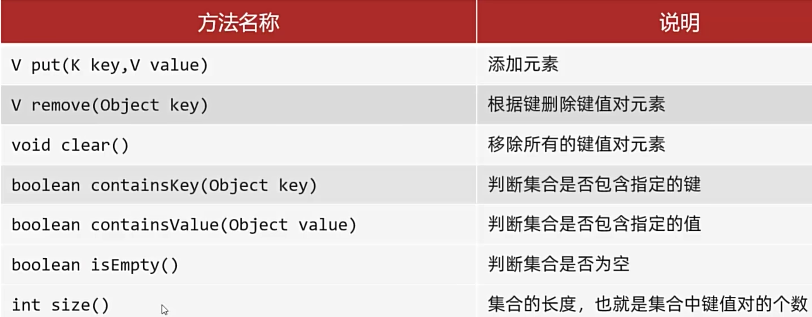
## 遍历
### 通过键k找值v
```Java
	Set<String> keys = map.keySet();
	
	//遍历单列集合，得到每一个键
	for (String key : keys) {  
    System.out.println(map.get(key));  
	}
	
	//迭代器遍历
	Iterator it =  keys.iterator();  
	while(it.hasNext()){  
	    String key = (String)it.next();  
	    System.out.println(key+":"+map.get(key));  
	}
	
	//lambda表达式遍历
	keys.forEach(key -> System.out.println(map.get(key)));
```

### 键值对对象遍历
```Java
	//Set存储键值对
	Set<Map.Entry<String, String>> es = map.entrySet();
	//Entry是Map的内部接口
	
	//遍历每一个键值对对象
	for (Map.Entry<String, String> e : es) {  
	
	    String  key = e.getKey();  
	    String value = e.getValue();  
	    
	    System.out.println(key + ":" + value);  
	}
	
	//遍历迭代器
	Iterator <Map.Entry<String,String>> it = es.iterator();  
	while(it.hasNext()){  
	    Map.Entry<String,String> entry = it.next();  
	    String key = entry.getKey();  
	    String value = entry.getValue();  
	    System.out.println(key+":"+value);  
	}
	
	//lambda表达式
	es.forEach(e -> System.out.println(e.getKey()+":"+e.getValue()));
```
### lambda表达式遍历
```Java
	map.forEach(new BiConsumer<String, String>() {  
	    @Override  
	    public void accept(String k, String v) {  
	        System.out.println(k+ ":" +v);  
	    }  
	});
	-----------------------
	map.forEack((key,value) -> System.out.println(k+":"+v));
	
```
## HashMap
- HashMap 是 Map 的一个实现类
- 特点都是由键决定的：无序，不重复，无索引
- HashMap 与 HashSet 的底层原理是一样的，都是哈希表
- **HashMap的键位置如果存储的是自定义对象，需要重写hashCode和equals**

### 样例
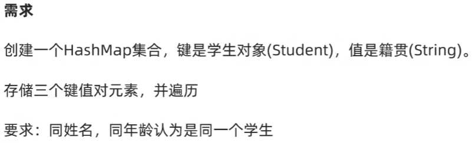
```Java
	默认的hashCode和equals方法
	@Override  
	public boolean equals(Object obj) {  
	    if(this == obj) return true;  
	    if(obj == null || getClass() != obj.getClass() ) return false;  
	    Student student = (Student)obj;  
	    return  name.equals(student.name) && age == student.age;  
	}  
	
	@Override  
	public int hashCode() {  
	    return Objects.hash(name,age);  
	}
```

## LinkedHashMap
- <span style="color: #dc3545;">由键决定：有序</span>、不重复、无索引
- 这里的有序值得是保证存储和去除的元素一致
- <span style="color: #dc3545;">原理：</span>底层数据结构依然是哈希表，只是每个键值对元素又额外多了一个双链表的机制记录存储的顺序
### TreeMap
- TreeMap跟TreeSet的底层原理一样，都是红黑树结构的
- 由键决定特性：不重复，无索引，可排序
- 可排序：**<span style="color: #dc3545;font-weight: bold;">对键进行排序</span>
- <span style="color: #dc3545;font-weight: bold;">注意：默认按照键的从小到大进行排序，也可以自己规定键的排序规则</span>
#### 代码两种书写排序规则
- 创建Comparable接口，指定比较规则
- 创建集合时传递Comparator比较器对象，指定比较规则
```Java
		TreeMap<Integer,String> tm = new TreeMap<>(new Comparator<Integer>() {  
		    @Override  
		    public int compare(Integer o1, Integer o2) {  
		        //o1 : 当前要添加的元素  
		        //o2 : 当前要添加的元素        
		        //升序
				return o1 - o2;
		    }  
		});
```
## HashMap源码分析
- HashMap里面每一个对象包含以下内容
```Java
1.1链表中的键值对对象
	包含：
			int hash;
			final K key;
			V value;
			Nodfe<K,V> next;
1.2红黑树中的键值对对象
	包含：
			int hash;
			final K key;
			V value;
			Node<K,V> right;
			boolean red;
2.添加元素
	HashMap<String,Integer> hm = new HashMap<>();
	hm.put("aaa",111);
	hm.put("bbb",222);
添加元素的时候至少考虑三种情况
2.1 数组位置为null
2.2 数组位置不为null，键重复，元素覆盖
2.3 数组位置不为null，键不重复，挂在下面形成链表或者红黑树


```

```Java

//参数一：键
//参数二：值
//返回值：被覆盖元素的值，如果没有覆盖，返回value
public V put(K key, V value) {  
	
	//参数一：
	return putVal(hash(key), key, value, false, true);  
}  
//利用键计算出对应的哈希值，再把哈希值进行一些处理
static final int hash(Object key) {  
    int h;  
    return (key == null) ? 0 : (h = key.hashCode()) ^ (h >>> 16);  
}

//参数一：键的哈希值
//参数二：键
//参数三：值
//参数四：如果键重复了是否保留 
//       true->表示老元素的值保留，不会覆盖 
//       false->表示老欧元素的值不会保留，会进行覆盖
final V putVal(int hash, K key, V value, boolean onlyIfAbsent,boolean evict) {  
	Node<K,V>[] tab; //定义一个局部变量，用来记录哈希表数组的地址值，用于优化（方法在栈里，变量在堆里，直接在栈里找地址值） null
	Node<K,V> p; //临时第三方变量，记录键值对对象的地址值
	int n, i;  //当前数组的的长度与索引
	
	//将哈希表中数组的地址值赋值给局部变量tab
	//将数组长度赋值给n
	
	if ((tab = table) == null || (n = tab.length) == 0)  //true
		//1.如果当前是第一次添加数据，底层会创建一个默认长度为16，加载因子为0.75的数组
		//2.如果不是第一次添加数据，会看数组中的元素是否达到了扩容条件
		//如果没有达到扩容条件 -> 无操作
		//如果达到了 -> 底层会把数组扩容为原先的 两倍 ，并把数据全部转移到新的哈希表中
		n = (tab = resize()).length;  
	
	//拿着数组的长度跟键的哈希值进行计算得到 -> 在数组中应存入的位置
	//获取数组中对应元素的数据（第一次为null）	
	if ((p = tab[i = (n - 1) & hash]) == null)
		添加第一个元素  
		//底层会创建一个键值对对象，直接放到数组当中
		tab[i] = newNode(hash, key, value, null);  
	else {  
		添加其他元素
		Node<K,V> e; 
		K k;   
		
		//p.hash:数组中键值对的哈希值
		//hash:当前要添加键值对的哈希值
		//如果键不一样，此时返回false
		if (p.hash == hash && 
			((k = p.key) == key || (key != null && key.equals(k)))) 
			e = p;  
		else if (p instanceof TreeNode) 
			//判断数组中获取出来的键值对是不是红黑树的节点
			//如果是，则调用putTreeVal，把当前的节点按照红黑树的规则添加到树当中
			e = ((TreeNode<K,V>)p).putTreeVal(this, tab, hash, key, value);  
		else {  
			//如果数组中获取出来的键值对不是红黑树的节点
			//表示此时下面挂的是链表 
			for (int binCount = 0; ; ++binCount) {  
				if ((e = p.next) == null) { //下一个元素为null
					//此时就会创建一个新的节点，挂在下面，形成链表
					p.next = newNode(hash, key, value, null);  
					//判断当前链表长度是否超过8，如果超过，会调用treeifyBin
					//treeifyBin方法的底层还会继续判断，判断数组的长度是否大于等于64
					//如果同时满足这两个条件，就会把这个链表转成红黑树
					if (binCount >= TREEIFY_THRESHOLD - 1) //7，插入后长度为8
						treeifyBin(tab, hash);  
					break;  
				}  
				if (e.hash == hash &&  
					((k = e.key) == key || (key != null && key.equals(k)))) 
					break;  
				p = e;  
			}  
		}  
		//下一个节点不为空
		//如果e为null，表示当前不需要覆盖任何元素
		if (e != null) { 
			V oldValue = e.value;  //保存旧值
			//是否保留
			if (!onlyIfAbsent || oldValue == null) 
				//当前要添加的值
				e.value = value;  //覆盖值
			afterNodeAccess(e);  //后置处理
			return oldValue; //都返回旧值
		}   
	}  
	
	
	/*与并发修改异常有关，暂时忽略*/++modCount;  
	//threshold:记录数组的长度*0.75，哈希表的扩容时机
	//
	if (++size > threshold)  
	//扩容
		resize();  
	
	/*与LinkedHashMap有关，暂时忽略*/afterNodeInsertion(evict);
	
	return null;  //表示当前没有覆盖任何元素，返回null
}
```

### 哈希冲突处理逻辑
```Java
1.hash不等 -> 绝对不是同一个Key
2.hash相等 -> 可能是同一个（冲突了），继续比较 == 或 equals
3.equals相等 -> 确定是同一个元素，执行覆盖
	因为冲突不可避免，所以 HashMap 才需要用 equals() 再次确认身份，并用链表/红黑树来安置多出来的“鸽子”。
	
扩展：为什么 `HashMap` 里的 `TREEIFY_THRESHOLD`（树化阈值）定为 8？
	根据泊松分布，在哈希函数设计合理的情况下，同一个桶位冲突达到 8 个的概率只有千万分之6
```

## TreeMap源码分析


