# 栈Stack
- **后进先出，先进后出**
- 压栈/进栈：数据进入栈模型的过程
- 弹栈/出栈：数据离开栈模型的过程

# 队列Queue
- **先进先出，后进后出**
- 入队列：数据从**后端进入**队列模型的过程
- 出队列：数据从**前端离开**队列模型的过程

# 数组
- ==查询速度快==：查询数据通过地址值和索引定位，查询任意数据耗时相同（元素在内存中是连续存储的）
- ==删除效率低==：要将原始数据删除，同时后面每个数据前移
- ==添加效率低==：添加位置后的每个数据后移，再添加元素

# 链表
- 链表中的结点是独立的对象，在内存中是不连续的，每个节点包含数据值和下一个结点的地址
- 链表==查询慢==，无论查询哪个数据都从头开始找。
- 链表的==增删快==（对比数组）

 
# 树
```Java
	 [父节点地址值，值，左子节点地址值，右子节点地址值]
	 度：每一个节点的 子节点 数量
	 树高：树的总层数
	 
	   10        <-- 根节点
       /  \
      5    15     <-- 第二层
     / \     \
    3   7    20   <-- 第三层
       /
      6           <-- 第四层
```

```mermaid
graph TD
    %% 根节点
    Root((Java Generics)) 

    %% 第一层：核心动机
    Root --> Motivation[核心目标]
    Motivation --> Safety[类型安全: 编译期检查]
    Motivation --> Reusability[代码复用: 编写一次 运行多种类型]
    Motivation --> NoCast[消除强制转换: 自动 checkcast]

    %% 第二层：基本定义
    Root --> Definition[如何定义]
    Definition --> GenericClass["类/接口: ClassName&lt;T&gt;"]
    Definition --> GenericMethod["方法: &lt;T&gt; returnType method()"]

    %% 第三层：通配符与边界 (最难点)
    Root --> Wildcards[通配符与边界]
    Wildcards --> Unbounded["无界: &lt;?&gt;"]
    Wildcards --> UpperBounded["上界: &lt;? extends T&gt; <br/>(PECS - Producer Extends)"]
    Wildcards --> LowerBounded["下界: &lt;? super T&gt; <br/>(PECS - Consumer Super)"]

    %% 第四层：底层原理
    Root --> Principle[底层原理]
    Principle --> Erasure[类型擦除: 运行时变为 Object]
    Principle --> BridgeMethod[桥接方法: 保持多态性]

    %% 约束限制
    Root --> Restrictions[约束限制]
    Restrictions --> NoPrimitive[不能用基本类型: 必须用包装类]
    Restrictions --> NoStatic[静态成员不能引用泛型参数]
    Restrictions --> NoInstance[不能直接 new T]
```


