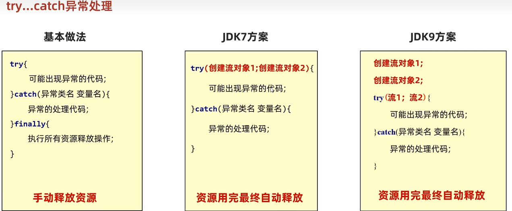

**程序是在“内存”里跑的，所以永远以内存为原点。**
- **参照物：程序/内存**

- **Input (输入)**：数据从硬盘/网络 **流进** 内存。—— **读（Read）**

- **Output (输出)**：数据从内存 **流出** 到硬盘/网络。—— **写（Write）**

| **维度**         | **字节流 (万能，图片/视频/文本)** | **字符流 (仅限纯文本，自带编码)** |
| -------------- | --------------------- | -------------------- |
| **输入 (Read)**  | **InputStream**       | **Reader**           |
| **输出 (Write)** | **OutputStream**      | **Writer**           |
# 字节流
## `FileOutputStream`
- 操作本地文件的字节输出流，可以把程序中的数据写到本地文件中

### 核心步骤：

1. **创建对象**：`FileOutputStream fos = new FileOutputStream("a.txt");`
   
    - _细节1：如果文件不存在，会自动创建，但是要保证父级路径是存在的。_
    - _细节2：如果文件存在，会清空原内容_
    
2. **写出数据**：`fos.write(97);` // 写出的是 ASCII 码，文件中显示 'a'。
	
3. **释放资源**：`fos.close();` // **极其重要！** 不关流，文件会被程序锁死。

### 写出数据的三种方式
| **方法名**                                      | **说明**    | **适用场景**                 |
| -------------------------------------------- | --------- | ------------------------ |
| **`write(int b)`**                           | 一次写一个字节   | 极少用，效率太低                 |
| **`write(byte[] b)`**                        | 一次写一个字节数组 | **常用**，适合写出大量数据          |
| **`write(byte[] b, off, len)`** `off:offset` | 写出数组的一部分  | **最常用**，配合循环读取时能精确控制写出的量 |
### `FileOutputStream`写数据的问题
#### 换行
- **Windows**: `\r\n 回车 + 换行，java在底层会补全`
	
- **Linux/Unix**: `\n`
	
- **Mac**: `\r`

`System.lineSeparator() 获取操作系统的换行符`

#### 续写
`public FileOutputStream(File file, boolean append) true则续写`

## `FileInputStream`

- **功能**：硬盘 $\rightarrow$ 内存 (读取字节)。
  
- **结束标志**：读取到 `-1`。
  
- **性能优化**：定义 `byte[]` 数组作为缓冲区，一次读取多个字节。
  
- **适用场景**：文件拷贝（图片、音视频）、不需要处理文本内容的场景。

### 核心步骤：

1. **创建对象**：`FileIutputStream fis = new FileIutputStream("a.txt");`
   - _细节1：如果文件不存在，会**直接报错**_
    
2. **读取数据**：`int b = fis.read(97);` // 读出的是 ASCII 码，读出来显示 'a'。
	- _细节1： 读到文件末尾，`read`返回`-1`_
	
3. **释放资源**：`fis.close();`

### 读入数据的方法
| **方法名**                   | **返回值类型** | **含义**                             |
| ------------------------- | --------- | ---------------------------------- |
| **`read()`**              | `int`     | 读取一个字节(效率低)，返回该字节的值；读完返回 **-1**    |
| **`read(byte[] buffer)`** | `int`     | 读取字节填充进数组，返回**实际读取个数**；读完返回 **-1** |
| **`available()`**         | `int`     | 返回文件剩余的可读字节数（慎用，大文件会爆内存）           |

## 文件拷贝
```Java
	FileInputStream fis = new FileInputStream(PATH+"b.txt");  
	FileOutputStream fos = new FileOutputStream(PATH+"copy.txt");  
	byte[] buffer = new byte[1024];//1KB  
	int len;  
	while ((len = (fis.read(buffer))) != -1) {  
	    fos.write(buffer, 0, len);  
	}  
	fos.close();  
	fis.close();
```
>[!NOTE]
>**`close`关闭顺序**：先开的后关，后开的先关
## 异常处理`try-with-resources`
### `try-catch-finally`

>**`finally`代码块一定会执行，除非虚拟机退出**

**当流对象实现了`AutoCloseable`接口时，可以使用小括号**

### 修正后的文件拷贝
```Java
	FileInputStream fis = new FileInputStream(PATH + "b.txt");  
	FileOutputStream fos = new FileOutputStream(PATH + "copy.txt");  
	  
	try (fis;fos){  
	    byte[] buffer = new byte[1024];//1KB  
	    int len;  
	    while ((len = (fis.read(buffer))) != -1) {  
	        fos.write(buffer, 0, len);  
	    }  
	} catch (IOException e) {  
	    e.printStackTrace();  
	}
```

# 字符集
| **编码格式**  | **中文占位** | **字节流读取过程**           | **结果**                         |
| --------- | -------- | --------------------- | ------------------------------ |
| **GBK**   | 2 字节     | `fis.read()` 一次拿 1 字节 | 拿到了半个字 $\rightarrow$ **乱码**    |
| **UTF-8** | 3 字节     | `fis.read()` 一次拿 1 字节 | 拿到了三分之一个字 $\rightarrow$ **乱码** |
## 字符流 = 字节流 + 字符集
| **特性**   | **字节流 (Stream)**   | **字符流 (Reader/Writer)**    |
| -------- | ------------------ | -------------------------- |
| **数据单位** | 字节 (8 bit)         | 字符 (16 bit)                |
| **处理对象** | **所有文件**（图片、视频、文本） | **仅限纯文本**（txt, java, html） |
| **读中文**  | 会乱码                | **不会乱码**                   |
| **拷贝图片** | 完美拷贝               | **文件会损坏**（千万别用字符流拷图片）      |

## 核心步骤：

1. **创建对象**：`FileReader fr = new FileReader("a.txt");`
   
    - _细节_1：
    
2. **读取数据**：`while((ch = fr.read() )!= -1){}` 
	
	- _细节1：按字节读取，遇到中文，**一次会读多个字节**，读取后解码。返回整数_
	
	- _细节2：读到文件末尾返回`-1`_
	
		- `read()`的细节：
		- _在读取之后，方法的底层还会进行解码并转成十进制，最终会把这个十进制作为返回值，这个十进制的数据也表示在字符集上的数字。_
	
3. **释放资源**：`fr.close();`

# 缓冲流

```plainext
	IO流体系
	├─ 字节流
	│  ├─ InputStream（字节输入流）
	│  │  ├─ FileInputStream（基本字节输入流）
	│  │  └─ BufferedInputStream（字节缓冲输入流）
	│  └─ OutputStream（字节输出流）
	│     ├─ FileOutputStream（基本字节输出流）
	│     └─ BufferedOutputStream（字节缓冲输出流）
	└─ 字符流
	   ├─ Reader（字符输入流）
	   │  ├─ FileReader（基本字符输入流）
	   │  └─ BufferedReader（字符缓冲输入流）
	   └─ Writer（字符输出流）
	      ├─ FileWriter（基本字符输出流）
	      └─ BufferedWriter（字符缓冲输出流）
```
