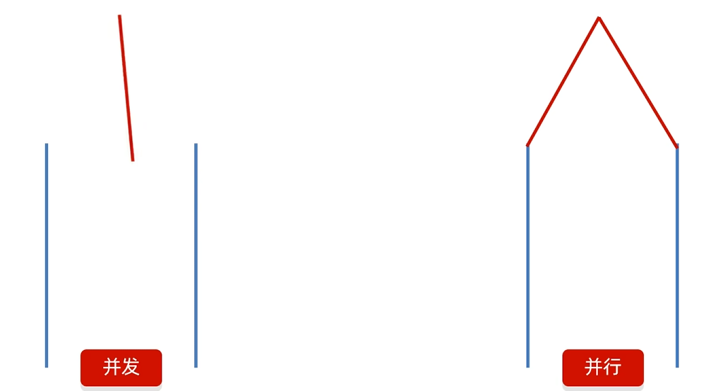
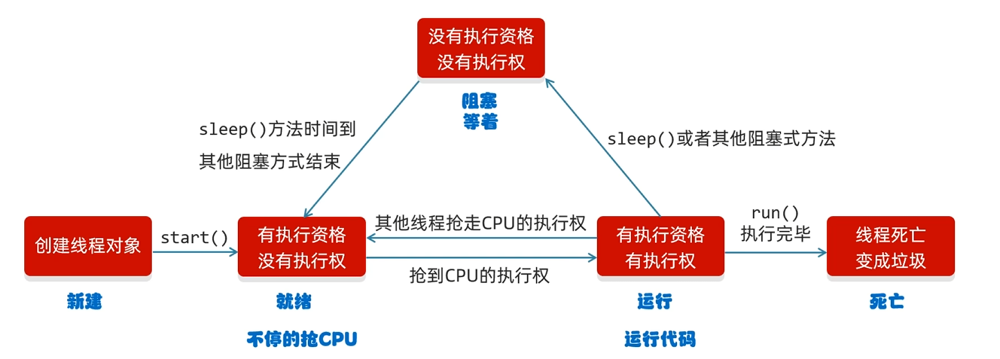

+++
date = '2026-03-22'
draft = false
title = '13-多线程和JUC'
tags = []
categories = ["Java笔记"]
+++

> 本文更新于 2026-03-22

# 多线程
>1.**进程 (Process)**：运行中的程序（比如 IDEA、Chrome、QQ）。它是操作系统资源分配的最小单位。
  >  
>2.**线程 (Thread)**：进程中的一个“执行路径”。一个进程可以包含多个线程（比如 Chrome 里一个线程下载文件，一个线程渲染网页）。

## 并发和并行
| **维度**   | **并发 (Concurrency)** | **并行 (Parallelism)** |
| -------- | -------------------- | -------------------- |
| **核心特点** | 任务**交替**执行           | 任务**同时**执行           |
| **资源需求** | 单核 CPU 即可实现          | 必须**多核 CPU**         |
| **目的**   | 提高 CPU 利用率，解决“阻塞”    | 提高计算速度，缩短处理时间        |
| **关系**   | 并发不一定是并行             | 并行一定是并发的一种形式         |

## 实现方式

### 继承`Thread`类
```Java
public class MyThread extends Thread {
    @Override
    public void run() {
        for (int i = 0; i < 100; i++) {
            System.out.println(getName() + " 在运行: " + i);
        }
    }
}
	// 启动：new MyThread().start();
	优点:代码简单，直接 `this` 就能获取线程名。
	缺点：Java 是单继承，继承了 Thread 就不能继承别的类了。
```
## 实现`Runnable`接口
```Java
public class MyRun implements Runnable {
    @Override
    public void run() {
        System.out.println(Thread.currentThread().getName() + " 执行中");
    }
}
	// 启动：new Thread(new MyRun()).start();
	优点：扩展性强，可以实现接口的同时继承别的类；适合多个线程处理同一个资源。
```
## 实现`Callable`接口
```Java
public class MyCallable implements Callable<Integer> {
    @Override
    public Integer call() throws Exception {
        return 100 + 200; // 返回计算结果
    }
}
	// 启动需配合 FutureTask
	特点：可以获取线程执行后的结果，还能抛出异常。
	
```
## 成员方法
| **方法名**                     | **说明**          | **备注**                    |
| --------------------------- | --------------- | ------------------------- |
| **`setName(String name)`**  | 设置线程名称          | 默认是 `Thread-0,Thread-1` 等 |
| **`getName()`**             | 获取线程名称          | 建议在构造时就起好名字               |
| **`getPriority()`**         | 获取线程优先级         | 范围 1-10，默认 5              |
| **`setPriority(int p)`**    | 设置线程优先级         | 优先级越高，抢到 CPU 时间片的**概率**越大 |
| **`currentThread()`**       | **静态方法**，获取当前线程 | 哪条线程执行这行代码，就返回谁           |
>**给线程设置名字：** 
>	可以用`set`也可以用构造方法
>	
> 
>`currentThread()`:
>	当`JVM`虚拟机启动之后，会自动启动多条线程，其中一条是`main`线程，它的作用是调用`main`方法，并执行里面的代码。


### 状态控制方法

这些方法直接影响线程的运行节奏，是多线程编程的核心。
#### ① `sleep(long ms)`：线程休眠

- **类型**：静态方法。
    
- **作用**：让当前线程进入“阻塞状态”指定的时间。
    
- **特点**：**不释放锁**（如果你拿着钥匙睡觉，别人依然进不来）。
    
- **应用**：在拼图游戏中，如果想制作一个“倒计时”或“动画间隔”，就用它。
    
#### ② `yield()`：线程让步

- **类型**：静态方法。
    
- **作用**：暗示 CPU 当前线程愿意让出执行权。
    
- **特点**：线程从“运行”回到“就绪”状态。CPU 可能会再次选中它，也可能选中别人。这是一种**谦让**，不是强制停止。
    
#### ③ `join()`：线程插队

- **类型**：成员方法。
    
- **作用**：在 A 线程中调用 `B.join()`，意味着 A 必须等 B 执行完，A 才能继续。
    
- **类比**：你在排队买饭，突然一个 VIP（B 线程）插到了你前面，你必须等他买完。

### 守护线程`（Daemon Thread）`

- **方法**：`setDaemon(true)`
    
- **定义**：当进程中所有的“用户线程”都结束了，守护线程即便没运行完，也会**被 JVM 强制杀掉**。(不是立马结束，而是 **陆续结束**)
    
- **比喻**：用户线程是“国王”，守护线程是“保镖”。国王死了，保镖也就没存在的意义了。
    
- **应用**：垃圾回收器（GC）就是一个经典的守护线程。

## 生命周期

## 线程安全
### 三大特性
- **原子性 (Atomicity)**：一个操作要么全部执行成功，要么全部失败，中间不能被中断。
    
- **可见性 (Visibility)**：一个线程修改了共享变量的值，其他线程能够立即看到。
    
- **有序性 (Ordering)**：程序执行的顺序按照代码的先后顺序执行（防止指令重排）。

### 为什么会出现线程不安全？

线程安全问题发生的**三个必要条件**（缺一不可）：

1. **多线程环境**：至少有两个线程在跑。
    
2. **共享资源**：多个线程访问同一个变量（如成员变量、静态变量）。
    
3. **写操作**：至少有一个线程在修改这个变量。

### 解决方案1: 同步代码块 `(synchronized)`

- **在实例方法中，通常用 `this`；在静态方法中，通常用 `类名.class`。**

```Java
public class MyThread extends Thread {  
    static int sum = 0;  
    //锁对象，一定要是唯一的
    static final Object obj = new Object();  
  
    @Override  
    public void run() {  
        while (true) {  
            synchronized (obj) {  
                // 核心：在锁内部再次判断，保证原子性  
                if (sum < 100) {  
                    try {  
                        Thread.sleep(100); // 模拟网络延迟或出票时间  
                    } catch (InterruptedException e) {  
                        e.printStackTrace();  
                    }  
                    sum++;  
                    System.out.println(getName()+"正在卖第"+sum+"张票!");  
                } else {  
                    // 票卖完了，跳出死循环  
                    break;  
                }  
            }  
        }  
    }  
}
```
#### 🛠️ 卖票案例避坑指南

1. **锁的唯一性**：用了 `static final Object obj`，这确保了无论创建多少个 `MyThread` 对象，它们抢的都是同一把锁。
    
2. **判断逻辑的位置**：
    
    - 如果判断在 `synchronized` 外面，会有“判断通过但由于抢锁延迟导致数据过期”的风险。
        
    - **金律**：对共享变量的**判断**和**修改**，必须包裹在同一个 `synchronized` 块内。
        
3. **Sleep 的位置**：
    
    - `sleep` 放在同步块里会**“抱着锁睡觉”**，其他线程只能干等，效率低。
        
    - 在这个练习中，它是为了放大问题。在实际开发中，应尽量缩短同步块的代码量。

### 解决方案2: 同步方法
#### 同步方法的分类与锁对象

>同步方法分为两种，它们的锁对象是 Java 自动指定的，不需要手动创建 `obj`。

##### ① 同步实例方法（非静态）

- **格式**：`public synchronized void method() { ... }`
    
- **锁对象**：**`this`**（当前调用该方法的对象）。
    
- **适用场景**：多个线程操作同一个对象的成员变量。
    

##### ② 同步静态方法

- **格式**：`public static synchronized void method() { ... }`
    
- **锁对象**：**`类名.class`**（当前类的字节码文件对象）。
    
- **适用场景**：多个线程操作类的静态变量（比如你代码里的 `static int sum`）。

>[!IMPORTANT]
>`StringBuffer`、`Vector`、`Hashtable` 内部都是通过同步方法实现线程安全的，所以它们效率比 `StringBuilder`、`ArrayList`、`HashMap` 低
>
>单线程用`StringBuilder`，多线程要**考虑线程安全**用`StringBuffer`

### `Lock`锁(接口)

> **1.Static 关键字**：因为是 `extends Thread`，所以 `Lock` 必须加 `static`。否则每个线程对象都有一把自己的锁，根本锁不住！
>  
> **2.Lock 的位置**：放在 `try` 块上方。
>  
> **3.Unlock 的位置**：必须在 `finally` 第一行。
>  
> **4.死循环出口**：在 `break` 之前，务必确保 `finally` 能被触发（Java 默认支持，不用担心）。
```Java
public class MyThread extends Thread {
    static int sum = 0;
    static Lock lock = new ReentrantLock();

    @Override
    public void run() {
        while (true) {
            // 1. 锁放在 try 外面
            lock.lock(); 
            try {
                if (sum < 100) {
                    Thread.sleep(10); 
                    sum++;
					sout(getName() + "正在卖第" + sum + "张票!");
                } else {
                    // 2. 票卖完了，跳出循环
                    break; 
                }
            } catch (InterruptedException e) {
                e.printStackTrace();
            } finally {
                // 3. 无论如何都会还锁
                lock.unlock(); 
            }
        }
    }
}
```

#### ⚖️ 锁的权衡 (Trade-off)

- **`synchronized`**：**自动挡**。适合 80% 的日常业务场景，JVM 帮你管，安全、省心。
    
- **`Lock`**：**手动挡**。适合 20% 的高并发、高性能、复杂调度场景。能漂移、能极速，但操作不当容易熄火（死锁）。
    
- **结论**：**优先使用 `synchronized`**，直到你发现它实现不了你的某个高级需求（如公平性、超时、尝试获取）时，再重构为 `Lock`。


## 等待唤醒机制

- **生产者 (Producer)**：负责准备数据（比如从网络下载图片、计算游戏解法）。
    
- **消费者 (Consumer)**：负责使用数据（比如把图片渲染到屏幕、执行步数）。
    
- **仓库 (Buffer)**：中间存储数据的变量或容器。

| **方法名**           | **作用**                      | **状态切换** |
| ----------------- | --------------------------- | -------- |
| **`wait()`**      | 让当前线程释放锁，进入等待池，直到被唤醒        | 运行 -> 等待 |
| **`notify()`**    | 随机唤醒**一个**在该锁上等待的线程         | 等待 -> 就绪 |
| **`notifyAll()`** | 唤醒在**这把锁**上等待的**所有**线程（更安全） | 等待 -> 就绪 |
```Java
//定义中间控制类（Buffer）
public class Desk {
    // 0: 没有饭, 1: 有饭
    public static int foodFlag = 0;
    // 锁对象
    public static final Object lock = new Object();
}

//消费者
public void run() {
    while (true) {
        synchronized (Desk.lock) {
            if (Desk.foodFlag == 0) {
                try { Desk.lock.wait(); } catch (Exception e) {} // 没饭就等
            } else {
                System.out.println("吃货：开炫！");
                Desk.foodFlag = 0; // 吃完了
                Desk.lock.notifyAll(); // 叫醒厨师再做点
            }
        }
    }
}

//生产者
public void run() {
    while (true) {
        synchronized (Desk.lock) {
            if (Desk.foodFlag == 1) {
                try { Desk.lock.wait(); } catch (Exception e) {} // 有饭就歇着
            } else {
                System.out.println("厨师：出锅一份回锅肉！");
                Desk.foodFlag = 1; // 饭好了
                Desk.lock.notifyAll(); // 叫醒吃货开饭
            }
        }
    }
}
```

### 阻塞队列
| **实现类**                   | **特点**        | **适用场景**                                |
| ------------------------- | ------------- | --------------------------------------- |
| **`ArrayBlockingQueue`**  | **有界**，底层是数组  | 必须指定大小，性能稳定，最常用。                        |
| **`LinkedBlockingQueue`** | **可选界**，底层是链表 | 默认大小是 `Integer.MAX_VALUE`（接近无限），容易 OOM。 |
```Java
//生产者
public class Cook extends Thread {
    private BlockingQueue<String> queue;
    public Cook(BlockingQueue<String> queue) { this.queue = queue; }

    @Override
    public void run() {
        while (true) {
            try {
                // put 方法自带阻塞逻辑：如果队列满了，就在这儿等
                queue.put("回锅肉");
                System.out.println("厨师放了一份回锅肉，当前库存：" + queue.size());
            } catch (InterruptedException e) { e.printStackTrace(); }
        }
    }
}

//消费者
public class Foodie extends Thread {
    private BlockingQueue<String> queue;
    public Foodie(BlockingQueue<String> queue) { this.queue = queue; }

    @Override
    public void run() {
        while (true) {
            try {
                // take 方法自带阻塞逻辑：如果队列空了，就在这儿等
                String food = queue.take();
                System.out.println("吃货炫了一份：" + food);
            } catch (InterruptedException e) { e.printStackTrace(); }
        }
    }
}

//测试类（连接两者）
// 创建一个只能装 1 份饭的阻塞队列
BlockingQueue<String> queue = new ArrayBlockingQueue<>(1);

new Cook(queue).start();
new Foodie(queue).start();
```

| **操作类型** | **抛出异常**    | **返回特殊值**  | **阻塞（推荐）**   | **超时退出**               |
| -------- | ----------- | ---------- | ------------ | ---------------------- |
| **插入**   | `add(e)`    | `offer(e)` | **`put(e)`** | `offer(e, time, unit)` |
| **移除**   | `remove()`  | `poll()`   | **`take()`** | `poll(time, unit)`     |
| **检查**   | `element()` | `peek()`   | 无            | 无                      |

## 线程池
