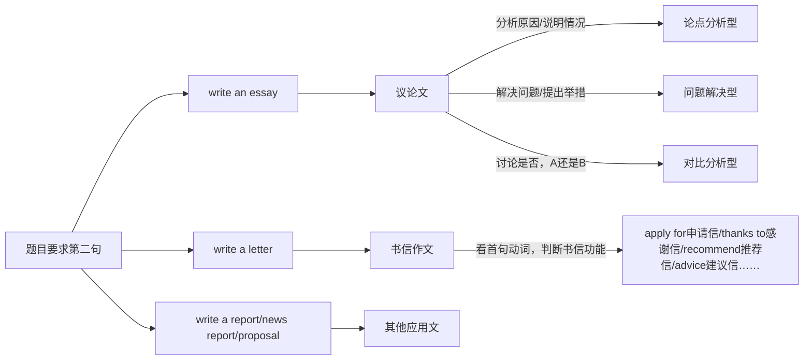

> 本文更新于 2026-06-03

# 单词区
proposal 建议
ambitious 有抱负的
aggressive 强势的
spotted 有斑点的
Journey to West 西游记
 obvious 显而易见 `It is obvious that...`
 
 

# 英语写作分类

- **题目要求第二句**
    
    1. `write an essay` → **议论文**
        
        - 分析原因 / 说明情况 → 论点分析型
        - 解决问题 / 提出举措 → 问题解决型
        - 讨论是否，A 还是 B → 对比分析型
        
    2. `write a letter` → **书信作文**
        
        - 判断方法：看首句动词，判断书信功能
            
            - apply for：申请信
            - thanks to：感谢信
            - recommend：推荐信
            - advice：建议信
            
        
    3. `write a report / news report / proposal` → **其他应用文**

