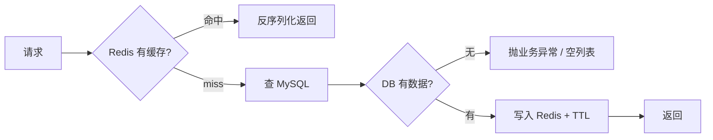

+++
date = '2026-07-19'
draft = false
title = '缓存'
tags = ['Redis', '缓存', 'Cache-Aside']
categories = ["Redis"]
aliases = ['Redis缓存', 'Cache-Aside', '旁路缓存']
+++

> 本文更新于 2026-07-19

# 缓存

- 临时存放热点数据，减少对 MySQL 的重复查询，加快读取
- **MySQL**：权威数据源，数据以库为准
- **Redis**：加速层，可以丢、可以过期，丢了再从 MySQL 查

相关：[[Redis基础]]（命令 / Jedis / SpringDataRedis）

```text
读：先 Redis → miss 再 MySQL → 回写 Redis
写：先改 MySQL → 再删对应缓存 key（写路径失效）
```



> [!tip] 分工一句话
> MySQL 存真相，Redis 做加速。缓存可以丢，不能当主库。

---

# Cache-Aside（旁路缓存）

业务自己管「查缓存 / 查库 / 回写 / 删缓存」，不靠 Redis 自动同步 MySQL。最常用。

## 读

```text
1. GET cache:user:{id}
2. 命中 → JSON 转对象 → 返回
3. miss → 查 MySQL
4. DB 无 → 抛业务异常（详情接口常见；列表可返回空）
5. DB 有 → 写入 Redis（建议带 TTL）→ 返回
```

**要点**

- 序列化对称：写 `JSONUtil.toJsonStr`，读 `toBean` / `toList`
- key 统一前缀，如 `cache:user:`，避免撞 key（见 [[Redis基础#Key的层级格式]]）
- 优先 `StringRedisTemplate` + 字符串 JSON，不要默认 JDK 序列化（乱码 `\xac\xed...`，见 [[Redis基础#RedisTemplate 与 StringRedisTemplate]]）

## 写路径失效

**写路径失效** = 增删改写完 DB 后，把相关缓存 key **删掉**。

- 不是立刻 set 新值，而是让缓存失效
- 下次读 miss，再从 DB 拉最新数据回写

**为什么删而不是改**

- 实现简单，只记要删哪些 key
- 读多写少时合适，不必每次写都维护缓存内容
- 避免「缓存字段不全」等问题

| 操作 | DB | 删哪些 key |
| --- | --- | --- |
| 增 create | INSERT | `cache:user:list`（单条可不写，等第一次读） |
| 改 update | UPDATE | `cache:user:{id}` + `cache:user:list` |
| 删 delete | DELETE | `cache:user:{id}` + `cache:user:list` |

```java
// update / delete 成功后
stringRedisTemplate.delete(CACHE_USER_KEY + id);
stringRedisTemplate.delete(CACHE_USER_KEY + "list");
```


> [!warning] 漏删
> 只删 `cache:user:1`、不删 `cache:user:list` → 列表仍可能读到旧数据（脏读）。

---

# TTL（Time To Live）

- **TTL** = 键的存活时间；到期 Redis **自动删除**该 key
- 命令侧：`EXPIRE` / `SETEX` / `SET key value EX sec`，查剩余：`TTL key`（见 [[Redis基础#通用]]）
- `-1` 永不过期；`-2` key 不存在

```java
// 方式一
stringRedisTemplate.opsForValue().set(key, json, 30, TimeUnit.MINUTES);

// 方式二
stringRedisTemplate.opsForValue().set(key, json, Duration.ofMinutes(30));
```

**为什么要设 TTL**

1. **兜底一致性**：写路径漏删时，脏数据最多活到过期
2. **省内存**：冷数据自动清
3. **配合主动删**：主动删负责「写完立刻失效」，TTL 负责「最坏也能恢复」

| 手段 | 作用 |
| --- | --- |
| 写路径删缓存 | 主动保证，写完马上失效 |
| TTL | 兜底；**不能代替**写后删缓存 |

> [!important] 练习约定
> `getById`、`list` 的 `set` 都带 TTL（如 30 分钟）。TTL 是保险，不是写后删的替代品。

---

# getById 示例

`StringRedisTemplate` + Hutool `JSONUtil`：

```java
private static final String CACHE_USER_KEY = "cache:user:";

@Override
public User getById(Long id) {
    String key = CACHE_USER_KEY + id;
    String userJson = stringRedisTemplate.opsForValue().get(key);
    if (userJson != null) {
        return JSONUtil.toBean(userJson, User.class);
    }
    User user = userMapper.selectById(id);
    if (user == null) {
        throw new BusinessException("用户不存在");
    }
    stringRedisTemplate.opsForValue().set(
            key, JSONUtil.toJsonStr(user), Duration.ofMinutes(30));
    return user;
}
```

---

# list 缓存

业务「用户列表」用 **String + 整表/整页 JSON**，不要默认用 `opsForList`。

| API | 实际存的是 | 适合 |
| --- | --- | --- |
| `opsForValue` + JSON | 一个字符串（整份列表） | 业务对象列表缓存 |
| `opsForList` | Redis List 结构 | 队列、时间线、push/pop（见 [[Redis基础#List类型]]） |

```text
key: cache:user:list
读：GET → JSONUtil.toList
miss：selectList → set(JSON, TTL)
写：create / update / delete 后 delete 该 key
```

```java
String key = CACHE_USER_KEY + "list";
String json = stringRedisTemplate.opsForValue().get(key);
if (json != null) {
    return JSONUtil.toList(json, User.class);
}
List<User> list = userMapper.selectList(null);
if (list == null || list.isEmpty()) {
    return List.of(); // 列表空一般不抛异常
}
stringRedisTemplate.opsForValue().set(
        key, JSONUtil.toJsonStr(list), Duration.ofMinutes(30));
return list;
```

> [!note] 规模
> 练习阶段可整表缓存；数据量大再考虑分页 key（如 `cache:user:list:page:1`），避免无脑全表。

---

# 缓存更新策略

缓存不会一直在，常见三种「消失」方式：

| 方式 | 含义 | 一致性 | 维护成本 | 场景 |
| --- | --- | --- | --- | --- |
| 超时剔除 | 设 TTL，到期自动删 | 中（过期前可能旧） | 低 | 通用兜底 |
| 主动更新/失效 | 写库后删或改缓存 | 高 | 中（要记清 key） | 增删改后 |
| 内存淘汰 | 内存满按策略踢 key | 弱 | 系统行为 | 防 OOM |

## 操作缓存和数据库时要考虑的三个问题

1. **删除缓存还是更新缓存？**
   - 更新缓存：每次改 DB 都改缓存 → 无效写多（有些 key 根本没人读）
   - 删除缓存：写 DB 后让缓存失效，**下次查询时再回写** → 更常见
2. **如何保证缓存与数据库「同时成功或失败」？**
   - 单体：可把 DB 操作和删缓存放同一事务思路里（删缓存失败要可重试/可兜底）
   - 分布式：TCC 等分布式事务（练习阶段不必上）
3. **先操作缓存还是先操作数据库？**
   - 方案 A：先删缓存，再写 DB
   - 方案 B：先写 DB，再删缓存
   - 两者并发下都可能短暂不一致，**A 出问题概率通常更大**
   - 练习/常见实践：**先写 DB，再删缓存**

![[Redis缓存-1.png]]

## 最佳实践

| 一致性要求 | 做法 |
| --- | --- |
| 低 | 主要靠 Redis 内存淘汰 + TTL |
| 高 | **主动失效（写后删）** + TTL 超时剔除兜底 |

**读操作**

```text
缓存命中 → 直接返回
缓存未命中 → 查 DB → 写入缓存并设超时时间
```

**写操作**

```text
先写数据库 → 再删除缓存
尽量保证 DB 与删缓存的原子性（失败可重试；TTL 兜底）
```

> [!success] 练习主用
> **主动失效 + TTL 兜底**；写路径：先 DB 后 delete key。

---
# 缓存穿透
是指客户端请求的数据再缓存中和数据库中都不存在，这样缓存就会失效，请求就会打到数据库
## 缓存空对象
## 布隆过滤
---

# 分层

| 层 | 职责 |
| --- | --- |
| Service | 查库、查/写/删缓存；返回 `User` 或抛 `BusinessException`，**不**返回 `Result` |
| Controller | 调 Service → `Result.success(data)` |
| 全局异常 | 捕获业务异常 → `Result.error(msg)` |

缓存逻辑放 Service，不要散在 Controller。

---


---

# 能讲清的三句话

1. MySQL 是主数据，Redis 只做加速；Cache-Aside = 读旁路 + 写后删缓存。
2. TTL 是过期时间，兜底脏数据和内存；**不能**替代写路径失效。
3. 业务列表用 String 存 JSON；`opsForList` 是 Redis 列表结构，场景不同。
