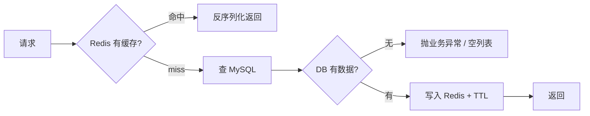

+++
date = '2026-07-19'
draft = false
title = '缓存'
tags = ['Redis', '缓存', 'Cache-Aside']
categories = ["Redis"]
aliases = ['Redis缓存', 'Cache-Aside', '旁路缓存']
+++

> 本文更新于 2026-07-19

# 缓存

- 临时存放热点数据，减少对 MySQL 的重复查询，加快读取
- **MySQL**：权威数据源，数据以库为准
- **Redis**：加速层，可以丢、可以过期，丢了再从 MySQL 查

相关：[[Redis基础]]（命令 / Jedis / SpringDataRedis）

```text
读：先 Redis → miss 再 MySQL → 回写 Redis
写：先改 MySQL → 再删对应缓存 key（写路径失效）
```



> [!tip] 分工一句话
> MySQL 存真相，Redis 做加速。缓存可以丢，不能当主库。

---

# Cache-Aside（旁路缓存）

业务自己管「查缓存 / 查库 / 回写 / 删缓存」，不靠 Redis 自动同步 MySQL。最常用。

## 读

```text
1. GET cache:user:{id}
2. 命中 → JSON 转对象 → 返回
3. miss → 查 MySQL
4. DB 无 → 抛业务异常（详情接口常见；列表可返回空）
5. DB 有 → 写入 Redis（建议带 TTL）→ 返回
```

**要点**

- 序列化对称：写 `JSONUtil.toJsonStr`，读 `toBean` / `toList`
- key 统一前缀，如 `cache:user:`，避免撞 key（见 [[Redis基础#Key的层级格式]]）
- 优先 `StringRedisTemplate` + 字符串 JSON，不要默认 JDK 序列化（乱码 `\xac\xed...`，见 [[Redis基础#RedisTemplate 与 StringRedisTemplate]]）

## 写路径失效

**写路径失效** = 增删改写完 DB 后，把相关缓存 key **删掉**。

- 不是立刻 set 新值，而是让缓存失效
- 下次读 miss，再从 DB 拉最新数据回写

**为什么删而不是改**

- 实现简单，只记要删哪些 key
- 读多写少时合适，不必每次写都维护缓存内容
- 避免「缓存字段不全」等问题

| 操作 | DB | 删哪些 key |
| --- | --- | --- |
| 增 create | INSERT | `cache:user:list`（单条可不写，等第一次读） |
| 改 update | UPDATE | `cache:user:{id}` + `cache:user:list` |
| 删 delete | DELETE | `cache:user:{id}` + `cache:user:list` |

```java
// update / delete 成功后
stringRedisTemplate.delete(CACHE_USER_KEY + id);
stringRedisTemplate.delete(CACHE_USER_KEY + "list");
```


> [!warning] 漏删
> 只删 `cache:user:1`、不删 `cache:user:list` → 列表仍可能读到旧数据（脏读）。

---

# TTL（Time To Live）

- **TTL** = 键的存活时间；到期 Redis **自动删除**该 key
- 命令侧：`EXPIRE` / `SETEX` / `SET key value EX sec`，查剩余：`TTL key`（见 [[Redis基础#通用]]）
- `-1` 永不过期；`-2` key 不存在

```java
// 方式一
stringRedisTemplate.opsForValue().set(key, json, 30, TimeUnit.MINUTES);

// 方式二
stringRedisTemplate.opsForValue().set(key, json, Duration.ofMinutes(30));
```

**为什么要设 TTL**

1. **兜底一致性**：写路径漏删时，脏数据最多活到过期
2. **省内存**：冷数据自动清
3. **配合主动删**：主动删负责「写完立刻失效」，TTL 负责「最坏也能恢复」

| 手段 | 作用 |
| --- | --- |
| 写路径删缓存 | 主动保证，写完马上失效 |
| TTL | 兜底；**不能代替**写后删缓存 |

> [!important] 练习约定
> `getById`、`list` 的 `set` 都带 TTL（如 30 分钟）。TTL 是保险，不是写后删的替代品。

---

# getById 示例

`StringRedisTemplate` + Hutool `JSONUtil`：

```java
private static final String CACHE_USER_KEY = "cache:user:";

@Override
public User getById(Long id) {
    String key = CACHE_USER_KEY + id;
    String userJson = stringRedisTemplate.opsForValue().get(key);
    if (userJson != null) {
        return JSONUtil.toBean(userJson, User.class);
    }
    User user = userMapper.selectById(id);
    if (user == null) {
        throw new BusinessException("用户不存在");
    }
    stringRedisTemplate.opsForValue().set(
            key, JSONUtil.toJsonStr(user), Duration.ofMinutes(30));
    return user;
}
```

---

# list 缓存

业务「用户列表」用 **String + 整表/整页 JSON**，不要默认用 `opsForList`。

| API | 实际存的是 | 适合 |
| --- | --- | --- |
| `opsForValue` + JSON | 一个字符串（整份列表） | 业务对象列表缓存 |
| `opsForList` | Redis List 结构 | 队列、时间线、push/pop（见 [[Redis基础#List类型]]） |

```text
key: cache:user:list
读：GET → JSONUtil.toList
miss：selectList → set(JSON, TTL)
写：create / update / delete 后 delete 该 key
```

```java
String key = CACHE_USER_KEY + "list";
String json = stringRedisTemplate.opsForValue().get(key);
if (json != null) {
    return JSONUtil.toList(json, User.class);
}
List<User> list = userMapper.selectList(null);
if (list == null || list.isEmpty()) {
    return List.of(); // 列表空一般不抛异常
}
stringRedisTemplate.opsForValue().set(
        key, JSONUtil.toJsonStr(list), Duration.ofMinutes(30));
return list;
```

> [!note] 规模
> 练习阶段可整表缓存；数据量大再考虑分页 key（如 `cache:user:list:page:1`），避免无脑全表。

---

# 缓存更新策略

缓存不会一直在，常见三种「消失」方式：

| 方式 | 含义 | 一致性 | 维护成本 | 场景 |
| --- | --- | --- | --- | --- |
| 超时剔除 | 设 TTL，到期自动删 | 中（过期前可能旧） | 低 | 通用兜底 |
| 主动更新/失效 | 写库后删或改缓存 | 高 | 中（要记清 key） | 增删改后 |
| 内存淘汰 | 内存满按策略踢 key | 弱 | 系统行为 | 防 OOM |

## 操作缓存和数据库时要考虑的三个问题

1. **删除缓存还是更新缓存？**
   - 更新缓存：每次改 DB 都改缓存 → 无效写多（有些 key 根本没人读）
   - 删除缓存：写 DB 后让缓存失效，**下次查询时再回写** → 更常见
2. **如何保证缓存与数据库「同时成功或失败」？**
   - 单体：可把 DB 操作和删缓存放同一事务思路里（删缓存失败要可重试/可兜底）
   - 分布式：TCC 等分布式事务（练习阶段不必上）
3. **先操作缓存还是先操作数据库？**
   - 方案 A：先删缓存，再写 DB
   - 方案 B：先写 DB，再删缓存
   - 两者并发下都可能短暂不一致，**A 出问题概率通常更大**
   - 练习/常见实践：**先写 DB，再删缓存**

![[Redis缓存-1.png]]

## 最佳实践

| 一致性要求 | 做法 |
| --- | --- |
| 低 | 主要靠 Redis 内存淘汰 + TTL |
| 高 | **主动失效（写后删）** + TTL 超时剔除兜底 |

**读操作**

```text
缓存命中 → 直接返回
缓存未命中 → 查 DB → 写入缓存并设超时时间
```

**写操作**

```text
先写数据库 → 再删除缓存
尽量保证 DB 与删缓存的原子性（失败可重试；TTL 兜底）
```

> [!success] 练习主用
> **主动失效 + TTL 兜底**；写路径：先 DB 后 delete key。

---
# 缓存穿透

是指客户端请求的数据在**缓存中和数据库中都不存在**，缓存起不到拦截作用，请求会打到数据库。

**原因：**

- 业务上本来就没有的 id（误传、脏链接）
- 恶意扫描不存在的 id，绕过缓存直打 DB
- 未做参数校验，非法 id 也会查库

**解决方案：**

- 缓存空对象（null / `""`），短 TTL
- 布隆过滤：不存在的 id 直接拦截，不进 DB
- 增强 id 复杂度，避免被连续猜测
- 做好数据基础格式校验（类型、范围）
- 热点参数 / 异常流量限流

## 缓存空对象

| | `""`（空字符串） | `null`（get 结果） |
| --- | --- | --- |
| Redis | key **存在**，value 为空串 | key **不存在**（或已过期） |
| 业务含义 | 查过 DB，确认不存在（防穿透） | 未命中：没查过 / 已过期 |
| 是否查库 | 否 | 是 |

![[Redis缓存-2.png]]

> [!note] 读流程
> - `isNotBlank` 为 true → 正常 JSON → `toBean`
> - `isNotBlank` 为 false 且 `!= null` → `""` / `" "` → 空对象 → 抛异常，**不查库**
> - 两个都不进 → `null` → miss → **才查 DB**

```java
public User getById(Long id) {
    String key = CACHE_USER_PREFIX + id;
    String userJson = stringRedisTemplate.opsForValue().get(key);

    // 等价于 userJson != null && !userJson.isBlank()
    if (StrUtil.isNotBlank(userJson)) {
        // 真正有值才返回
        return JSONUtil.toBean(userJson, User.class);
    }
    if (userJson != null) {
        // 空对象：有 key、值为 blank
        throw new BusinessException("用户不存在");
    }
    // miss：仅 null 时查库
    User user = userMapper.selectById(id);
    if (user == null) {
        // 空对象 TTL 要短
        stringRedisTemplate.opsForValue().set(key, "", Duration.ofMinutes(2));
        throw new BusinessException("用户不存在");
    }
    stringRedisTemplate.opsForValue().set(key, JSONUtil.toJsonStr(user), CACHE_USER_TTL);
    return user;
}
```

> [!warning] 注意
> 空对象必须用 `""`（或 blank）才能和上面的 `isNotBlank` + `!= null` 配套；若标记写成 `"null"`，`isNotBlank` 为 true，会误进 `toBean`。

## 布隆过滤

用位图 + 多个哈希函数，判断「某个 id **一定不存在** / **可能存在**」：

- 判定**不存在** → 直接拒绝，不查缓存、不查库（防穿透主力之一）
- 判定**可能存在** → 再走正常 Cache-Aside（仍可能误判存在，但不会误杀「一定不存在」）

优点：省内存、拦截无效 id 能力强。  
缺点：有误判（假阳性）；元素删除麻烦；要提前把合法 id 灌进过滤器。

练习阶段优先掌握**缓存空对象**；布隆多在海量非法 id 扫描时上。

---

# 缓存雪崩

在同一时段大量缓存 key **同时失效**，或 Redis 宕机，导致大量请求直打数据库，压力骤增。

**解决方案：**

- 给不同 key 的 TTL 加随机值，避免同一时刻批量过期
- Redis 集群 / 主从，提高可用性
- 降级、限流，保护 DB
- 多级缓存（本地 + Redis）

---

# 缓存击穿

也叫**热点 key 问题**：一个被高并发访问、重建成本高的 key 突然失效，大量请求同时打到 DB。

**和穿透 / 雪崩的区别（一句话）**

| 问题 | 关键 |
| --- | --- |
| 穿透 | 查**根本不存在**的数据，缓存拦不住 |
| 击穿 | **热点 key** 刚好过期，并发全打 DB |
| 雪崩 | **大批 key** 同时过期，或 Redis 挂了 |

**解决方案：**

- **互斥锁**：只有拿到锁的线程查库并回写；其它线程 sleep 后重试
- **逻辑过期**：key 不设 Redis TTL，value 里带逻辑过期时间；过期后异步重建，请求可先返回旧数据

![[Redis缓存-4.png]]

| | 互斥锁 | 逻辑过期 |
| --- | --- | --- |
| 优点 | 无额外内存；一致性较好；实现相对简单 | 线程无需干等，吞吐更好 |
| 缺点 | 等待影响性能；实现不当可能死锁 / 误删锁 | 额外内存；实现复杂；短暂不一致 |
| 一致性 | 较强（重建完成前别人等或重试） | 较弱（过期窗口可能返回旧数据） |

> [!tip] 练习选型
> 热点 + 想讲清一致性 → **互斥锁**。要极致吞吐、可接受短暂旧数据 → 逻辑过期。生产锁优先考虑 Redisson，手写用来练原理。

## 互斥锁

```text
1. 查缓存（含空对象判断，同穿透）
2. miss → tryLock(lock:user:{id})
3. 失败 → sleep 一小会 → 递归/重试本方法
4. 成功 → 双重检查缓存（别人可能已重建）
5. 仍 miss → 查 DB → 回写缓存（有数据 / 空对象）
6. finally：仅自己持锁时 unlock
```

![[Redis缓存-5.png]]

```java
public User queryWithMutex(Long id) {
    String key = CACHE_USER_PREFIX + id;
    String userJson = stringRedisTemplate.opsForValue().get(key);
    if (StrUtil.isNotBlank(userJson)) {
        return JSONUtil.toBean(userJson, User.class);
    }
    if (userJson != null) {
        throw new BusinessException("用户不存在");
    }

    // 缓存重建：互斥锁
    String lockKey = "lock:user:" + id;
    User user = null;
    boolean isLock = tryLock(lockKey);
    try {
        if (!isLock) {
            Thread.sleep(50);
            return queryWithMutex(id); // 重试互斥，不要改成 PassThrough
        }
        // 双重检查：拿到锁后再看一次缓存
        userJson = stringRedisTemplate.opsForValue().get(key);
        if (StrUtil.isNotBlank(userJson)) {
            return JSONUtil.toBean(userJson, User.class);
        }
        if (userJson != null) {
            throw new BusinessException("用户不存在");
        }

        user = userMapper.selectById(id); // 注意：参数是 id，不是 key
        if (user == null) {
            stringRedisTemplate.opsForValue().set(key, "", CACHE_NULL_KEY); // 空对象，防穿透
            throw new BusinessException("用户不存在");
        }
        stringRedisTemplate.opsForValue().set(key, JSONUtil.toJsonStr(user), CACHE_USER_TTL);
    } catch (InterruptedException e) {
        Thread.currentThread().interrupt(); // 恢复中断标志
        throw new RuntimeException(e);
    } finally {
        // 只有自己抢到锁才删，否则会误删别人的锁
        if (isLock) {
            unlock(lockKey);
        }
    }
    return user;
}

private boolean tryLock(String key) {
    // SET NX + 过期，避免死锁
    Boolean flag = stringRedisTemplate.opsForValue()
            .setIfAbsent(key, "1", Duration.ofSeconds(10));
    return BooleanUtil.isTrue(flag); // 防 NPE：Boolean 可能为 null
}

private void unlock(String key) {
    stringRedisTemplate.delete(key);
}
```

**易错点**

| 坑 | 正确做法 |
| --- | --- |
| 抢锁失败后 `return queryWithPassThrough` | 应 `return queryWithMutex`，否则不再互斥 |
| `finally` 里无条件 `unlock` | 必须 `if (isLock) unlock`，否则误删别人的锁 |
| `selectById(key)` | 必须 `selectById(id)` |
| DB 无数据不写空对象 | 互斥路径也要 `set("", 短 TTL)` |
| 锁 key 写成 `look:` | 统一 `lock:user:{id}` |

### `Thread.currentThread().interrupt()`

`sleep` / `wait` 等被中断时会：

1. **抛出 `InterruptedException`**
2. **清掉中断标志**（`true` → `false`）

若 catch 后只包成 `RuntimeException` 抛出，上层就不知道「这个线程曾被要求停止」。

```java
} catch (InterruptedException e) {
    Thread.currentThread().interrupt(); // 把中断标志补回 true
    throw new RuntimeException(e);
}
```

> [!note] 记一句
> catch 了 `InterruptedException` → 先 `interrupt()` 恢复标志，再抛或返回。练习代码不写多数接口也能跑；线程池 / 可取消任务里是规范写法。


---

## 逻辑过期

```Java
public User queryWithLogicalExpire(Long id) throws InterruptedException {  
    String key = CACHE_USER_PREFIX + id;  
    Thread.sleep(200);  
    //从Redis查询缓存  
    String userJson = stringRedisTemplate.opsForValue().get(key);  
    if(StrUtil.isBlank(userJson)) {  
        throw new BusinessException("用户不存在");  
    }  
    //命中，判断是否过期  
    RedisData redisData = JSONUtil.toBean(userJson, RedisData.class);  
    User user = JSONUtil.toBean((JSONObject) redisData.getData(), User.class);  
    LocalDateTime expireTime = redisData.getExpireTime();  
  
    if(expireTime.isAfter(LocalDateTime.now())){  
        //未过期，返回用户  
        return user;  
    }  
    //已过期，缓存重建  
    //1 获取互斥锁  
    String lockKey = LOCK_USER_KEY + id;  
    boolean isLock = tryLock(lockKey);  
    //2 判断是否获取成功  
    if(isLock){  
        //3 成功，开启独立线程，实现缓存重建  
        //DoubleCheck 缓存未过期就不要重建缓存  
        String lastestJson = stringRedisTemplate.opsForValue().get(key);  
        if(StrUtil.isNotBlank(lastestJson)){  
            redisData = JSONUtil.toBean(lastestJson, RedisData.class);  
            if(redisData.getExpireTime() != null && redisData.getExpireTime().isAfter(LocalDateTime.now())) {  
                //提前return需要解锁  
                unlock(lockKey);  
                return JSONUtil.toBean((JSONObject) redisData.getData(), User.class);  
            }  
        }  
        //过期，重建  
        CACHE_REBUILD_EXECUTOR.submit(()->{  
            try {  
                this.saveUserToRedis(id, 20L);  
            } catch (Exception e) {  
                throw new RuntimeException(e);  
            } finally {  
                unlock(lockKey);  
            }  
        });  
    }  
    //4 返回用户信息  
    return user;  
}
```
---
