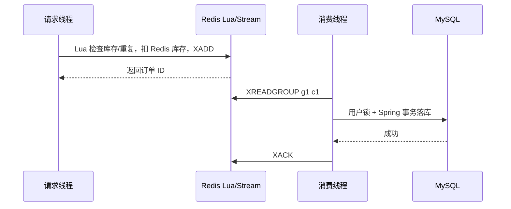

+++
date = '2026-08-12'
draft = false
title = '分布式锁'
tags = ['Redis', '分布式锁', 'Lua', 'Redisson']
categories = ['Redis']
aliases = ['Redis分布式锁', 'Lua脚本', '原子解锁']
+++

> 本文用于复习 Redis 分布式锁，并结合当前 HM DianPing 秒杀下单代码说明。

相关笔记：[[Redis基础]]、[[Redis缓存]]、[[消息队列]]

# 先记结论

分布式锁用来让多个进程在同一时间段内串行访问共享资源，例如库存扣减、缓存重建和同一用户下单。它只负责“谁可以进入临界区”，不等于数据库事务，也不能替代幂等校验。

一个可用的 Redis 锁至少要满足：

1. 锁的 key 能代表同一份资源。
2. value 使用唯一 owner，不能写死为 `1`。
3. 加锁必须是原子操作：`SET key value NX EX seconds`。
4. 解锁必须原子地完成“校验 owner + 删除”。
5. 必须有 TTL 作为兜底，进程崩溃后锁最终会释放。

## 为什么需要分布式锁

Java 的 `synchronized` 和 `ReentrantLock` 只在一个 JVM 内有效。应用部署成多个实例后，不同实例之间看不到彼此的线程锁，因此需要一个所有实例都能访问的协调位置。

| 方案 | 适用范围 | 说明 |
| --- | --- | --- |
| `synchronized` / `ReentrantLock` | 单个 JVM | 简单，但不能跨实例 |
| MySQL 行锁 | 数据库事务 | 一致性较强，但会占用数据库连接和锁资源 |
| Redis 锁 | 短临界区、高并发 | 性能好，需要正确处理 owner、TTL 和故障 |
| ZooKeeper | 强协调场景 | 一致性和运维成本都更高 |

## 手写 Redis 锁

### 加锁

```redis
SET lock:order:1 <uuid> NX EX 10
```

`NX` 表示 key 不存在时才设置，`EX 10` 表示 10 秒后自动过期。`SETNX` 本身没有 TTL，不能把 `SETNX` 和 `EXPIRE` 分成两条命令，否则进程可能在两条命令之间崩溃，留下永久锁。

Java 中的简化写法：

```java
String owner = uuid + "-" + Thread.currentThread().threadId();
Boolean acquired = stringRedisTemplate.opsForValue()
        .setIfAbsent("dp:lock:" + name, owner, Duration.ofSeconds(10));
```

### 为什么不能直接 `DEL`

下面的流程会误删别人的锁：

```text
线程 A 读到自己的锁
线程 A 暂停，锁 TTL 到期
线程 B 获得同一个 key
线程 A 恢复并直接 DEL
线程 B 的锁被删除
```

### Lua 原子解锁

当前项目的 `SimpleRedisLock` 用 Redis String 保存 owner，所以解锁脚本也必须按 String 处理：

```lua
-- KEYS[1] = 锁 key，ARGV[1] = 加锁时写入的 owner
if redis.call('get', KEYS[1]) == ARGV[1] then
    return redis.call('del', KEYS[1])
end
return 0
```

脚本在 Redis 的单线程命令执行模型中一次执行，期间不会插入其他客户端命令。返回 `1` 表示删除了自己的锁，返回 `0` 表示 owner 不匹配或 key 已不存在。

> [!danger] String 锁和 Hash 锁不能混用
> `SimpleRedisLock` 写入的是 String；如果用 `HEXISTS`、`HINCRBY` 解锁，会得到 `WRONGTYPE`。当前 `src/main/resources/lua/unlock.lua` 已改成 String 版本。下面的 Hash 脚本只用于理解 Redisson，不能拿来解手写锁。

### 手写锁的边界

手写锁适合学习 `NX`、TTL 和 Lua 原子解锁。它默认不可重入，也不会自动等待；如果业务执行时间超过 TTL，锁可能提前释放。严格业务代码通常使用 Redisson 或者自己实现续期、重试和故障处理。

## Redisson 可重入锁

Redisson 的 `RLock` 会把锁保存成 Redis Hash：

```text
key   = lock:order:100
field = 客户端 UUID + 线程 ID
value = 重入次数
```

第一次加锁时写入 Hash 并设置过期时间；同一线程再次加锁时只增加重入次数。解锁时次数减一，减到零才删除整个 key。这样同一线程可以嵌套调用持有同一把锁的代码。

简化的获取逻辑如下：

```lua
if redis.call('exists', KEYS[1]) == 0 then
    redis.call('hset', KEYS[1], ARGV[1], 1)
    redis.call('pexpire', KEYS[1], ARGV[2])
    return 1
end
if redis.call('hexists', KEYS[1], ARGV[1]) == 1 then
    redis.call('hincrby', KEYS[1], ARGV[1], 1)
    redis.call('pexpire', KEYS[1], ARGV[2])
    return 1
end
return 0
```

真实 Redisson 还会用 Pub/Sub 通知等待者，并处理锁状态和续期。

### 等待、重试和 watchdog

`tryLock(waitTime, unit)` 中的参数是“最多等待多久拿锁”，不是锁的持有时间。当前订单代码使用：

```java
RLock lock = redissonClient.getLock("lock:order:" + userId);
boolean acquired = false;
try {
    // 课程项目立即尝试拿锁；不指定 leaseTime，启用 watchdog
    acquired = lock.tryLock();
    if (!acquired) {
        throw new IllegalStateException("获取订单锁失败");
    }
    proxy.createVoucherOrder(voucherOrder);
} finally {
    if (acquired && lock.isHeldByCurrentThread()) {
        lock.unlock();
    }
}
```

调用 `tryLock()` 或只传等待时间时，Redisson 会用 watchdog 定期续期，默认租约大约 30 秒。进程崩溃后续期停止，TTL 到期锁会释放。`tryLock(5, TimeUnit.SECONDS)` 表示最多等 5 秒，适合确实需要短暂等待的场景。

如果写成 `tryLock(5, 30, TimeUnit.SECONDS)`，第三个参数是固定 leaseTime，30 秒后不会自动续期，业务必须保证在租约内完成。拿不到锁时应返回、抛出异常让消息重试，或进入明确的排队流程；不要写没有上限的忙等循环。

### 锁的公平性和主从风险

Redisson 可以提供公平锁，但需要维护等待队列，会增加开销。Redis 主从复制存在延迟，故障切换时可能出现锁状态丢失或短暂不一致；单机 Redis 适合学习和小型实习项目，不能把多个单实例客户端称为 Redis 集群。

## MultiLock

`RMultiLock` 可以把多把 `RLock` 组合起来，只有满足组合条件才认为获得锁：

```java
RLock lock1 = client6379.getLock("lock:order:1");
RLock lock2 = client6380.getLock("lock:order:1");
RLock multiLock = redisson.getMultiLock(lock1, lock2);
try {
    if (multiLock.tryLock(5, TimeUnit.SECONDS)) {
        // 临界区
    }
} finally {
    if (multiLock.isHeldByCurrentThread()) {
        multiLock.unlock();
    }
}
```

当前项目的 `RedisConfig` 保留 6379、6380、6381 三个客户端用于课程演示，但订单服务实际只注入名为 `redissonClient` 的 6379 客户端，没有使用 `getMultiLock`。MultiLock 不是强一致数据库锁，也不必为了这个实习项目强行引入。

## 当前项目的订单锁

秒杀请求先由 Lua 完成 Redis 库存扣减、用户去重和写入 `stream.orders`。消费者拿到消息后，以用户 ID 为 key 加锁：

```text
lock:order:{userId}
```

按用户加锁的目的是串行化同一个用户的“查重 + 扣数据库库存 + 保存订单”。锁不能替代：

- `@Transactional` 事务；
- 数据库 `stock > 0` 条件更新；
- `(user_id, voucher_id)` 唯一索引；
- 对重复消息的幂等查询。

消息重复投递是正常的至少一次语义。数据库里已有订单时直接返回，消费者随后 ACK；业务异常时不 ACK，让消息保留在 Pending List。

## 和消息队列的关系

当前订单流程完整链路见 [[消息队列#本项目：Redis Stream 异步秒杀下单]]：



## 易错检查清单

- 加锁不要写成 `SETNX` 后再单独 `EXPIRE`。
- owner 必须包含实例/线程信息，不能固定为 `1`。
- String 锁只能用 `GET + DEL` Lua 解锁，不能套 Hash 脚本。
- `finally` 中只在当前线程确实持有锁时 `unlock()`。
- 不要把等待时间和固定租约时间混淆。
- 锁只保护临界区，事务和数据库唯一索引仍然必须存在。
- Stream 消息要在数据库事务成功后 ACK。
