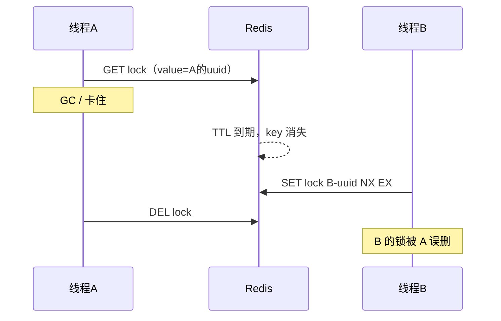
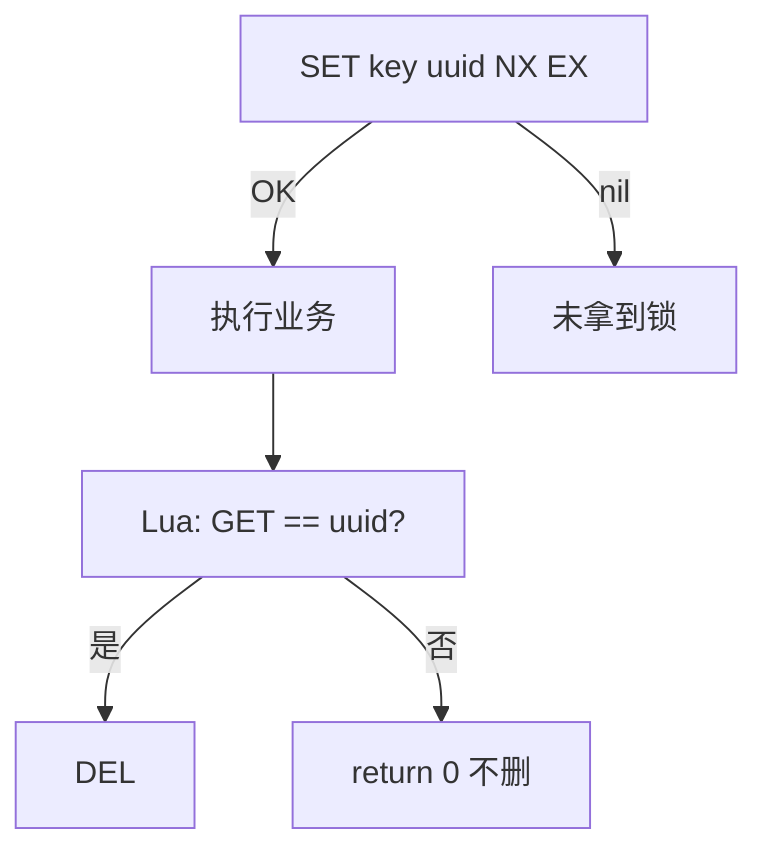

+++
date = '2026-07-23'
draft = false
title = '分布式锁'
tags = ['Redis', '分布式锁', 'Lua']
categories = ["Redis"]
aliases = ['Redis分布式锁', 'Lua脚本', '原子解锁']
+++

> 本文更新于 2026-07-23

相关：[[Redis基础]]（`SET NX EX`） · [[Redis缓存]]（互斥重建时的手写锁）


# 悲观锁
# 乐观锁
- 不加锁，在更新时判断是否有其他线程修改
## CAS 法
## 一人一单
synchronized
无法解决分布式情况下的并发


---

---

# 为什么要分布式锁
|         | **MySQL**       | **Redis**      | **Zookeeper**    |
| ------- | --------------- | -------------- | ---------------- |
| **互斥**  | 利用mysql本身的互斥锁机制 | 利用setnx这样的互斥命令 | 利用节点的唯一性和有序性实现互斥 |
| **高可用** | 好               | 好              | 好                |
| **高性能** | 一般              | 好              | 一般               |
| **安全性** | 断开连接，自动释放锁      | 利用锁超时时间，到期释放   | 临时节点，断开连接自动释放    |

多实例 / 多线程抢同一资源（下单、扣库存、缓存重建）时，JVM 的 `synchronized` / `ReentrantLock` **只在单机有效**。

跨进程要靠中间件：Redis 用 **「占坑」** 做锁：

```bash
# 加锁：不存在才设置，并带过期，防死锁
	SET lock:order:1 <uuid> NX EX 10
# 返回 OK → 拿到锁；返回 nil → 没拿到
```

| 步骤 | 命令 / 动作 | 作用 |
| --- | --- | --- |
| 加锁 | `SET key uuid NX EX seconds` | 原子：占坑 + 过期 |
| 业务 | 执行临界区 | — |
| 解锁 | 见下文 | **必须先判断是自己的锁再删** |

相关常量练习里常见：`lock:user:{id}`，TTL 如 10 秒（见 redis-demo 的 `tryLock`）。

---


---

# 原子性问题

手写解锁如果分两步：

```text
1. GET lock:user:1          → 拿到 value
2. 判断 value == 我的 uuid
3. DEL lock:user:1          → 删除
```

问题：1～3 **不是原子**。中间可能：

1. 你的锁 **TTL 到期被 Redis 删掉**
2. 别人 `SET NX` 拿到了同一把锁
3. 你的线程从阻塞里回来，执行 `DEL` → **误删别人的锁**

常见触发：**GC 停顿**、网络抖动、线程调度，都可能把「判断」和「删除」拉开。

![[分布式锁-1.png]]

> [!danger] 核心
> 要保证 **「判断锁是否是自己」和「释放锁」一起执行**（原子），不能拆成两次 Redis 往返。

`SET NX EX` 加锁本身是原子的；**危险在解锁**。



---

# Lua 脚本

Redis 执行 Lua 时 **单线程、整段脚本原子执行**：脚本跑完前不会插入别的客户端命令。  
所以用 Lua 把「比对 uuid + DEL」绑在一起，解决误删。

## 在脚本里调 Redis

```lua
-- 写
redis.call('set', 'name', 'Lee')

-- 读（返回值给脚本用）
local v = redis.call('get', 'name')

-- 删
redis.call('del', 'name')
```

| API | 失败时 | 练习建议 |
| --- | --- | --- |
| `redis.call(...)` | 抛错，脚本中止 | 解锁逻辑常用 |
| `redis.pcall(...)` | 返回错误对象，不中止 | 需要自己判断错误时用 |

## 客户端怎么跑

```bash
# EVAL 脚本  key个数  key1 key2 ...  arg1 arg2 ...
EVAL "return redis.call('get', KEYS[1])" 1 name

# 解锁经典脚本（见下）
EVAL "if redis.call('get', KEYS[1]) == ARGV[1] then return redis.call('del', KEYS[1]) else return 0 end" 1 lock:user:1 <uuid>
```

| 位置 | 含义 |
| --- | --- |
| `KEYS[1]`、`KEYS[2]`… | 脚本里用到的 **key**（Redis 集群按 key 路由） |
| `ARGV[1]`、`ARGV[2]`… | 普通参数（如 uuid、过期秒数） |
| 第一个数字 | **key 的个数**（后面先列满 KEYS，再列 ARGV） |

> [!tip] KEYS vs ARGV
> key 必须放 `KEYS[]`，值 / uuid 放 `ARGV[]`。集群模式下 key 决定脚本发到哪个节点。

## 原子解锁（最常用）

```lua
-- KEYS[1] = 锁的 key
-- ARGV[1] = 加锁时写入的 uuid
if redis.call('get', KEYS[1]) == ARGV[1] then
    return redis.call('del', KEYS[1])
else
    return 0
end
```

| 返回 | 含义 |
| --- | --- |
| `1` | 是自己的锁，已删除 |
| `0` | 不是自己的锁 / key 已不存在，**不删** |

对应 Java（`StringRedisTemplate`）示意：

```java
private static final String UNLOCK_LUA =
    "if redis.call('get', KEYS[1]) == ARGV[1] then " +
    "return redis.call('del', KEYS[1]) else return 0 end";

public void unlock(String key, String uuid) {
    stringRedisTemplate.execute(
        new DefaultRedisScript<>(UNLOCK_LUA, Long.class),
        Collections.singletonList(key),
        uuid
    );
}
```

加锁时 value 必须用 **唯一标识**（UUID），不能写死 `"1"`，否则无法区分是谁的锁：

```java
// 加锁
String uuid = UUID.randomUUID().toString();
Boolean ok = stringRedisTemplate.opsForValue()
    .setIfAbsent(lockKey, uuid, Duration.ofSeconds(10));
// 解锁必须带同一个 uuid 进 Lua
```

> [!warning] 和练习代码的差别
> redis-demo 早期 `tryLock` 写的是 `setIfAbsent(key, "1", 10s)`，`unlock` 直接 `delete(key)`。  
> **单机学习互斥重建可以**；要严格防误删，应改成 **uuid + Lua 解锁**。

## 原子加锁（可选）

`SET key uuid NX EX sec` 一条命令已经原子，一般 **不必** 再包 Lua。  
若逻辑更复杂（校验 + 续期 + 可重入）再用脚本或 **Redisson**。

## 小例子（熟悉语法）

```bash
# 设置并返回 OK
EVAL "return redis.call('set', KEYS[1], ARGV[1])" 1 name Lee

# 比较后删除（模拟解锁）
SET lock:demo abc EX 30
EVAL "if redis.call('get', KEYS[1]) == ARGV[1] then return redis.call('del', KEYS[1]) else return 0 end" 1 lock:demo abc
# → 1

EVAL "if redis.call('get', KEYS[1]) == ARGV[1] then return redis.call('del', KEYS[1]) else return 0 end" 1 lock:demo other
# → 0（uuid 不对，不删）
```

## EVALSHA（可选）

```bash
SCRIPT LOAD "return redis.call('get', KEYS[1])"   # 返回 sha1
EVALSHA <sha1> 1 name                             # 按摘要执行，省网络传脚本
```

脚本变了要重新 `LOAD`；节点重启后缓存的脚本会丢，客户端通常 **EVALSHA 失败再回退 EVAL**。

---

# 手写锁完整路径（对照）

```text
加锁：SET lock:user:{id} {uuid} NX EX 10
  成功 → 做业务（查库、重建缓存…）
  失败 → 重试 / 返回 / 阻塞一会再试

解锁：EVAL 比对 uuid + DEL
  只删自己的；别人的不动
```



---

# 和 Redisson 的关系

| | 手写 SET + Lua | Redisson |
| --- | --- | --- |
| 学习 | 看清加锁 / 误删 / 原子解锁 | 生产开箱 |
| 可重入 | 要自己设计 | 支持 |
| 看门狗续期 | 要自己做 | 默认续期 |
| 推荐 | 练习、面试讲原理 | 业务项目 |

练习阶段：**先手写 SET NX + Lua 解锁**，再学 Redisson，原理才接得上。

---

# 易错点

1. 解锁只 `DEL`、不比对 uuid → 误删别人的锁  
2. value 写死 `"1"` → 无法证明「是我的锁」  
3. 锁过期时间 < 业务执行时间 → 业务没完锁先没，别人进入；过长则持有者宕机恢复慢  
4. 把业务 SQL 写进 Lua → 脚本应只碰 Redis，业务仍在 Java  
5. `KEYS *` 式思维：Lua 里也不要扫全库，只操作传入的 `KEYS[i]`  
6. 缓存互斥重建的锁（`lock:user:{id}`）和解业务单的锁，**key 别混**

> [!success] 记住三句
> 1. 加锁：`SET key uuid NX EX sec`  
> 2. 解锁：Lua 里 `get == uuid` 再 `del`  
> 3. Lua 在 Redis 内原子执行，用来粘「判断 + 删除」
