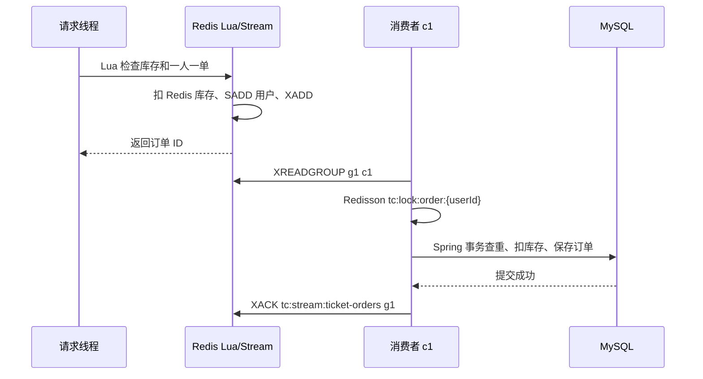
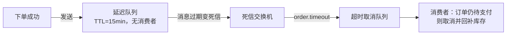

+++
date = '2026-08-16'
draft = false
title = '消息队列'
tags = ['Redis', '消息队列', 'Redis Stream', '异步秒杀', 'RabbitMQ', 'SpringAMQP', 'Feed流']
categories = ['Redis']
aliases = ['Redis消息队列', 'Stream异步秒杀', 'RabbitMQ笔记']
+++

> 本文用于复习消息队列：Redis Stream 异步秒杀、Feed 流滚动分页、RabbitMQ 与 Spring AMQP，结合 ticket-center 项目代码说明。

相关笔记：[[Redis基础]]、[[分布式锁]]

# 消息队列

消息队列（Message Queue，MQ）把生产者和消费者解耦：

- 生产者：先把消息写入队列
- 消费者：稍后读取并处理

常见用途：异步执行、削峰填谷、故障重试。

```text
Producer -> Queue/Stream -> Consumer -> 业务数据库
```

两条重要认知：

1. Redis Stream 是**至少一次投递**——消费者可能因超时或重试，再次处理同一条消息，所以业务必须幂等
2. Redis Lua 只能保证 **Redis 内部命令**的原子性，不能把 Redis 和 MySQL 变成一个跨系统事务

## Redis 实现 MQ 的三种结构

| 结构 | 持久化/回溯 | ACK 和消费者组 | 适用场景 |
| --- | --- | --- | --- |
| List | 有限回溯；`BRPOP` 取出即删除 | 没有原生 ACK/消费组 | 简单、允许丢消息的异步任务 |
| Pub/Sub | 不保存历史；订阅前或断线期间消息会丢 | 没有 ACK/消费组 | 实时广播通知 |
| Stream | 有 ID，可回溯；受 Redis RDB/AOF 配置影响 | 支持消费组、ACK、Pending | 可靠异步任务和秒杀下单 |

### List

```redis
LPUSH queue.orders {"id":1001}
BRPOP queue.orders 0
```

`BRPOP` 阻塞等待消息，但消息一旦取出就从 List 删除。

消费者在处理数据库前崩溃，消息通常无法恢复 —— 不适合需要可靠投递的订单。

### Pub/Sub

```redis
SUBSCRIBE activity.updated
PUBLISH activity.updated "activity-1001"
```

实时广播：一条消息发给**当时在线**的所有订阅者。

两个缺陷：

- Redis 不为离线订阅者保存消息
- 没有消费确认机制

### Stream

Stream 是带 ID 的追加日志。每条 entry 由多个 field/value 组成：

```redis
XADD tc:stream:ticket-orders * ticketId 1 userId 101 id 10001
```

Redis 返回类似 `1720000000000-0` 的 entry ID。

> [!warning] entry 和 Pending 是两回事
> `XACK` 只把消息从消费组的 PEL（Pending Entries List）移除，**不会删除 Stream entry**。
>
> 清理消息要另用 `XDEL` 或 `XTRIM`。

## Stream 核心概念

- **Stream**：消息日志，例如项目中的 `tc:stream:ticket-orders`。
- **Entry ID**：`毫秒时间戳-序号`，用于定位和回溯消息。
- **消费组（Consumer Group）**：组内多个消费者分流消息，同一条消息不会被组内正常消费者重复领取。
- **消费者（Consumer）**：组内的一个逻辑消费端，需要使用稳定且唯一的名称。
- **last-delivered-id**：消费组记录的投递位置。
- **PEL**：消息已经投递但尚未 ACK 的列表，记录所属消费者和空闲时间。

消费者组的三个关键点：

1. **消息分流**：组内消费者各自处理不同消息，提升吞吐。
2. **位置记录**：组保存投递位置，消费者重启后可以继续读取。
3. **确认机制**：处理成功后 `XACK`，失败消息留在 PEL 中等待重试。

## 常用命令

### 消息读写

```shell
XADD tc:stream:ticket-orders * ticketId 1 userId 101 id 10001
XRANGE tc:stream:ticket-orders - + COUNT 10   # 按范围查
XLEN tc:stream:ticket-orders                  # 长度
```

### 消费组

```shell
# 0 表示从历史消息开始；MKSTREAM：队列不存在时自动创建
XGROUP CREATE tc:stream:ticket-orders g1 0 MKSTREAM
XINFO GROUPS tc:stream:ticket-orders          # 查看消费组
XINFO CONSUMERS tc:stream:ticket-orders g1    # 查看组内消费者
```

### 读取

```shell
# 普通读取
XREAD COUNT 1 STREAMS tc:stream:ticket-orders 0

# 消费组读取新消息；> 表示"从未投递给任何消费者"的消息
XREADGROUP GROUP g1 c1 COUNT 1 BLOCK 2000 STREAMS tc:stream:ticket-orders >
```

`BLOCK` 的单位是毫秒；读自己消费者的 Pending，把 `>` 换成 `0`。

### 确认与接管

```shell
# 处理成功后确认
XACK tc:stream:ticket-orders g1 1720000000000-0

# 查看 Pending
XPENDING tc:stream:ticket-orders g1
XPENDING tc:stream:ticket-orders g1 - + 10

# 接管空闲超过 30s 的消息
XCLAIM tc:stream:ticket-orders g1 c2 30000 1720000000000-0
```

### 清理

```shell
# 控制日志长度；不要误删仍需要恢复的未 ACK 消息
XTRIM tc:stream:ticket-orders MAXLEN ~ 10000
```

## demo项目：Redis Stream 异步秒杀下单

当前项目保留课程式的单线程消费者结构：



### 1. 请求线程执行 Lua

`src/main/resources/lua/seckill.lua` 接收三个 `ARGV`：`ticketId`、`userId`、`orderId`，一次完成：

1. 读取 `tc:ticket:stock:{ticketId}`，库存不存在或小于等于 0 返回 `1`。
2. 检查 `tc:ticket:order:{ticketId}` 是否已经包含用户，重复下单返回 `2`。
3. `INCRBY stockKey -1` 扣减 Redis 库存。
4. `SADD orderKey userId` 记录用户。
5. `XADD tc:stream:ticket-orders * ticketId userId id` 写入订单消息。

返回 `0` 后，请求线程立即把订单 ID 返回给前端，不等待 MySQL 落库。

### 2. 应用启动创建消费组

`TicketOrderServiceImpl` 在 `@PostConstruct` 中执行：

```java
stringRedisTemplate.execute((RedisCallback<String>) connection -> connection.xGroupCreate(
        "tc:stream:ticket-orders".getBytes(StandardCharsets.UTF_8),
        "g1",
        ReadOffset.from("0"),
        true // MKSTREAM：队列不存在时创建
));
```

重复启动时 Redis 会返回 `BUSYGROUP`，代码把它当作正常情况忽略，避免应用因为消费组已存在而启动失败。

### 3. 消费 Pending 和新消息

消费者名称是 `c1`。

每次循环分两步：

1. `ReadOffset.from("0")`：读 **c1 自己**的 Pending（失败重试）
2. `ReadOffset.lastConsumed()`：读新消息（`>`）

```java
List<MapRecord<String, Object, Object>> records =
        stringRedisTemplate.opsForStream().read(
                Consumer.from("g1", "c1"),
                StreamReadOptions.empty().count(1).block(Duration.ofSeconds(2)),
                StreamOffset.create("tc:stream:ticket-orders", ReadOffset.lastConsumed())
        );
```

当前项目**没有实现跨消费者接管**（`XPENDING` / `XCLAIM`）。

生产环境需要补两件事：

- 按空闲时间扫描 PEL，`XCLAIM` 接管后重试——实例宕机后消息不卡死
- 多实例部署时，每个实例使用唯一的 consumerName

### 4. 加锁并通过事务代理落库

消费者按**用户**加 Redisson 锁，再通过 Spring 代理调用事务方法（直接 `this.` 调用会让 `@Transactional` 失效）：

```java
RLock lock = redissonClient.getLock("tc:lock:order:" + userId);
boolean acquired = lock.tryLock();
try {
    if (!acquired) {
        throw new IllegalStateException("获取订单锁失败");
    }
    proxy.createTicketOrder(ticketOrder);
} finally {
    if (acquired && lock.isHeldByCurrentThread()) {
        lock.unlock();
    }
}
```

事务方法三步：

1. 查询 `(user_id, ticket_id)` 是否已有订单
2. 用 `stock > 0` 条件更新，扣数据库库存
3. 保存订单

数据库表的 `(user_id, ticket_id)` 唯一索引，是并发和重复消息下的最终幂等兜底。

### 5. ACK 时机

```java
// createTicketOrder 成功提交后才执行
stringRedisTemplate.opsForStream().acknowledge(
        "tc:stream:ticket-orders", "g1", record.getId());
```

事务、锁或保存订单抛异常时，`XACK` 不会执行，消息留在 PEL 中等待重试。

重复消费是"至少一次"语义的正常表现 —— 所以数据库幂等不能省。

## Java API 速查

### 单独生产一条消息

```java
RecordId id = stringRedisTemplate.opsForStream()
        .add("tc:stream:ticket-orders", Map.of(
                "ticketId", ticketId.toString(),
                "userId", userId.toString(),
                "id", orderId.toString()));
```

项目实际把这一步放在 Lua 中，与扣库存和用户去重保持原子性。

### 读取 Pending

```java
List<MapRecord<String, Object, Object>> pending =
        stringRedisTemplate.opsForStream().read(
                Consumer.from("g1", "c1"),
                StreamReadOptions.empty().count(1),
                StreamOffset.create("tc:stream:ticket-orders", ReadOffset.from("0")));
```

生产环境做法：

- `XPENDING` 过滤 `idle >= 30s` 的消息
- `XCLAIM` 接管
- 仍然只能在**数据库事务提交后** ACK

## 可靠性、幂等和监控

- **幂等**：数据库查询 + 唯一索引 `(user_id, ticket_id)`；订单 ID 也应保持唯一。
- **ACK**：永远晚于业务成功，不能在收到消息后立即 ACK。
- **失败重试**：临时异常留在 PEL；永久失败的毒消息应限制重试次数并转移到死信 Stream。
- **库存对账**：Redis 预扣成功而 MySQL 永久失败时，需要补偿或对账，Lua 不会自动回滚 MySQL。
- **监控**：关注 `XLEN`、消费延迟、`XPENDING` 数量、最老 Pending 的 idle 时间和失败次数。
- **清理**：定期 `XTRIM` 控制 Stream 长度，但要保留仍可能恢复的未 ACK 消息。
- **扩容**：单线程吞吐不足时，可以在同一消费组增加消费者；每个实例应使用唯一 consumerName。

## 常见坑

1. 没有 `MKSTREAM` 创建消费组，启动时报 `NOGROUP`。
2. 用 `$` 建组，导致建组前的历史消息不再读取；课程示例用 `0`。
3. 只读取 `>`，不处理自己的 Pending，失败消息会卡住。
4. ACK 早于数据库提交，数据库失败后消息已经丢失。
5. 误以为 `XACK` 会删除 Stream entry；它只移除 PEL 记录。
6. 多实例复用固定消费者名，故障接管和监控都会混乱。
7. `XCLAIM` 的 idle 阈值过短，可能造成同一订单同时被重复处理。
8. 无限重试永久失败消息，导致消费者线程一直阻塞在同一条消息上。
9. 字段名不一致：项目消息字段必须是 `ticketId`、`userId`、`id`。
10. Stream 无限增长；清理时不能误删还需要恢复的消息。

## 小结

一句话对比：

- List：简单，但没有可靠确认
- Pub/Sub：实时，但不保存历史
- Stream：同时提供 ID、阻塞读取、消费组和 Pending

项目的落库保障 = Lua（库存 + 一人一单 + 入队的原子性）+ Redisson 锁 + Spring 事务 + 数据库条件更新 + 唯一索引。

---

# Feed 流的实现

Feed 流（关注页信息流）：粉丝要看到"我关注的人"发的消息。

| 模式 | 写成本 | 读成本 | 读取延迟 | 难度 | 适用场景 |
| --- | --- | --- | --- | --- | --- |
| 拉模式（Pull） | 低 | 高 | 高 | 复杂 | 很少单独使用 |
| 推模式（Push） | 高 | 低 | 低 | 简单 | 用户量少、没有大 V |
| 推拉结合 | 中 | 中 | 低 | 很复杂 | 千万级用户量、有大 V |

**拉模式**：发布时只写数据库；读取时实时查"我关注的人"，再按时间聚合。

缺点是读成本高：关注了大 V，每次刷新都要现算。

**推模式**：发布时把消息 id 写进每个粉丝的收件箱（Redis ZSet，score = 时间戳或消息 id）；读取时只查自己的收件箱，延迟低。

缺点是写成本高：大 V 百万粉丝，一次发布就是百万次写。

**推拉结合**：普通用户发消息推给粉丝；大 V 发消息只写库。

粉丝读取时："收件箱里的普通用户 + 实时拉取的大 V"按时间归并。

## 滚动分页

收件箱是 ZSet，但**不能用传统 `LIMIT offset, count` 分页**：读取过程中新消息插入（score 更大），固定 offset 会重复或漏读。

改用 score + offset 滚动分页，命令 `ZREVRANGEBYSCORE key max min LIMIT offset count`：

| 参数 | 首次 | 后续 |
| --- | --- | --- |
| `max` | 当前时间戳 | 上一次结果中的最小时间戳 |
| `min` | 0 | 0 |
| `offset` | 0 | 上一次结果中与最小时间戳相同的元素个数 |
| `count` | 每页条数 | 每页条数 |

```java
Set<TypedTuple<String>> tuples = stringRedisTemplate.opsForZSet()
        .reverseRangeByScoreWithScores(key, 0, max, offset, size);
```

> [!warning] 坑
> - 相同 score（同一毫秒发布）的消息必须靠 offset 跳过，否则下一页重复返回
> - offset 是"上一页里与最小 score 相同的个数"，每次独立计算，不是累积偏移量

---

# RabbitMQ

## 同步通讯与异步通讯

同步调用（HTTP / Feign 直连）的问题：

- **耦合度高**：接口一变，调用方全跟着改
- **性能下降**：调用链上每一步串行等待
- **资源浪费**：线程挂起等响应
- **级联失败**：下游一挂，整条链路挂

异步通讯（事件驱动，MQ 就是其中的 Broker）：

- 优点：耦合低、吞吐量提升（发送即返回）、故障隔离（下游挂了消息堆积等恢复）、流量削峰
- 缺点：依赖 Broker 的可靠性 / 安全性 / 吞吐能力；架构复杂，业务没有明显流程线，不好追踪管理

| 情况 | 选 |
| --- | --- |
| 后续步骤是主流程的一部分，用户必须立刻知道完整结果（如支付扣款） | 同步 |
| 后续步骤重、可等、流量有波峰（下单落库、发短信、记日志、通知） | 异步 |

## MQ 选型对比

| 产品 | 公司/社区 | 开发语言 | 协议支持 | 可用性 | 单机吞吐量 | 消息延迟 | 消息可靠性 |
| --- | --- | --- | --- | --- | --- | --- | --- |
| RabbitMQ | Rabbit（Pivotal） | Erlang | AMQP、STOMP 等多协议 | 高 | 一般（万级） | **微秒级** | 高 |
| ActiveMQ | Apache | Java | 多协议 | 一般 | 差 | 毫秒级 | 一般 |
| RocketMQ | 阿里 | Java | 自定义协议 | 高 | 高（十万级） | 毫秒级 | 高（事务消息） |
| Kafka | Apache | Scala & Java | 自定义协议 | 高 | **非常高（百万级）** | 毫秒以内 | 一般 |

> [!tip] 选型
> Kafka 吞吐之王，适合日志采集、大数据流。
>
> RocketMQ 适合电商金融：事务消息、延迟消息原生支持。
>
> RabbitMQ 路由灵活、延迟最低，适合业务消息。

## 核心概念（AMQP 模型）

```text
Producer -> Exchange ->(Binding, 按 RoutingKey 匹配) -> Queue -> Consumer
```

- **Connection / Channel**：TCP 连接，以及连接上的轻量逻辑通道（复用连接，降低 TCP 开销）；对 MQ 的操作都通过 channel 进行
- **Exchange**：接收 publisher 的消息，按规则路由到绑定的队列

> [!warning] 交换机不缓存消息
> 路由失败即丢失。除非开 mandatory + ReturnCallback，或配置备份交换机。

- **Queue**：缓存消息
- **Binding / RoutingKey**：交换机与队列的绑定关系及匹配规则
- **VirtualHost**：对 queue、exchange 等资源的逻辑分组隔离

基本消息队列的消息发送流程：

1. 建立 connection
2. 创建 channel
3. 声明队列
4. 通过 channel 发送消息

接收流程：

1. 建立 connection
2. 创建 channel
3. 声明队列
4. 定义 consumer 的消费行为 `handleDelivery()`
5. 将消费者绑定到队列

## Spring AMQP

AMQP 是应用间消息通信的协议，与语言和平台无关；Spring AMQP 是它的 Spring 实现。

**发送**：

- 引入 amqp 的 starter 依赖
- 配置 RabbitMQ 地址
- `RabbitTemplate.convertAndSend(exchange, routingKey, msg)`

**接收**：

- 定义类，加 `@Component`
- 方法加 `@RabbitListener(queues = "...")`，**方法参数就是消息体**

> [!warning] 没有消息回溯
> 消息一旦消费成功就从队列删除，RabbitMQ 不像 Redis Stream 有 PEL 可回查。

### WorkQueue 工作模型

多个消费者绑定到同一个队列，**同一条消息只会被一个消费者处理**。

`prefetch` 控制单个消费者预取的消息数量：预取少 → 处理快的消费者拿到更多消息（能者多劳），避免消息倾斜。

### 交换机类型

| 类型 | 路由规则 | 典型用例 |
| --- | --- | --- |
| Fanout | 广播到所有绑定的队列 | 一条消息同时通知短信、积分、统计 |
| Direct | RoutingKey 与 BindingKey **完全匹配** | `order.create` → 订单落库队列 |
| Topic | 通配符匹配：`#` 0 个或多个单词，`*` 恰好一个，以 `.` 分割 | `ticket.#` 订阅所有票务消息 |

Direct 与 Fanout 的差异：Fanout 路由给每个绑定队列；Direct 按 RoutingKey 判断——多个队列的 BindingKey 相同时，效果就退化成 Fanout。

声明拓扑的三类 Bean：`Queue`、`FanoutExchange` / `DirectExchange` / `TopicExchange`、`Binding`。

注解声明：`@RabbitListener` 的 `queuesToDeclare = @Queue(...)`，以及 `@Exchange`、`bindings`。

### 消息转换器

序列化和反序列化由 `MessageConverter` 实现。

**默认是 JDK 序列化**：体积大、可读性差、有安全漏洞史。

推荐两端统一 `Jackson2JsonMessageConverter`（JSON）。

> [!warning] 发送方与接收方必须使用相同的 MessageConverter

### 使用示例

```java
// 发送
@Autowired
private RabbitTemplate rabbitTemplate;

@Test
void testSendMessage2SimpleQueue() throws InterruptedException {
    rabbitTemplate.convertAndSend("simple.queue", "hello, spring amqp!");
    Thread.sleep(2000); // 消费是异步的，等监听容器完成回调
}
```

```java
// 接收：必须是常驻 Spring bean 的方法
@Component
public class SpringRabbitListener {

    @RabbitListener(queuesToDeclare = @Queue(name = "simple.queue", durable = "true"))
    public void listenSimpleQueue(String msg) {
        System.out.println("消费者接收到 simple.queue 的消息：【" + msg + "】");
    }
}
```

> [!bug] 常见坑
> `@RabbitListener` 不能标在 `@Test` 方法上：测试跑一次 JVM 就退出，消费者必须是**常驻 bean 的方法**，由监听容器在消息到达时回调。
>
> `String msg` 参数是 @RabbitListener 的消息注入特性，与测试框架无关。
>
> 另外，JUnit 4（`org.junit.Test` + `@RunWith`）不支持构造器注入、方法不能带参，混用即 `InvalidTestClassError`；Spring Boot 3 配套 JUnit 5（starter-test 自带），不要再手动引入 junit4。

## 可靠性三段论（面试重点）

消息从生产到消费，可能丢在三个位置，对应三道保险。

**① 发送端 → Broker**

- `publisher-confirm-type: correlated`：ConfirmCallback 确认消息到达 Broker
- `publisher-returns: true`：ReturnsCallback 捕获路由失败
- 失败时业务补偿，例如回滚 Redis 里预扣的库存

**② Broker 存储**

- 交换机 durable
- 队列 durable
- 消息持久化（deliveryMode = 2）

三者缺一不可：队列不持久化，Broker 重启时队列连同消息一起消失。

**③ 消费端**

ACK 语义：Spring 的 `acknowledge-mode: auto` **不是自动确认**，而是——

- 监听方法正常返回 → 容器代为 ack
- 抛异常 → 按配置处理

配合容器重试（如 max-attempts = 3）+ `default-requeue-rejected: false`：

重试耗尽 → nack 且不重回原队列 → 进入死信队列。

> [!note] 配套幂等
> 至少一次（at-least-once）投递必然存在重复消费，靠"业务查重 + 分布式锁 + 数据库条件更新"兜底。

## 死信与延迟队列

消息变死信的三种来源：

- 被 nack / reject 且不重回原队列
- 消息 TTL 过期
- 队列已满

死信不是被丢弃：队列声明 `x-dead-letter-exchange` 后，死信转投到该交换机，由死信队列接住，用于人工兜底或失败分析。

**延迟队列 = TTL 队列（无消费者）+ DLX**，经典场景是超时订单取消：



> [!warning] 队头阻塞
> TTL 队列是 FIFO：队头消息的 TTL 更长时，后面短 TTL 的消息会被卡住，无法先出队。
>
> 所有消息 TTL 相同（如超时时长统一 15 分钟）则无此问题——先发的先过期。
>
> 超时时长不固定时：用梯度 TTL 队列，或 delayed-message-exchange 插件。

## RabbitMQ 与 Redis Stream 对比

| 维度 | Redis Stream | RabbitMQ |
| --- | --- | --- |
| 部署 | 复用现有 Redis，零新增中间件 | 独立中间件 |
| 可靠性语义 | ACK / PEL 有，但毒消息兜底、发送确认要自己拼 | confirm / return / 重试 / 死信开箱即用 |
| 消费扩展 | 同组增加消费者，consumerName 自管 | concurrency / prefetch 配置即扩展 |
| 延迟消息 | 无原生支持 | TTL + DLX 原生支持 |
| 运维 | 无独立控制台 | 管理台（15672）可视化 |

异步方案的演进：同步调用 → JVM 阻塞队列（异步，但进程重启即丢）→ Redis Stream（异步 + 持久化）→ MQ（异步 + 成体系可靠性）。
