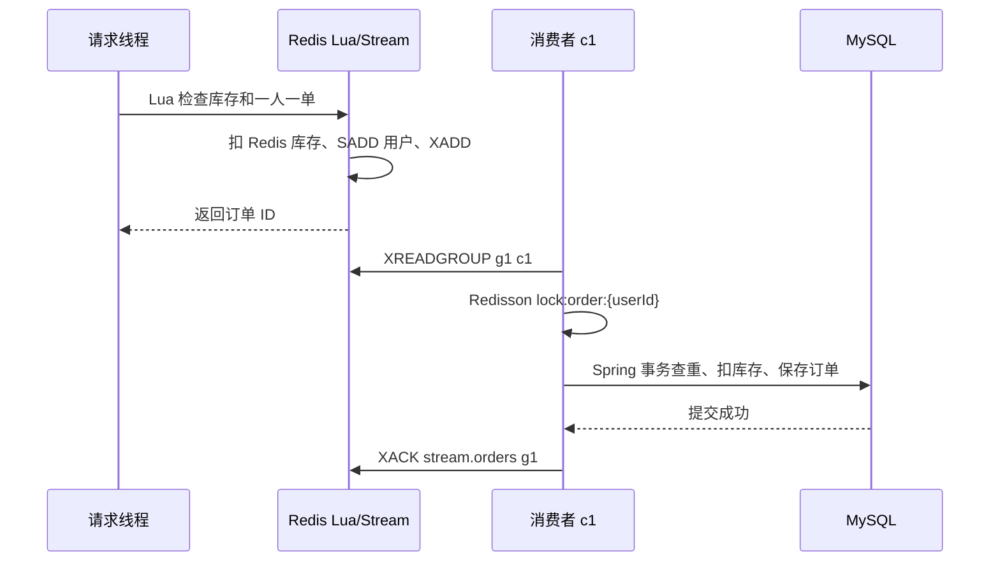

+++
date = '2026-08-12'
draft = false
title = '消息队列'
tags = ['Redis', '消息队列', 'Redis Stream', '异步秒杀']
categories = ['Redis']
aliases = ['Redis消息队列', 'Stream异步秒杀']
+++

> 本文用于复习 Redis 实现消息队列，并结合当前 HM DianPing 秒杀下单代码说明。

相关笔记：[[Redis基础]]、[[分布式锁]]

# 消息队列

消息队列（Message Queue，MQ）把生产者和消费者解耦：生产者先把消息写入队列，消费者稍后读取并处理。它常用于异步执行、削峰填谷和故障重试。

```text
Producer -> Queue/Stream -> Consumer -> 业务数据库
```

Redis Stream 默认适合做**至少一次投递**：消费者可能因为超时或重试再次处理同一条消息，所以业务必须幂等。Redis Lua 只能保证 Redis 内部命令的原子性，不能把 Redis 和 MySQL 变成一个跨系统事务。

## Redis 实现 MQ 的三种结构

| 结构 | 持久化/回溯 | ACK 和消费者组 | 适用场景 |
| --- | --- | --- | --- |
| List | 有限回溯；`BRPOP` 取出即删除 | 没有原生 ACK/消费组 | 简单、允许丢消息的异步任务 |
| Pub/Sub | 不保存历史；订阅前或断线期间消息会丢 | 没有 ACK/消费组 | 实时广播通知 |
| Stream | 有 ID，可回溯；受 Redis RDB/AOF 配置影响 | 支持消费组、ACK、Pending | 可靠异步任务和秒杀下单 |

### List

```redis
LPUSH queue.orders {"id":1001}
BRPOP queue.orders 0
```

`BRPOP` 阻塞等待消息，但消息一旦取出就从 List 删除。消费者进程在处理数据库前崩溃，消息通常无法恢复，因此不适合需要可靠投递的订单。

### Pub/Sub

```redis
SUBSCRIBE activity.updated
PUBLISH activity.updated "activity-1001"
```

它是实时广播：一个消息会发给当时在线的所有订阅者。Redis 不会为离线订阅者保存消息，也没有消费确认机制。

### Stream

Stream 是带 ID 的追加日志。每条 entry 由多个 field/value 组成：

```redis
XADD stream.orders * voucherId 1 userId 101 id 10001
```

Redis 返回类似 `1720000000000-0` 的 entry ID。Stream entry 与消费组的 Pending 状态是两回事：`XACK` 只会把消息从消费组 Pending Entries List（PEL）移除，不会删除 Stream entry；清理消息要另用 `XDEL` 或 `XTRIM`。

## Stream 核心概念

- **Stream**：消息日志，例如项目中的 `stream.orders`。
- **Entry ID**：`毫秒时间戳-序号`，用于定位和回溯消息。
- **消费组（Consumer Group）**：组内多个消费者分流消息，同一条消息不会被组内正常消费者重复领取。
- **消费者（Consumer）**：组内的一个逻辑消费端，需要使用稳定且唯一的名称。
- **last-delivered-id**：消费组记录的投递位置。
- **PEL**：消息已经投递但尚未 ACK 的列表，记录所属消费者和空闲时间。

消费者组的三个关键点：

1. **消息分流**：组内消费者各自处理不同消息，提升吞吐。
2. **位置记录**：组保存投递位置，消费者重启后可以继续读取。
3. **确认机制**：处理成功后 `XACK`，失败消息留在 PEL 中等待重试。

## 常用命令

```shell
# 查看和追加消息
XADD stream.orders * voucherId 1 userId 101 id 10001
XRANGE stream.orders - + COUNT 10
XLEN stream.orders

# 创建消费组；0 表示从历史消息开始，MKSTREAM 自动创建空 Stream
XGROUP CREATE stream.orders g1 0 MKSTREAM
XINFO GROUPS stream.orders
XINFO CONSUMERS stream.orders g1

# 普通读取
XREAD COUNT 1 STREAMS stream.orders 0

# 消费组读取新消息；> 表示从未投递给任何消费者的消息
XREADGROUP GROUP g1 c1 COUNT 1 BLOCK 2000 STREAMS stream.orders >

# 处理成功后确认
XACK stream.orders g1 1720000000000-0

# 查看 Pending，并接管空闲太久的消息
XPENDING stream.orders g1
XPENDING stream.orders g1 - + 10
XCLAIM stream.orders g1 c2 30000 1720000000000-0

# 控制日志长度；不要误删仍需要恢复的未 ACK 消息
XTRIM stream.orders MAXLEN ~ 10000
```

`XREADGROUP ... >` 只读新消息；用 `0` 可以读取当前消费者自己的 Pending。`BLOCK` 的单位是毫秒。`XPENDING` 查看 PEL，`XCLAIM` 可以让其他消费者接管空闲超过阈值的消息。

## demo项目：Redis Stream 异步秒杀下单

当前项目保留课程式的单线程消费者结构：



### 1. 请求线程执行 Lua

`src/main/resources/lua/seckill.lua` 接收三个 `ARGV`：`voucherId`、`userId`、`orderId`，一次完成：

1. 读取 `dp:seckill:stock:{voucherId}`，库存不存在或小于等于 0 返回 `1`。
2. 检查 `dp:seckill:order:{voucherId}` 是否已经包含用户，重复下单返回 `2`。
3. `INCRBY stockKey -1` 扣减 Redis 库存。
4. `SADD orderKey userId` 记录用户。
5. `XADD stream.orders * voucherId userId id` 写入订单消息。

返回 `0` 后，请求线程立即把订单 ID 返回给前端，不等待 MySQL 落库。

### 2. 应用启动创建消费组

`VoucherOrderServiceImpl` 在 `@PostConstruct` 中执行：

```java
stringRedisTemplate.execute((RedisCallback<String>) connection -> connection.xGroupCreate(
        "stream.orders".getBytes(StandardCharsets.UTF_8),
        "g1",
        ReadOffset.from("0"),
        true // MKSTREAM：队列不存在时创建
));
```

重复启动时 Redis 会返回 `BUSYGROUP`，代码把它当作正常情况忽略，避免应用因为消费组已存在而启动失败。

### 3. 消费 Pending 和新消息

消费者名称是课程代码中的 `c1`。每次循环先用 `ReadOffset.from("0")` 读取 **c1 自己** 的 Pending，再用 `ReadOffset.lastConsumed()` 读取新消息：

```java
List<MapRecord<String, Object, Object>> records =
        stringRedisTemplate.opsForStream().read(
                Consumer.from("g1", "c1"),
                StreamReadOptions.empty().count(1).block(Duration.ofSeconds(2)),
                StreamOffset.create("stream.orders", ReadOffset.lastConsumed())
        );
```

当前实习项目没有实现跨消费者 `XPENDING/XCLAIM` 接管。如果某个实例宕机后由其他实例接管，生产环境还需要补充按空闲时间扫描 PEL、`XCLAIM` 后再重试；固定使用同一个消费者名也不适合多实例部署。

### 4. 加锁并通过事务代理落库

消费者按用户加 Redisson 锁，然后调用 `proxy.createVoucherOrder(voucherOrder)`。通过 Spring 代理调用是为了让 `@Transactional` 生效：

```java
RLock lock = redissonClient.getLock("lock:order:" + userId);
boolean acquired = lock.tryLock();
try {
    if (!acquired) {
        throw new IllegalStateException("获取订单锁失败");
    }
    proxy.createVoucherOrder(voucherOrder);
} finally {
    if (acquired && lock.isHeldByCurrentThread()) {
        lock.unlock();
    }
}
```

事务方法先查询 `(user_id, voucher_id)` 是否已有订单；没有则用 `stock > 0` 条件更新数据库库存，再保存订单。数据库表的 `(user_id, voucher_id)` 唯一索引是并发和重复消息下的最终幂等兜底。

### 5. ACK 时机

```java
// createVoucherOrder 成功提交后才执行
stringRedisTemplate.opsForStream().acknowledge(
        "stream.orders", "g1", record.getId());
```

如果事务、锁或保存订单抛出异常，`processRecord` 不会执行 `XACK`，消息会留在 PEL 中。重复消费是至少一次语义的正常表现，因此数据库幂等不能省略。

## Java API 速查

### 单独生产一条消息

```java
RecordId id = stringRedisTemplate.opsForStream()
        .add("stream.orders", Map.of(
                "voucherId", voucherId.toString(),
                "userId", userId.toString(),
                "id", orderId.toString()));
```

项目实际把这一步放在 Lua 中，与扣库存和用户去重保持原子性。

### 读取 Pending

```java
List<MapRecord<String, Object, Object>> pending =
        stringRedisTemplate.opsForStream().read(
                Consumer.from("g1", "c1"),
                StreamReadOptions.empty().count(1),
                StreamOffset.create("stream.orders", ReadOffset.from("0")));
```

生产环境可结合 `XPENDING` 过滤 `idle >= 30s` 的消息，再使用 `XCLAIM` 接管；处理成功后仍然只能在数据库事务提交后 ACK。

## 可靠性、幂等和监控

- **幂等**：数据库查询 + 唯一索引 `(user_id, voucher_id)`；订单 ID 也应保持唯一。
- **ACK**：永远晚于业务成功，不能在收到消息后立即 ACK。
- **失败重试**：临时异常留在 PEL；永久失败的毒消息应限制重试次数并转移到死信 Stream。
- **库存对账**：Redis 预扣成功而 MySQL 永久失败时，需要补偿或对账，Lua 不会自动回滚 MySQL。
- **监控**：关注 `XLEN`、消费延迟、`XPENDING` 数量、最老 Pending 的 idle 时间和失败次数。
- **清理**：定期 `XTRIM` 控制 Stream 长度，但要保留仍可能恢复的未 ACK 消息。
- **扩容**：单线程吞吐不足时，可以在同一消费组增加消费者；每个实例应使用唯一 consumerName。

## 常见坑

1. 没有 `MKSTREAM` 创建消费组，启动时报 `NOGROUP`。
2. 用 `$` 建组，导致建组前的历史消息不再读取；课程示例用 `0`。
3. 只读取 `>`，不处理自己的 Pending，失败消息会卡住。
4. ACK 早于数据库提交，数据库失败后消息已经丢失。
5. 误以为 `XACK` 会删除 Stream entry；它只移除 PEL 记录。
6. 多实例复用固定消费者名，故障接管和监控都会混乱。
7. `XCLAIM` 的 idle 阈值过短，可能造成同一订单同时被重复处理。
8. 无限重试永久失败消息，导致消费者线程一直阻塞在同一条消息上。
9. 字段名不一致：项目消息字段必须是 `voucherId`、`userId`、`id`。
10. Stream 无限增长；清理时不能误删还需要恢复的消息。

## 小结

List 简单但没有可靠确认，Pub/Sub 实时但不保存历史，Stream 才同时提供 ID、阻塞读取、消费组和 Pending。当前项目用 Lua 保证 Redis 内的“库存 + 一人一单 + 入队”原子性，再用 Redisson 锁、Spring 事务、数据库条件更新和唯一索引完成可靠落库。

---
#