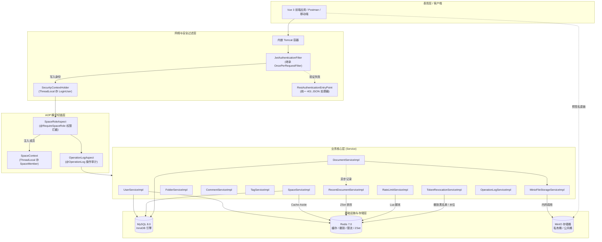
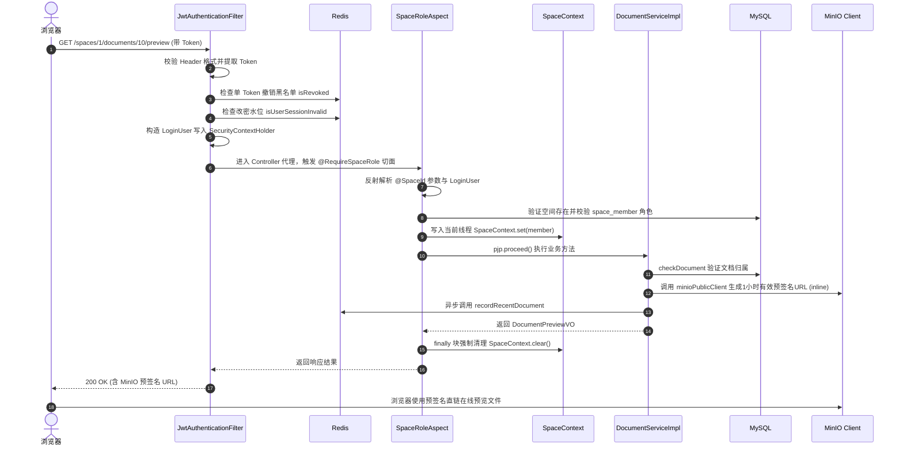
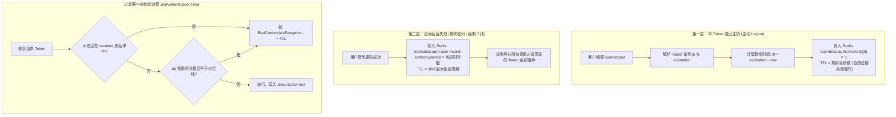
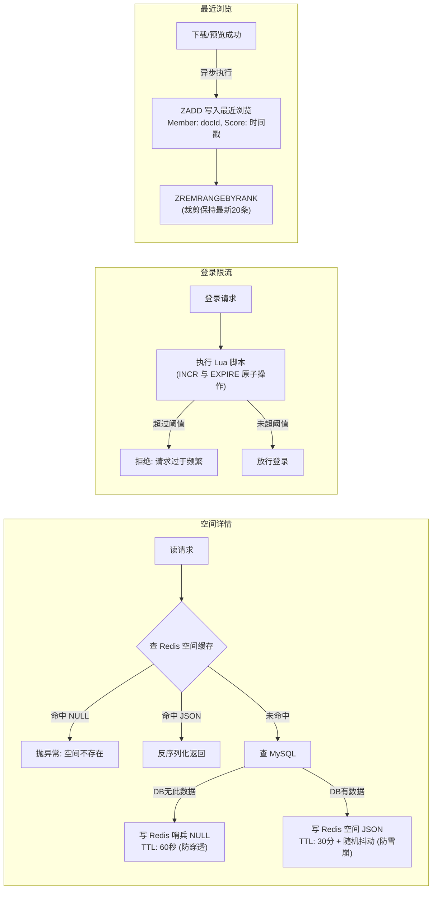

# TeamDocs 架构全景与核心源码深度剖析

> **文档属性**：本项目剖析**完全基于真实 Java 源码、SQL 脚本与配置文件提取**，不掺杂任何二手文档推断，供深度吃透底层逻辑、从容应对高难度技术面试。

---

## 目录
- [一、 系统总体技术架构与请求生命周期](#一-系统总体技术架构与请求生命周期)
  - [1.1 核心技术选型与版本一览](#11-核心技术选型与版本一览)
  - [1.2 系统分层全景架构图](#12-系统分层全景架构图)
  - [1.3 一次 HTTP 请求的真实执行链路图](#13-一次-http-请求的真实执行链路图)
- [二、 认证体系与双层 Token 失效机制](#二-认证体系与双层-token-失效机制)
  - [2.1 JWT 生成与双重验证机制](#21-jwt-生成与双重验证机制)
  - [2.2 Spring Security 与过滤器链定制](#22-spring-security-与过滤器链定制)
  - [2.3 修改密码的“数据库-缓存补偿事务”](#23-修改密码的数据库-缓存补偿事务)
- [三、 细粒度空间权限与 AOP 上下文透传](#三-细粒度空间权限与-aop-上下文透传)
  - [3.1 元注解组合：`@RequireSpaceRole` 与 `@SpaceId`](#31-元注解组合-requirespacerole-与-spaceid)
  - [3.2 `SpaceRoleAspect` 切面拦截与校验流程](#32-spaceroleaspect-切面拦截与校验流程)
  - [3.3 ThreadLocal 上下文传递与防内存泄漏设计](#33-threadlocal-上下文传递与防内存泄漏设计)
  - [3.4 细粒度资源越权控制：`ResourcePermissionHelper`](#34-细粒度资源越权控制-resourcepermissionhelper)
- [四、 MinIO 对象存储架构与端点隔离](#四-minio-对象存储架构与端点隔离)
  - [4.1 双 Client 架构：内网与公网端点解耦](#41-双-client-架构内网与公网端点解耦)
  - [4.2 预签名 URL（Presigned URL）与零中转流传输](#42-预签名-urlpresigned-url与零中转流传输)
  - [4.3 在线预览 vs 附件下载（RFC 5987 文件名编码）](#43-在线预览-vs-附件下载rfc-5987-文件名编码)
- [五、 Redis 高并发实战与故障优雅降级](#五-redis-高并发实战与故障优雅降级)
  - [5.1 空间详情：Cache-Aside + 哨兵防穿透 + 随机 TTL 防雪崩](#51-空间详情cache-aside--哨兵防穿透--随机-ttl-防雪崩)
  - [5.2 登录/注册限流：Lua 脚本原子窗口计数](#52-登录注册限流lua-脚本原子窗口计数)
  - [5.3 最近浏览：ZSet 排序截断 + 异步写入 + 读时惰性清理](#53-最近浏览zset-排序截断--异步写入--读时惰性清理)
  - [5.4 故障隔离与 Fail-Open 降级设计](#54-故障隔离与-fail-open-降级设计)
- [六、 MySQL 表结构与高级索引设计](#六-mysql-表结构与高级索引设计)
  - [6.1 核心表模型与关联关系](#61-核心表模型与关联关系)
  - [6.2 文档列表与回收站：消除 `Using filesort` 的联合索引](#62-文档列表与回收站消除-using-filesort-的联合索引)
  - [6.3 关系表 `document_tag`：双向覆盖索引（免回表）](#63-关系表-document_tag双向覆盖索引免回表)
  - [6.4 MySQL 8 ngram 全文检索与停用词排坑](#64-mysql-8-ngram-全文检索与停用词排坑)
  - [6.5 逻辑删除 `@TableLogic` 的双向封锁与破解](#65-逻辑删除-tablelogic-的双向封锁与破解)
- [七、 审计日志与系统健壮性](#七-审计日志与系统健壮性)
  - [7.1 `@OperationLog` + SpEL 动态解析与资源快照](#71-operationlog--spel-动态解析与资源快照)
  - [7.2 `Propagation.REQUIRES_NEW` 独立事务隔离](#72-propagationrequires_new-独立事务隔离)
- [八、 面试官高频深水区 10 连问（源码级对答策略）](#八-面试官高频深水区-10-连问源码级对答策略)
- [九、 面试高频题库全景通关清单（8组核心考点 + 必考场景题）](#九-面试高频题库全景通关清单8组核心考点--必考场景题)
  - [9.1 第一组：项目整体（开场与设计思想）](#91-第一组项目整体开场与设计思想)
  - [9.2 第二组：登录认证与 JWT](#92-第二组登录认证与-jwt)
  - [9.3 第三组：权限控制与防越权](#93-第三组权限控制与防越权)
  - [9.4 第四组：10GB 大文件与对象存储（MinIO）](#94-第四组10gb-大文件与对象存储minio)
  - [9.5 第五组：Redis 深度与高并发](#95-第五组redis-深度与高并发)
  - [9.6 第六组：MySQL 索引与底层原理](#96-第六组mysql-索引与底层原理)
  - [9.7 第七组：并发问题与线程安全](#97-第七组并发问题与线程安全)
  - [9.8 第八组：Spring 框架底层](#98-第八组spring-框架底层)
  - [9.9 第九组：必考高频实战场景题](#99-第九组必考高频实战场景题)

---

## 一、 系统总体技术架构与请求生命周期

### 1.1 核心技术选型与版本一览（源自 `pom.xml`）
- **JDK 版本**：Java 17
- **核心框架**：Spring Boot `3.5.14`（内嵌 Tomcat、Spring 6.x）
- **安全框架**：Spring Security + JJWT `0.12.5`（API采用 parser() / verifyWith() 最新规范）
- **持久层**：MyBatis-Plus `3.5.9` + MyBatis-Plus JSQLParser `3.5.9` + MySQL Connector/J
- **缓存与辅助**：Spring Data Redis（底层使用 Lettuce 驱动）+ Hutool `5.8.40`
- **对象存储**：MinIO Java SDK `8.6.0` + OkHttp `4.12.0`
- **切面框架**：Spring Boot Starter AOP（AspectJ Runtime）

---

### 1.2 系统分层全景架构图



---

### 1.3 一次 HTTP 请求的真实执行链路图

以调用 `GET /spaces/1/documents/10/preview`（获取文档预览地址）为例，代码内部流转流程如下：



---

## 二、 认证体系与双层 Token 失效机制

### 2.1 JWT 生成与双重验证机制
在 `JWTUtils.java` 中：
- 采用 JJWT `0.12.5` 规范，签发包含以下标准载荷：
  - `jti`：`UUID.randomUUID().toString()`，为每个 Token 赋予全局唯一 ID。
  - `issuedAt`：签发时刻。
  - `expiration`：过期时刻（由 `${jwt.expiration}` 配置，通常为 7 天）。
  - 自定义 Claims：`userId` 与 `username`。
  - 签名算法：基于 HMAC-SHA 密钥签名。

在 `TokenRevocationServiceImpl.java` 中设计了**双层失效体系**：



### 2.2 Spring Security 与过滤器链定制
查看 `SecurityConfig.java`：
1. **无状态会话**：`.sessionManagement(s -> s.sessionCreationPolicy(SessionCreationPolicy.STATELESS))`，彻底关闭 HttpSession。
2. **防重复注册排坑**：
   ```java
   @Bean
   public FilterRegistrationBean<JwtAuthenticationFilter> jwtFilterRegistration(JwtAuthenticationFilter filter) {
       FilterRegistrationBean<JwtAuthenticationFilter> registration = new FilterRegistrationBean<>(filter);
       registration.setEnabled(false); // 禁用 Servlet 容器默认自动注册
       return registration;
   }
   ```
   **面试考点**：Spring Boot 会将所有标注 `@Component` 的 Filter 自动注册到 Servlet 容器过滤链。而我们在 Security 中又配置了 `.addFilterBefore(jwtAuthenticationFilter, UsernamePasswordAuthenticationFilter.class)`。若不显式设置 `setEnabled(false)`，会导致一个请求被执行两次 Filter！
3. **白名单设计**：
   - 匿名放行：`POST /user/login`、`POST /user/register`、`GET /actuator/health/**`。
   - 其余请求统一要求认证；未通过者由 `RestAuthenticationEntryPoint` 返回统一格式 JSON：
     `{"code": 401, "message": "未登录或登录状态已失效", "data": null}`。

### 2.3 修改密码的“数据库-缓存补偿事务”
查看 `UserServiceImpl.java` 的 `changePassword` 方法：
```java
// 1. 业务校验：比对原密码 BCrypt，判断新旧密码一致性
// 2. 更新数据库为新密码哈希
int updated = userMapper.updateById(user);
if (updated != 1) throw new BusinessException("修改密码失败");

try {
    // 3. 设置 Redis 水位，使旧 Token 全部失效
    tokenRevocationService.invalidateAllForUser(loginUser.getUserId());
} catch (RuntimeException e) {
    // 4. 【异常补偿】：若 Redis 操作失败，将数据库密码恢复为 oldPasswordHash
    user.setPassword(oldPasswordHash);
    userMapper.updateById(user);
    throw new BusinessException("修改密码失败，请稍后重试", e);
}
```
**设计价值**：避免了“数据库改掉了、但缓存设置超时抛异常、导致用户旧会话依然能无限期盗刷”的双写不一致安全隐患。

---

## 三、 细粒度空间权限与 AOP 上下文透传

### 3.1 元注解组合：`@RequireSpaceRole` 与 `@SpaceId`
- `@RequireSpaceRole`：放在方法上，声明该操作允许哪些角色（`OWNER`、`ADMIN`、`MEMBER`，默认全选）。
- `@SpaceId`：放在参数上，显式指示切面哪一个参数是空间 ID。

### 3.2 `SpaceRoleAspect` 切面拦截与校验流程
源码见 `SpaceRoleAspect.java`：
1. 拦截 `@Around("@annotation(asia.creat.anno.RequireSpaceRole)")`。
2. 反射扫描方法参数注解，提取被 `@SpaceId` 修饰的 `Long` 参数，以及类型为 `LoginUser` 的参数。
3. 查 `spaceMapper.selectById(spaceId)` 验证空间合法性。
4. 查 `space_member` 联合唯一索引：
   ```java
   SpaceMember member = spaceMemberMapper.selectOne(
       new LambdaQueryWrapper<SpaceMember>()
           .eq(SpaceMember::getSpaceId, spaceId)
           .eq(SpaceMember::getUserId, loginUser.getUserId())
   );
   ```
5. 校验用户是否为成员，以及 `Arrays.asList(roles).contains(member.getRole())` 是否满足权限要求。

### 3.3 ThreadLocal 上下文传递与防内存泄漏设计
```java
SpaceContext.set(member); // 存入 ThreadLocal
try {
    return pjp.proceed(); // 放行进入具体业务 Service
} finally {
    SpaceContext.clear(); // 【核心防漏机制】
}
```
**面试深度考点**：
- **为什么使用 ThreadLocal？** 后续 Service（如删除文档、重命名）无需再次向数据库发起 `selectOne` 查询当前操作人的角色，直接通过 `SpaceContext.getSpaceMember()` 就能获取，减少数据库 RTT。
- **为什么必须在 finally 中 clear？** Tomcat 使用线程池处理请求，线程在请求结束后不会被销毁而是归还线程池。若不 clear：
  1. 下一次别的用户请求复用该线程时，可能读取到上一个用户的 `SpaceMember`，发生严重越权。
  2. `ThreadLocalMap` 的 Entry 对 Value（`SpaceMember` 对象）是强引用，导致即使请求结束，对象仍无法被垃圾回收器回收，发生**内存泄漏（Memory Leak）**。

### 3.4 细粒度资源越权控制：`ResourcePermissionHelper`
见 `ResourcePermissionHelper.java`：
- 空间层级的角色确定后，细粒度到文档/文件夹/评论的修改删除：
  ```java
  public void checkOwnerOrCreator(SpaceMember member, Long creatorId, Long currentUserId) {
      if (member.getRole() == SpaceRole.MEMBER && !creatorId.equals(currentUserId)) {
          throw new BusinessException("没有权限操作该资源");
      }
  }
  ```
- **业务规则**：`OWNER` 与 `ADMIN` 拥有空间内所有资源的最高管理权；而普通 `MEMBER` **只能修改或删除自己上传的文档/自己创建的文件夹/自己的评论**。

---

## 四、 MinIO 对象存储架构与端点隔离

### 4.1 双 Client 架构：内网与公网端点解耦
在 Docker 或 Kubernetes 部署中，后端与 MinIO 处于内部容器网络（如 `http://minio:9000`），而浏览器处于外网或宿主机网络（如 `http://localhost:19000`）。

源码见 `MinioConfig.java` 和 `MinioFileStorageServiceImpl.java`：
- `minioClient`：连接内网 `endpoint`，后端直连用于 `putObject`（上传头像/文件）和 `removeObject`（物理删除）。
- `minioPublicClient`：配置 `publicEndpoint`（对外的域名或IP端口），并**显式固定 region（"us-east-1"）**，专门用于后端调用 `getPresignedObjectUrl` 离线计算带 HMAC-SHA 签名的下载直链。
- **排坑点**：AWS S3/MinIO 的预签名算法会将 `Host` 请求头参与签名。如果用内网客户端签发，URL 里的 Host 是 `minio:9000`，前端浏览器使用 `localhost:19000` 访问时，MinIO 校验签名头不一致，会直接拒绝（`SignatureDoesNotMatch`）。双 Client 机制完美解决了此问题。

### 4.2 预签名 URL 与零中转流传输
- 下载与预览请求流程：
  1. 浏览器向后端发起 `GET /spaces/{id}/documents/{id}/download`。
  2. 后端仅校验数据库权限，耗时约 5ms。
  3. 后端调用 `minioPublicClient.getPresignedObjectUrl`，生成 1 小时内有效的签名直链并返回。
  4. 浏览器重定向或直接通过 MinIO URL 下载几百兆的文件流。
- **架构优势**：后端服务器网卡、JVM 内存和 Worker 线程完全不承担大文件数据流，并发吞吐量极大提升。

### 4.3 在线预览 vs 附件下载（RFC 5987 文件名编码）
见 `DocumentServiceImpl.java`：
通过 MinIO 预签名 API 传递 `extraQueryParams` 覆盖响应头：
- **预览**：`response-content-disposition: inline; filename*=UTF-8''...`（浏览器原生支持的 PDF、图片直接内嵌展示）。
- **下载**：`response-content-disposition: attachment; filename*=UTF-8''...`（强制弹出保存对话框）。
- **文件名编码细节**：
  ```java
  private String buildContentDisposition(String type, String filename) {
      String encodedFilename = URLEncoder.encode(filename, StandardCharsets.UTF_8)
              .replace("+", "%20");
      return type + "; filename*=UTF-8''" + encodedFilename;
  }
  ```
  Java 的 `URLEncoder` 会将空格转为 `+` 号，而在现代浏览器 RFC 6266 / RFC 5987 规范中，空格必须为 `%20`，否则下载的文件名会出现 `+` 号甚至乱码。

---

## 五、 Redis 高并发实战与故障优雅降级



### 5.1 空间详情：Cache-Aside + 哨兵防穿透 + 随机 TTL 防雪崩
源码见 `SpaceServiceImpl.java`：
1. **防缓存穿透（Cache Penetration）**：当黑客恶意刷不存在的 `spaceId` 时，若直接打到 DB 会压垮数据库。项目在 DB 查为空时，向 Redis 写入哨兵值 `"NULL"`，设置短超时 `NULL_TTL = Duration.ofSeconds(60L)`。下次再查命中 `"NULL"` 直接抛异常拦截。
2. **防缓存雪崩（Cache Avalanche）**：空间详情的基础缓存为 30 分钟，额外加上 `ThreadLocalRandom.current().nextLong(0, 301)` 秒的随机时间。让缓存在一个时间窗口内离散过期，防止大批热点 Key 同时失效造成数据库瞬间被打崩。
3. **Cache-Aside 双写**：更新或删除空间时，**先操作 MySQL 数据库，操作成功后显式调用 `cacheClient.delete(key)` 删除缓存**。

### 5.2 登录/注册限流：Lua 脚本原子窗口计数
源码见 `RateLimitServiceImpl.java` 及 `window_rate_limit.lua`：
```lua
local curr_count = redis.call('INCR', KEYS[1])
if curr_count == 1 then
    redis.call('EXPIRE', KEYS[1], ARGV[1])
end
return curr_count;
```
- **配置规则**：登录按 IP 每 60 秒限流 10 次；注册按 IP 每 60 秒限流 5 次。
- **为什么使用 Lua？** `INCR` 和 `EXPIRE` 必须是一个原子操作。如果分两步调用，在高并发或进程突然重启时，可能出现 `INCR` 执行成功但未能设置 `EXPIRE`，导致产生永不过期的死 Key。

### 5.3 最近浏览：ZSet 排序截断 + 异步写入 + 读时惰性清理
源码见 `RecentDocumentServiceImpl.java`：
- **Key 格式**：`teamdocs:user:recent:{userId}`，类型为 `Sorted Set (ZSet)`。
- **写入端**：
  - 触发时机：仅在文档详情、在线预览、文件下载**真正校验权限成功后**触发。
  - 使用 `@Async` 异步执行，主业务零等待。
  - `addZSet`：Member 为 `documentId.toString()`，Score 为 `System.currentTimeMillis()`。天然去重并刷新最后访问时间。
  - 范围修剪：`removeZSetRangeByRank(key, 0, -(MAX_RECENT_DOCUMENTS + 1))`，利用 Rank 将集合强制保留在最新的 20 条，不耗费多余内存。
- **读取端与惰性清理（Lazy Eviction）**：
  1. `ZREVRANGE WITHSCORES` 倒序取出前 20 个 `documentId` 与浏览时间。
  2. **元数据不放在 Redis**：仅在 Redis 存 ID，详情通过一次 MySQL `INNER JOIN space INNER JOIN space_member` 批量查询，保证只展示当前仍可访问且未删除的文档。
  3. **读时清理无用 Key**：若发现 Redis 里有的 ID 在 MySQL 中已经不存在或无权限了，将这些 ID 收集在 `invalid` 列表中，查询结束前批量执行 `cacheClient.removeZSetMembers(key, ...)`。
  - **为什么不在删除文档时主动删除所有用户的浏览记录？** 因为删除一个文档时，无法得知全系统成千上万个用户中谁浏览过它。若使用 `KEYS teamdocs:user:recent:*` 会引发 O(N) 的全库扫描，阻塞单线程 Redis 事件循环。读时惰性清理是轻量且优雅的解耦设计。

### 5.4 故障隔离与 Fail-Open 降级设计
查看 `CacheClient.java` 与 `RateLimitServiceImpl.java`：
- `CacheClient` 的 `get`、`set`、`delete` 均用 `try-catch` 包裹。Redis 连接超时或宕机时只打 `log.warn` 并返回 `null`。
- 空间详情在获取为 `null` 时自动回退查询 MySQL；
- 限流服务在捕获 Redis 异常后，`attempts` 保持为 `null`，逻辑返回 `false`（允许放行）。
- **核心哲学**：**辅助与旁路组件故障，决不能导致核心业务崩溃（Fail-Open 哲学）**。

---

## 六、 MySQL 表结构与高级索引设计

### 6.1 核心表模型与关联关系
数据库共计 8 张核心表：
1. `user`：用户身份表（用户名与邮箱具备 `UNIQUE` 索引）。
2. `space`：空间表（逻辑删除 `deleted`）。
3. `space_member`：空间成员关系表。
4. `folder`：文件夹表（树状模型，`parent_id=0` 表示根目录）。
5. `document`：文档元数据表（存储 MinIO 对象路径与元数据）。
6. `tag`：空间内的标签表。
7. `document_tag`：文档与标签多对多关联表。
8. `comment`：评论表（树状回复模型，`reply_to_id` 指向父评论）。
9. `operation_log`：AOP 审计日志记录表。

---

### 6.2 文档列表与回收站：消除 `Using filesort` 的联合索引

#### 场景 1：文件夹内文档列表分页
代码发起的查询 SQL（见 MyBatis-Plus 生成逻辑）：
```sql
SELECT * FROM document 
WHERE space_id = ? AND folder_id = ? AND deleted = 0 
ORDER BY updated_at DESC, id DESC 
LIMIT 0, 20;
```
- **建立的索引**：
  ```sql
  KEY idx_space_folder_updated (space_id, folder_id, deleted, updated_at, id)
  ```
- **底层原理**：
  1. `space_id`、`folder_id`、`deleted` 全是等值查找（`=`）。
  2. B+ 树叶子节点在满足这三列等值后，**数据本身就是严格按照 `updated_at DESC, id DESC` 排列的**。
  3. MySQL 存储引擎扫描叶子节点时直接输出有序流，**执行计划 Extra 为空或 `Using index condition`，彻底消除了 `Using filesort`**。

#### 场景 2：空间回收站列表
SQL（见 `DocumentMapper.xml` 的 `selectTrashedDocuments`）：
```sql
SELECT id, space_id, folder_id, name, ... FROM document 
WHERE space_id = #{spaceId} AND deleted = 1 
ORDER BY updated_at DESC, id DESC;
```
- **建立的索引**：
  ```sql
  KEY idx_space_deleted_updated (space_id, deleted, updated_at, id)
  ```
- **为什么不能复用第一个索引？**  
  根据**最左前缀原则（Leftmost Prefix Rule）**，回收站查询不包含 `folder_id`。如果强走行 `idx_space_folder_updated`，在第一列 `space_id` 之后由于缺少 `folder_id` 产生了断层，后面的 `deleted` 和 `updated_at` 将无法走索引，导致排序再次退化为代价昂贵的 `Using filesort`。因此专门为回收站定制了去掉了 `folder_id` 的联合索引。

---

### 6.3 关系表 `document_tag`：双向覆盖索引（免回表）
建表定义（见 `initDocument.sql`）：
```sql
CREATE TABLE document_tag (
    id          BIGINT NOT NULL AUTO_INCREMENT,
    document_id BIGINT NOT NULL,
    tag_id      BIGINT NOT NULL,
    PRIMARY KEY (id),
    UNIQUE KEY uk_doc_tag (document_id, tag_id),
    KEY idx_tag_document (tag_id, document_id)
);
```
- **两本反向目录的妙用**：
  - **按文档查标签**：`SELECT tag_id FROM document_tag WHERE document_id = ?`，走 `uk_doc_tag` 联合唯一索引。
  - **按标签查文档**：`SELECT document_id FROM document_tag WHERE tag_id = ?`，走 `idx_tag_document` 联合索引。
- **覆盖索引（Covering Index）**：整张表只用到这两个字段。索引树本身的叶子节点里已经包含了查询所需的全部数据，执行计划 Extra 显示 **`Using index`**，**完全不需要拿着主键 id 回表查询原数据行（零次回表）**。

---

### 6.4 MySQL 8 ngram 全文检索与停用词排坑
在 `fulltext_index.sql` 中：
```sql
SET PERSIST innodb_ft_enable_stopword = OFF;
ALTER TABLE document ADD FULLTEXT INDEX ft_name (name) WITH PARSER ngram;
ALTER TABLE document ADD FULLTEXT INDEX ft_description (description) WITH PARSER ngram;
```
- **为什么在 SQL 中使用 `MATCH(...) AGAINST(... IN BOOLEAN MODE)`？**
  - MySQL 全文检索默认是自然语言模式（Natural Language），存在 **50% 停用词阈值**（若某词在超过一半的行里出现则直接被判定为无效词返回空）。在小数据量开发测试时，极易搜不出数据。`IN BOOLEAN MODE` 可以强制关闭该阈值。
- **关于 `innodb_ft_enable_stopword = OFF` 的深刻踩坑故事**：
  - 现象：文档名带有英文单词 `"zip"` 怎么也搜不出来，但 `"md"`、`"txt"` 和中文却一切正常。
  - 根因：MySQL ngram 默认分词滑动窗口大小 `ngram_token_size=2`。"zip" 会被拆成 `"zi"` 和 `"ip"` 两个双字符分词（bigram）。然而 InnoDB 默认停用词表中包含单个英文字母 `"i"`。
  - **ngram 的致命规则：切出的分词只要包含了任何一个停用词，该分词就会被整词丢弃！**
  - 导致包含字母 i 的双字母组合（zi, ip, in, is 等）全部无法进入全文倒排索引！
  - 方案：执行 `SET PERSIST innodb_ft_enable_stopword = OFF` 彻底关闭全局停用词表，并在 Docker Compose 的启动参数中配置 `--innodb-ft-enable-stopword=OFF`。

---

### 6.5 逻辑删除 `@TableLogic` 的双向封锁与破解
在实体类中，`Space` 和 `Document` 标注了 `@TableLogic private Integer deleted;`。
- **踩坑现象**：在回收站调用恢复文档时：
  ```java
  doc.setDeleted(0);
  documentMapper.updateById(doc);
  ```
  更新行数居然始终返回 0，文档根本无法恢复。
- **底层原理**：MyBatis-Plus 的 `@TableLogic` 是**双向拦截**的：
  1. `SELECT` 查询时，自动在末尾追加 `AND deleted = 0`；
  2. `updateById(entity)` 更新时，同样会自动在 SQL 末尾追加 `WHERE id = ? AND deleted = 0`！
  3. 但回收站里的文档本身 `deleted` 已经是 `1` 了，导致 UPDATE 语句的 WHERE 条件永远不可能匹配，静默更新 0 行！
- **源码中的破局实现**：在 `DocumentMapper.xml` 中跳过 MyBatis-Plus 封装，手写原生更新 SQL：
  ```xml
  <update id="updateDeleted">
      UPDATE document SET deleted = 0, folder_id = #{FolderId} WHERE id = #{documentId}
  </update>
  ```

---

## 七、 审计日志与系统健壮性

### 7.1 `@OperationLog` + SpEL 动态解析与资源快照
源码见 `OperationLogAspect.java`：
- 注解使用示例：
  ```java
  @OperationLog(value = "更新空间", resourceType = "SPACE", resourceName = "#dto.name")
  ```
- **SpEL 动态求值**：切面利用 Spring 的 `SpelExpressionParser` 与 `DefaultParameterNameDiscoverer`，在方法执行前解析 `#dto.name`，精准抓取操作参数作为快照。
- **历史记录快照解析**：针对删除操作，删除后对象已经不存在，切面调用 `OperationResourceNameResolver` 调用底层 `selectNameIncludingDeleted`，即使已被软删除也能在日志中记录被删文档的真实名称。

### 7.2 `Propagation.REQUIRES_NEW` 独立事务隔离
源码见 `OperationLogServiceImpl.java`：
```java
@Override
@Transactional(propagation = Propagation.REQUIRES_NEW)
public void saveLog(OperationLogRecord log){
    operationLogMapper.insert(log);
}
```
**事务边界与异常隔离考点**：
1. **主业务失败，日志必须留存**：如果用户执行上传文档，业务抛出了 `BusinessException`。外层主事务回滚，切面捕获该异常，标记 `success = 0` 与 `errorMessage`。由于日志保存方法标注了 `REQUIRES_NEW`，Spring 会挂起当前事务并新建独立事务提交日志记录，确保失败操作依然能在数据库中审计留痕。
2. **日志写入失败，决不拖垮主业务**：在切面的 `finally` 中写入日志包裹在 `try-catch` 中并打 `log.error`。若数据库死锁或磁盘写满导致日志插入失败，切面绝不向外抛出异常，原本成功的用户业务依然能正常响应。

---

## 八、 面试官高频深水区 10 连问（源码级对答策略）

#### Q1：你的项目用了 Spring Security，为什么还要手写 `JwtAuthenticationFilter`？
> **答**：Spring Security 原生体系偏向有状态的 Cookie-Session 模式（如 `UsernamePasswordAuthenticationFilter`），其默认过滤器无法自动解析 HTTP 请求头里的 `Authorization: Bearer <token>`。  
> 我们通过继承 `OncePerRequestFilter` 自定义了 `JwtAuthenticationFilter`，嵌入在 `UsernamePasswordAuthenticationFilter` 之前。它的核心作用是拦截请求、提取并解析 JWT、到 Redis 校验注销黑名单和修改密码时间戳水位；校验合法后构建 `LoginUser` 填入 `SecurityContextHolder`，从而无缝接入 Spring Security 后续的上下文生命周期。

#### Q2：为什么不在 Controller/Service 里直接拿用户，而要用 `@AuthenticationPrincipal`？
> **答**：因为我们在 `JwtAuthenticationFilter` 中完成鉴权后，将携带 `LoginUser` 的 `UsernamePasswordAuthenticationToken` 存入了 `SecurityContextHolder`。Spring MVC 的参数解析器（`AuthenticationPrincipalArgumentResolver`）能自动识别控制器方法入参上的 `@AuthenticationPrincipal`，直接将凭证对象注入进来。这种方式代码无侵入，完全避免了在每个 Controller 里手动从 Request Header 提取和解析 Token。

#### Q3：为什么权限切面 `SpaceRoleAspect` 里，ThreadLocal 清理要写在 `finally`？如果不写会有什么严重后果？
> **答**：因为生产环境下内嵌的 Tomcat 会维护一个 HTTP 请求工作线程池。当一个请求处理完毕后，线程不会销毁而是放回池中复用。  
> 如果不在 `finally` 里显式调用 `SpaceContext.clear()`：  
> 1. **权限串号（安全事故）**：下一个请求若恰好复用了该线程，可能读取到上一个用户的 `SpaceMember` 导致越权漏洞；  
> 2. **内存泄漏**：ThreadLocal 的实现中，虽然 `ThreadLocalMap` 的 Key 是弱引用，但 Value（即我们存入的 `SpaceMember`）是强引用。只要线程长久存活，这个对象就永远无法被 GC 回收，长期积累会导致 JVM 内存溢出。

#### Q4：MinIO 签发预签名 URL 是怎么保证安全性的？前端拿到后可以无限期访问吗？
> **答**：预签名 URL 采用的是 AWS S3 兼容的 HMAC-SHA256 签名机制。URL 路径中包含了访问的 Bucket、ObjectKey、过期时间戳（Expires）、以及由服务端的 `SecretKey` 计算出的签名值（X-Amz-Signature）。  
> 1. **防篡改**：任何人若擅自修改 URL 里的参数或试图访问其他文件，MinIO 重新计算 HMAC 签名不匹配，会直接返回 403 Access Denied；  
> 2. **有限生命周期**：在代码中我们在 `GetPresignedObjectUrlArgs` 中强制设置了过期时间为 1 小时（`expiry(1, TimeUnit.HOURS)`），过期后链接自动失效，最大程度保障私有文件的安全性。

#### Q5：Redis 的 Cache-Aside 模式中，为什么更新数据时是“先更数据库，再删缓存”，而不是“先删缓存，再更数据库”？
> **答**：如果“先删缓存，再更数据库”：  
> - 线程 A 删除了缓存，还未来得及更新数据库；  
> - 此时高并发下线程 B 发起读请求，发现缓存为空，去查数据库拿到了旧值，并回填进 Redis；  
> - 随后线程 A 更新数据库成功。此时数据库是新值，而 Redis 永久停留了旧值，出现严重的脏数据。  
> 而采用“先更数据库，再删缓存”，只有在“读请求未命中查出旧值、且写请求在读请求回填之前完成更新和删除”的极罕见交错下才会发生脏数据（由于数据库写锁和内存写速度差异，概率极低）。另外我们在缓存上还配置了 30 分钟随机 TTL，具备最终一致性兜底。

#### Q6：最近浏览功能为什么不在用户点击时直接写 MySQL，而是用 Redis ZSet 做中转？
> **答**：  
> 1. **写性能与高频更新**：用户在线阅读或频繁切换预览时，最近浏览是高频写操作。如果每次都写 MySQL，涉及频繁的 `INSERT/UPDATE`、事务提交以及索引分裂，数据库磁盘 I/O 压力大。  
> 2. **天生支持去重与排序**：Redis ZSet 的 Member 是唯一的，重复浏览同一文档只需执行 `ZADD` 更新 Score（时间戳），不需要我们在业务中写复杂的“判断是否存在、存在则更新时间、不存在则插入”的代码。  
> 3. **容量受控**：利用 `ZREMRANGEBYRANK 0 -21` 可以由 Redis 底层以 O(log(N)+M) 的极高效率直接将集合裁剪为最近 20 条，不产生历史数据堆积。

#### Q7：Redis 做登录限流时，固定窗口与滑动窗口有什么区别？为什么当前选择固定窗口？
> **答**：固定窗口在时间窗口的交界处可能会出现“双倍突发流量”（例如 0:59 来 10 次，1:01 来 10 次，两秒内承受了 20 次）。滑动窗口（如 ZSet 实现）能更精准地控制任意时间跨度内的频率，但实现复杂度高，且需要存储每个请求的时间戳，内存消耗更大。  
> 针对团队文档平台“防暴力破解登录密码”的业务场景，主要目标是防止黑客用字典持续爆破账号。固定窗口结合 Lua 脚本单 Key 计数器（内存仅几十字节，单次耗时 < 1ms），能以极低资源消耗达成防爆破目的，是贴合业务体量的工程性价比最优解。

#### Q8：如果批量给 100 个文档打标签，怎么做数据库优化？
> **答**：在 `teamdocs-backend` 中，给文档打标签涉及 `document_tag` 关联表。  
> 1. **禁止循环逐条 Insert**：如果在 for 循环里调用 Mapper 的 `insert`，会产生 100 次网络 RTT 和 100 次数据库事务开销。  
> 2. **优化方案**：在 XML 中使用 `<foreach>` 拼接一条批量插入 SQL：`INSERT INTO document_tag (document_id, tag_id) VALUES (...), (...)...`。将 100 次网络折返压缩为 1 次，批量提交事务，减少 MySQL redo log 刷盘次数。

#### Q9：在 Spring AOP 中，切面的执行顺序是怎么保证的？
> **答**：在我们的项目中，既有安全权限切面 `SpaceRoleAspect`，又有日志审计切面 `OperationLogAspect`。  
> 权限检查必须先于日志切面执行（若无权限，应直接由权限切面阻断并抛异常，不应触发业务方法的 SpEL 解析）。  
> 我们通过在切面类上标注 `@Order` 注解来精确控制优先级：数值越小，优先级越高。在请求进入时，优先级高的切面先执行前置增强（Around 前半部分）；在方法返回后，优先级高的切面后执行后置增强。

#### Q10：为什么项目初期全文搜索选 MySQL ngram 而不是搭建 Elasticsearch？
> **答**：这是一个典型的**根据业务发展阶段进行架构选型权衡（Trade-off）**的体现：  
> 1. **运维与资源成本**：Elasticsearch 运行基于 JVM，单节点至少需要 2~4G 内存，对于面向中小团队的轻量级文档协作平台，引入 ES 会大幅拉高服务器部署门槛和容器编排复杂度。  
> 2. **数据一致性复杂度**：引入 ES 必须解决 MySQL 与 ES 之间的数据双写一致性问题（需要搭建 Canal 监听 Binlog 或引入 MQ 异步同步），增加了系统故障点。  
> 3. **业务体量匹配度**：在十万级文档元数据规模下，MySQL 8 原生支持的 ngram 解析器配合覆盖索引与布尔检索，查询耗时稳定在 10ms 以内，完全能满足现阶段全文检索需求。当未来文档量突破百万级或需要对大文件正文进行深度倒排检索时，再平滑重构演进至 ES 集群。

---

## 九、 面试高频题库全景通关清单（8组核心考点 + 必考场景题）

> 本清单汇总了 TeamDocs 项目面试中最核心、最常被深挖的 88 道硬核面试题。我们将按顺序逐题击破，吃透每个问题背后的设计权衡、代码实现与答题模板。

### 9.1 第一组：项目整体（开场与设计思想）
- [ ] **Q1：你先介绍一下这个项目。**
```
TeamDocs 是我主导设计并独立开发的一款面向小型团队的轻量级、可私有化自部署的文档协作平台

后端核心基于 Java 17、Spring Boot 3.5、Spring Security 和 MyBatis-Plus；数据层使用 MySQL 8 保存结构化关系；Redis 7 承载缓存、限流和状态控制；非结构化文件由自建的 MinIO 对象存储托管，并通过 Docker Compose 实现一键容器化编排

1.认证与安全控制：在 JWT 无状态认证的基础上，结合 Redis 设计了单 Token 撤销黑名单与用户改密时间戳水位双层机制，既保证扩展性，又解决了服务端无法主动踢人和失效旧 Token 的难题。

2.空间鉴权与防越权：设计了自定义注解 @RequireSpaceRole 与切面，结合 ThreadLocal 统一透传空间成员角色，并在请求结束时强制清理；同时在底层严格校验文档与空间的归属关系，彻底杜绝跨空间水平越权。

3.文件直传与容灾降级：基于 MinIO 预签名机制实现了大文件的浏览器直传和在线预览，后端零带宽中转；同时对 Redis 的 Cache-Aside 缓存（防穿透/防雪崩）与 Lua 登录限流做了 Fail-Open 故障优雅降级，Redis 异常时不阻断核心业务
```
- [ ] **Q2：这个项目解决了什么问题？**（介绍一下项目出发点）
```
这个项目的出发点是：在一些对文件有保密需求的企业中可以自部署文件系统，减少对外部网盘的依赖。另一方面小型团队的资料通常是零散在群聊、网盘等其他地方，对于查找、统一管理比较困难，同时不同成员之间的权限也不够清晰。
这个项目提供了可以自部署的团队文件管理系统，把团队资料集中管理，同时通过空间和角色权限控制明确成员访问范围
```
- [ ] **Q3：【重点】项目整体架构是怎么样的？**
```
前端HTTP请求 -> Spring Security + JWT -> Controller -> AOP权限控制 -> Service -> MySQL、Redis、MinIO

这个项目采用前后端分离的架构，前端负责页面和用户操作，后端基于 Spring Boot 提供 REST 接口。

后端请求进入系统后，首先经过 Spring Security 和 JWT 完成用户身份认证，然后进入 Controller 层。权限控制部分使用 AOP 统一处理空间角色权限，之后进入 Service 层执行业务逻辑。

数据存储方面，MySQL 主要保存用户、空间、文档等业务数据，Redis 负责登录限流、Token 吊销和最近访问记录，MinIO 负责实际存储文件。

所以整体可以理解成：前端发送请求，经过认证和权限校验后进入业务层，业务层根据不同需求分别操作 MySQL、Redis 和 MinIO。
```
- [ ] **Q4：为什么使用 Spring Boot？**
```
Spring Boot 主要解决的是后端项目快速搭建和各种组件方便整合的问题。
```
- [ ] **Q5：项目中为什么使用 MySQL、Redis、MinIO？它们分别负责什么？**
```
主要是根据不同数据的特点进行分工。

MySQL 主要负责保存业务数据，比如用户、空间、文档信息、文件夹以及权限相关的数据。这些数据需要持久化，并且存在比较明确的业务关系，所以使用关系型数据库。
Redis 主要负责一些对访问速度要求比较高，或者适合临时存储的数据。在这个项目中主要用于登录限流、Token 吊销和最近访问记录。
MinIO 则主要负责保存文件本身。因为文档文件可能比较大，不适合直接把文件内容存到 MySQL，所以 MySQL 保存文件的元数据，例如文件名、大小、存储路径，而实际文件放在 MinIO 中。

简单来说就是：MySQL 管业务数据，Redis 管高频和辅助数据，MinIO 管文件本体。
```
---
**1. MySQL 8：负责核心结构化业务数据与事务强一致性**

- **具体负责**：用户、空间成员关系、文件夹树、评论、操作日志以及文档的元数据（文件名、大小、存储路径等）。
- **选型理由**：这些业务数据之间具有严格的关联约束（如成员加入、文件夹级联删除、事务恢复）。我们需要借助 MySQL 的 ACID 事务保障数据不丢不乱，并利用 B+ 树联合索引消除列表分页的 `filesort` 额外排序。
- **边界考量**：**坚决不将二进制文件存入 MySQL 的 BLOB 字段**。大字段会迅速吃满表空间、污染 InnoDB 缓冲池（Buffer Pool），严重拖垮数据库的核心吞吐。

**2. Redis 7：负责高频读写、临时状态与高并发拦截**

- **具体负责**：空间详情的 Cache-Aside 缓存、基于 Lua 脚本的登录防刷限流、用户登出的 Token 吊销黑名单、以及跨空间的最近浏览记录。
- **选型理由**：
    - ① **解决高频读写性能**：登录限流每秒可能有大量请求，Redis 内存计数性能极高；
    - ② **利用 TTL 自动清算**：Token 黑名单的过期时间直接设为 Token 剩余存活期，到期由 Redis 自动删除，如果用 MySQL 记录还要额外写定时任务扫描清理；
    - ③ **利用特色结构**：最近浏览采用 ZSet，天然解决了按时间戳排序与去重的问题。
- **健壮性设计**：项目中所有 Redis 旁路能力均实现了 Fail-Open 降级，Redis 异常时自动穿透到 MySQL 或放行，绝不阻断核心业务。

**3. MinIO：负责海量非结构化文件本体的高吞吐存储**

- **具体负责**：存储所有的文档（Word/PDF/Excel）和图片文件。
- **选型理由**：
    - ① **控制流与数据流分离**：后端只负责验权，然后向 MinIO 申请带 HMAC 签名的**预签名 URL（Presigned URL）**，浏览器直接向 MinIO 传输几十兆的文件流，后端**零带宽消耗、零 JVM 内存占用**；
    - ② **无状态与集群扩展**：如果文件存在本地磁盘（`/opt/uploads`），应用就被单台服务器绑定死了，无法通过 Docker 横向扩展为多实例。MinIO 作为独立的分布式对象存储，让后端应用彻底无状态化，完全契合私有化自部署的需求。”

---

- [ ] **Q6：【重点】项目中最有技术含量的地方是什么？**
```
我认为这个项目比较有技术含量的地方主要有三个。

第一是权限控制。项目不是简单判断用户是否登录，而是结合 Spring Security、JWT 和 AOP，根据用户在具体 Space 中的角色判断他是否有操作某个资源的权限，这样可以把认证和业务权限分开处理。

第二是文件存储。项目使用 MySQL 保存文件元数据，MinIO 保存文件本体。上传时先进行权限和文件夹校验，再上传 MinIO，之后保存 MySQL。如果数据库保存失败，还会删除已经上传的文件，避免产生无效文件。

第三是 Redis 的使用。项目使用 Redis 做登录限流、Token 吊销和最近访问记录，其中登录限流涉及多个 Redis 操作，所以使用 Lua 保证操作的原子性。

所以我认为这个项目比较有价值的地方，不是单独使用了某一个技术，而是把认证、权限、数据库、Redis 和对象存储结合起来，形成了一套比较完整的业务流程。
```
- [ ] **Q7：你在这个项目中具体负责了什么？**
```
这个项目中我主要负责整体后端业务的设计和开发，包括用户认证、Space 和角色权限、文档和文件夹管理、文件上传下载、Redis 相关功能以及数据库交互等。

前端页面和测试部分主要借助 AI 工具完成，我自己的重点是后端业务逻辑，以及理解各个模块之间的调用关系和数据流转。对于 AI 生成的代码，我会进行代码检查和功能验证，确保后端的实现符合项目需求。

所以如果从我的主要贡献来说，重点是后端业务的设计、实现以及整个后端请求链路的理解。
```
- [ ] **Q8：【重点】如果让你重新设计这个项目，你会怎么改？**
```
如果重新设计这个项目，我会主要从大文件处理、文件上传可靠性和系统扩展性三个方面优化。

首先，大文件上传可以从现在的后端中转改成客户端直传 MinIO，进一步使用分片上传和断点续传，减少后端服务器的网络压力。

其次，可以完善文件上传的状态管理。例如先创建上传任务，文件上传完成并校验成功之后，再把文档状态修改为完成，这样可以更好地处理上传中断或者 MinIO 和 MySQL 状态不一致的问题。

最后，如果团队规模进一步扩大，我会考虑把一些耗时操作异步化，例如文件处理、操作日志等，避免影响主要请求的响应速度。

整体上不会改变项目的核心架构，而是在现有基础上针对大文件、可靠性和性能进行优化。
```

---

### 9.2 第二组：登录认证与 JWT

- [ ] **Q9：用户登录之后，JWT 是怎么生成和验证的？**
```
登录 → 生成 JWT → 前端保存 → 请求携带 JWT → 后端过滤器验证 → 恢复用户身份

用户登录时，后端首先根据用户提交的账号查询用户信息，然后校验密码。密码正确后生成 JWT，并返回给前端。

之后前端访问其他接口时，会把 JWT 放在请求头中。请求进入后端后，Spring Security 的 JWT 过滤器会读取请求头中的 Token，验证 Token 是否有效，并解析出用户身份信息。

验证通过后，后端会把当前用户信息放到当前请求的上下文中，后面的 Controller 和 Service 就可以获取当前登录用户，并进一步进行业务权限判断。

所以整个过程可以理解为：登录时生成 Token，请求时携带 Token，JWT 过滤器负责验证和解析，验证成功后恢复当前用户身份。
```
- [ ] **Q10：一次请求进入项目之后，JWT 具体在哪里被解析？**
```
在 Spring Security 的 JWT 认证过滤器中解析。过滤器从请求头的 Authorization 中获取 Bearer Token，验证 JWT 后解析出用户身份，并将认证结果放入 SecurityContext，后续业务代码就可以获取当前登录用户

客户端请求
   ↓
Spring Security Filter Chain
   ↓
JWT 认证过滤器
   ↓
从 Authorization 请求头取出 Token
   ↓
解析、验证 JWT
   ↓
得到用户身份信息
   ↓
放入 SecurityContext
   ↓
Controller
   ↓
Service
```
- [ ] **Q11：JWT 为什么要放在请求头里？**
```
JWT 是用户访问后端的身份凭证，所以放在 HTTP 请求头的 Authorization 中，由 Spring Security 的过滤器统一获取和验证，这样每个请求都可以独立完成身份认证。

1.每个请求都可以独立携带身份信息。后端不需要依赖服务器保存 Session。
2.Spring Security 可以统一处理。JWT 过滤器可以在请求进入 Controller 之前，从 Authorization 中取出 Token 并验证。
3.和请求参数、业务数据分开。JWT 是认证信息，不属于具体业务参数。
4.适合前后端分离。前端调用不同后端接口时，都可以统一通过请求头携带 Token。
```
- [ ] **Q12：JWT 和 Session 有什么区别？**
```
cookie  -> 客户端保存数据的机制
session -> 服务器保存登录状态的机制
token   -> 存在客户端，身份凭证的统称，JWT是token的一种具体实现


Cookie 是浏览器保存和携带数据的一种机制；Session 是服务器端保存用户登录状态的机制，通常通过 Cookie 中的 Session ID 找到服务器上的 Session。Token 是一种身份凭证的统称，可以由客户端携带并交给服务器验证。
JWT 则是 Token 的一种具体实现，它把用户信息和过期时间等放在规定的结构中，并通过签名保证没有被篡改。我的项目使用的是 JWT Token，前端通过 Authorization 请求头携带，后端的 Spring Security 过滤器负责验证
```
- [ ] **Q13：JWT 本身是无状态的，那用户退出登录以后，之前的 Token 怎么办？**

| 场景              | 实现方式                                        | 效果                        |
| --------------- | ------------------------------------------- | ------------------------- |
| 用户主动退出登录        | 将当前 `jti` 加入 Redis 黑名单                      | 仅当前设备 Token 失效，其他设备登录不受影响 |
| 修改密码、管理员踢人、账号封禁 | 更新 Redis 中该用户的 `token_invalid_before` 为当前时间 | 该用户所有历史签发的 Token 全部立即失效   |
```
JWT 本身无状态，服务端默认不存储会话，只靠签名和过期时间校验，因此单纯前端删除 Token 无法让已泄露的旧令牌失效。

这个项目的方案是用 Redis 做两层失效控制： 
	第一，退出登录时把当前 Token 的 jti 加入黑名单，过期时间和 Token 有效期一致，每次鉴权先校验黑名单； 
	第二，在 Redis 维护每个用户的 Token 失效时间水位，修改密码时更新这个时间戳，所有签发时间早于水位的 Token 都会失效。

这样既支持单设备登出，也支持全账号强制下线，同时黑名单自动过期，Redis 故障时还能降级，在保证安全的前提下兼顾了性能和可用性。
```
- [ ] **Q14：为什么不用数据库保存 Token 吊销信息，而使用 Redis？**
```
Token 吊销信息是临时数据，而且每次请求都可能查，所以 Redis 更合适

数据库当然也可以保存 Token 吊销信息，但我的项目选择 Redis，主要是因为 Token 吊销记录属于临时状态，而且请求过程中可能需要频繁查询。
比如 JWT 还有 30 分钟过期，那么 Redis 中的吊销记录只需要保存 30 分钟，之后自动过期即可，不需要永久保存。Redis 本身支持 TTL，可以自动清理这些过期数据，而且读写性能比较高，比较适合这种高频访问的临时数据。
所以简单来说：
数据库更适合保存用户、文档这些需要长期持久化的数据，而 Redis 更适合保存 Token 吊销这种临时、高频访问的数据。
```

- [ ] **Q15：如果 Redis 挂了，Token 吊销功能怎么办？**
我的实现是 fail-closed。因为 Token 撤销状态是认证链路的一部分，Redis 检查失败就抛异常，最终认证失败，而不是继续放行
```
如果 Redis 挂了，我的项目不会直接放行 Token。
因为 JWT Filter 在解析 JWT 之后，还需要去 Redis 检查 Token 是否被撤销，以及用户的旧会话是否已经整体失效。

在 TokenRevocationServiceImpl 里，如果 Redis 查询出现异常，会抛出 BusinessException，最终认证失败，而不是忽略 Redis 检查继续访问。

这样做主要是为了安全性：如果 Redis 不可用，我们无法确认这个 Token 是否已经被注销，如果直接放行，可能导致已经退出登录的旧 Token 继续使用。

所以我的项目采用的是偏安全的 fail-closed 策略：Redis 检查失败时不信任 Token，拒绝认证。生产环境下则需要进一步通过 Redis 高可用，比如主从、哨兵或者集群，降低 Redis 故障导致认证不可用的概率。
```
- [ ] **Q16：JWT 泄露了怎么办？**
```
如果 JWT 泄露，攻击者拿到 Token 后可以直接冒充用户访问接口，所以不能只依赖 JWT 自身的过期时间。

我的项目中主要通过 Redis 做 Token 撤销。JWT 里面有唯一的 jti，发现某个 Token 泄露后，可以把它加入 Redis 黑名单，之后 JWT Filter 每次请求都会检查这个 Token 是否被撤销，如果撤销就拒绝请求。另外，如果怀疑整个账号的 Token 都泄露了，还可以让这个用户之前签发的所有 Token 全部失效。

如果是更复杂的系统，还可以使用短生命周期 AccessToken + RefreshToken，降低 AccessToken 泄露后的风险。
另外，还可以：
	1. 全站强制启用 HTTPS，杜绝公网流量被中间人抓包截获凭据；
	2. 前端防范 XSS 漏洞，重要凭证优先使用带 HttpOnly; Secure; SameSite=Strict 属性的 Cookie 存储，避免被恶意脚本窃取；
	3. 后端严禁在业务日志和全局异常中打印完整 Token，防止日志脱敏失效。”
```
---

### 9.3 第三组：权限控制与防越权
- [ ] **Q17：你们项目是怎么做权限控制的？**
```
我们项目把认证和授权分开。

认证层使用 Spring Security + JWT，JWT Filter 负责验证 Token，并把当前用户放到 SecurityContext 中，解决“用户是谁”的问题。

授权层主要是空间级 RBAC。一个空间有 OWNER、ADMIN、MEMBER 三种角色。我们自定义了 @RequireSpaceRole 和 @SpaceId 注解，然后通过 AOP 统一做权限校验：根据当前用户和 spaceId 查询 SpaceMember，判断用户是否属于这个空间，以及他的角色是否满足接口要求。

通过后将成员信息注入 ThreadLocal（并在 finally 强制清理），使后续业务方法无需二次查库即可获得角色上下文
```
- [ ] **Q18：为什么使用 AOP 做权限控制？**
>因为权限控制是很多业务都会重复使用的“横切逻辑”，用 AOP 可以把它统一抽出来，减少重复代码，同时避免漏做权限校验
```
我们使用 AOP 主要是因为权限控制属于横切逻辑，会被很多业务接口重复使用。

如果直接在每个 Service 里面写权限判断，会产生大量重复代码，而且容易出现某个接口忘记做权限校验的问题。

所以我们定义了 @RequireSpaceRole 和 @SpaceId 注解，通过 AOP 统一拦截。AOP 获取当前用户和空间 ID，查询 SpaceMember 判断用户角色是否满足要求，权限通过后再执行真正的业务方法。

这样做的好处是权限逻辑集中管理，业务代码更干净，也降低了权限校验遗漏的风险。
```

- [ ]  **Q18-2：既然是重复代码那为什么不用抽象类 ?** 
> 抽象类适合解决“同一类对象之间的代码复用”；AOP 适合解决“很多不同业务方法都需要执行的一段横切逻辑”
```
抽象类当然也可以复用权限判断代码，但它更适合解决有继承关系的对象之间的代码复用。

我们项目里的 DocumentService、MemberService、FolderService 等业务之间并没有继承关系，只是很多方法都需要进行权限校验，这属于横切逻辑。

如果用抽象类，业务方法还需要主动调用 checkPermission()，容易出现漏调用的问题。而使用 AOP，可以通过 @RequireSpaceRole 统一拦截，在真正执行业务方法之前自动进行权限检查，不需要业务代码主动调用。

所以这里不是说抽象类不能做，而是 AOP 和这个场景的匹配度更高。
```
- [ ] **Q19：`@RequireSpaceRole` 是怎么工作的？**
```
调用接口
   ↓
Controller / Service 方法
   ↓
发现 @RequireSpaceRole
   ↓
AOP 拦截
   ↓
SpaceRoleAspect
   ↓
获取 userId
   ↓
获取 spaceId
   ↓
查询 SpaceMember
   ↓
获取用户角色
   ↓
和 @RequireSpaceRole 要求的角色比较
   ↓
有权限？
  ↙    ↘
 否      是
 ↓        ↓
拒绝    执行原方法

@RequireSpaceRole 本身只是一个权限声明注解，并不直接执行权限判断。

当一个方法标注 @RequireSpaceRole 后，SpaceRoleAspect 会通过 AOP 拦截这个方法，读取注解中要求的角色，然后从当前登录用户中获取 userId，再从方法参数的 @SpaceId 获取 spaceId。

接着根据 userId 和 spaceId 查询 SpaceMember，得到用户在这个空间中的角色，再和 @RequireSpaceRole 要求的角色进行比较。如果没有权限就抛出异常，如果有权限就继续执行原方法。同时权限通过后会把当前空间成员信息放入 SpaceContext，并在执行结束后清理。

简单来说就是：@RequireSpaceRole 负责“声明需要什么权限”，SpaceRoleAspect 负责“真正检查权限”。
```
- [ ] **Q20：AOP 和 Spring Security 分别负责什么？**
 > Spring Security 管“登录的人是谁”，AOP 管“这个人能不能操作这个空间里的东西” 
```
Spring Security 和 AOP 在我们项目中主要负责不同层次的问题。

Spring Security 主要负责认证，也就是解决“用户是谁”。JWT Filter 会验证 JWT，把用户信息放到 SecurityContext 中。

AOP 主要负责业务层面的授权，也就是解决“用户能做什么”。我们通过 @RequireSpaceRole 声明空间角色要求，再由 SpaceRoleAspect 根据 userId、spaceId 查询 SpaceMember，判断当前用户是 OWNER、ADMIN 还是 MEMBER。

所以简单来说，Spring Security 负责“验身份”，AOP 负责“验权限”。认证成功不代表用户拥有所有业务权限。
```
- [ ] **Q20-2：Spring Security 也能做权限控制，为什么你们还用 AOP？**
```
Spring Security 本身也支持授权，但我们项目的核心权限是空间级 RBAC，需要根据 userId + spaceId 查询 SpaceMember 再判断 OWNER、ADMIN、MEMBER。
为了把这类业务级权限校验统一抽出来，我们使用 AOP 和自定义注解实现。
```
- [ ] **Q21：为什么不直接在每个 Service 方法里面写权限判断？**
```
因为 TeamDocs 有很多业务都会涉及空间权限，如果每个 Service 都自己查询 SpaceMember、判断 OWNER/ADMIN/MEMBER，会产生大量重复代码，而且以后新增接口时容易忘记加权限检查。
```
- [ ] **Q22：用户属于多个 Space 怎么处理？**
> 用户不是“属于一个 Space”，而是通过 `SpaceMember` 和多个 Space 建立成员关系；每个 Space 里可以有不同角色
```
用户请求某个 Space 的资源时，JWT 提供 userId，接口参数通过 @SpaceId 提供当前操作的 spaceId，然后权限切面根据 userId + spaceId 查询 SpaceMember，得到当前用户在这个 Space 中的角色，再进行权限判断
```
- [ ] **Q23：OWNER、ADMIN、MEMBER 三种角色有什么区别？**
```
MEMBER 是普通成员，主要负责参与空间中的正常协作；ADMIN 是空间管理员，拥有更高的管理权限，可以执行部分成员和空间管理操作；OWNER 是空间所有者，拥有最高级别的空间管理权限。

不过我们不是简单按照角色等级写死所有权限，而是通过 @RequireSpaceRole 在具体接口上声明允许哪些角色，再由 SpaceRoleAspect 根据用户在当前 Space 的 SpaceMember 记录进行判断
```
- [ ] **Q24：如果用户有 Space 的权限，但是访问了另一个 Space 的文档怎么办？**
> 越权问题
```
核心就是：先确定资源属于哪个 Space，再检查 userId 在这个 Space 中有没有权限，从而避免跨 Space 越权访问
```
- [ ] **Q25：【重点】为什么既要检查 Space，又要检查 Document？（水平越权防御）**
> - **Space 检查的是“人有没有权限进入这个空间”。**  
> - **Document 检查的是“这个资源是不是真的属于这个空间”。**  
> - **Document 级业务检查的是“这个人能不能操作这个资源”。**  
> - **三层分别解决身份、空间授权、资源归属和具体操作权限问题。**
```
因为 Space 权限和 Document 归属检查解决的是两个不同的问题。

在我的项目里，Space 层通过 `@RequireSpaceRole` 和 AOP 检查当前用户是不是这个 Space 的成员，以及他的 OWNER、ADMIN、MEMBER 角色是否满足要求。

但是这还不够，因为客户端请求里同时会传 `spaceId` 和 `documentId`，后端不能只相信这两个 ID 的组合。

所以在 DocumentServiceImpl 里，我又通过 `checkDocument(documentId, spaceId)` 查询数据库中的 Document，然后比较 `Document.getSpaceId()` 和请求的 `spaceId` 是否一致。如果不一致，就直接抛出“文件不属于当前空间”。

这样即使攻击者把 documentId 改成其他 Space 的文档，也会在资源归属检查这里被拦截。

另外，对于重命名、删除、移动等操作，我还会继续通过 `checkOwnerOrCreator` 做更具体的文档操作权限检查。

所以我项目的权限链可以概括成：

JWT 确认用户身份，  
Space 权限确认用户有没有进入这个空间，  
Document 检查确认这个资源确实属于当前空间，  
最后再根据具体业务判断用户能不能操作这个文档。

这样可以避免只检查 Space 导致的跨空间资源访问，也能防御通过修改 documentId 产生的水平越权问题。
```

---

### 9.4 第四组：10GB 大文件与对象存储（MinIO）
- [ ] **Q26：为什么文件放 MinIO，不放 MySQL？**
```
MySQL 主要保存 Document 的业务元数据，比如 documentId、文件名、所属 Space、上传者等；真正的文件内容则存放在 MinIO。

这样设计主要是因为 MySQL 更适合保存结构化业务数据和做关系查询，而 MinIO 是对象存储，更适合保存 PDF、Word、图片这类较大的文件对象。

如果把大量文件二进制直接放进 MySQL，会让数据库体积快速膨胀，同时增加数据库备份、恢复和迁移的成本

                    TeamDocs
                       │
          ┌────────────┴────────────┐
          ↓                         ↓
       MySQL                      MinIO
          │                         │
   Document 元数据              真正的文件
          │                         │
   documentId                   object/file
   filename                     二进制内容
   spaceId                      PDF / Word / 图片...
   uploadBy
   ...
```
- [ ] **Q27：如果文件有 10GB 怎么上传？**
```
如果文件达到 10GB，我不会采用一次请求把整个文件通过服务器内存再上传到 MinIO，因为这样会占用大量服务器资源，而且上传失败后需要重新上传整个文件。

更合理的方案是使用 MinIO 的 Multipart Upload，也就是分片上传。

例如把 10GB 文件拆成很多小的 Part，前端可以并发或者顺序上传这些 Part，每个 Part 可以独立重试。如果中途网络断开，只需要继续上传没有完成的 Part，不需要重新上传整个 10GB 文件。

所有 Part 上传完成后，再调用完成接口，让 MinIO 把这些 Part 合并成一个完整的 Object。最后 MySQL 只保存 Document 的元数据和 MinIO 中对应的 objectName，文件本体还是放在 MinIO。

需要说明的是，目前 TeamDocs 主要实现的是 MinIO 文件存储和权限校验，还没有完整实现大文件分片和断点续传。如果要支持 10GB 文件，我会在现有架构上增加 Multipart Upload 和分片上传机制。
```
- [ ] **Q28：为什么不能让 Spring Boot 中转 10GB 文件？**
```
如果文件达到 10GB，我不建议让 Spring Boot 作为文件中转层。因为文件需要先上传到 Spring Boot，再由 Spring Boot 上传到 MinIO，相当于后端服务器要承担一遍完整的 10GB 网络流量。并发上传时，这会大量占用服务器的网络带宽和连接资源，也会增加请求持续时间和服务器压力。

更合理的方式是让 Spring Boot 只负责身份认证、权限校验和生成 MinIO 的预签名上传地址，然后客户端直接把文件上传到 MinIO。这样数据链路变成客户端直接到 MinIO，Spring Boot 不再传输 10GB 的文件内容。
```
- [ ] **Q29：什么是分片上传？**
```
分片上传就是把大文件拆成多个固定大小的分片，分别上传到对象存储，全部上传成功后再完成整个文件的组装。这样可以降低单次上传失败的成本，同时支持断点续传，特别适合 10GB 这种大文件
```
- [ ] **Q30：上传到一半服务器挂了怎么办？**
```
如果上传过程中服务器挂掉，我会使用分片上传，并给这次上传任务分配一个唯一的 uploadId，同时持久化记录已经成功上传的分片。服务器恢复之后，客户端根据 uploadId 查询已经完成的分片，只继续上传没有完成的部分，而不是重新上传整个文件。这样可以提高大文件上传的可靠性
```
- [ ] **Q31：上传到一半网络断了怎么办？**
同上
- [ ] **Q32：怎么实现断点续传？**
同上
- [ ] **Q33：怎么保证文件没有被重复上传（秒传机制）？**
> 当前未实现
```
上传文件之前，先计算文件的唯一标识，然后去服务器检查这个文件是不是已经存在。如果存在，就直接使用已有文件，不再重新上传文件内容

客户端上传之前先计算文件的 Hash 和文件大小，把这些信息发送给后端，后端查询数据库或者对象存储。如果发现相同 Hash 的文件已经存在，就不需要再次上传文件内容，直接复用已有文件，只创建对应的业务记录
```
- [ ] **Q34：MinIO 上传成功了，但是 MySQL 写入失败怎么办？**
```
先上传 MinIO，再写入 MySQL。如果 MinIO 上传成功，但是 MySQL 写入失败，就会执行补偿操作，删除刚刚上传到 MinIO 的文件，避免产生孤立文件。如果补偿删除也失败，会记录错误日志，同时保留最初的数据库异常。这样可以尽量保证 MinIO 和 MySQL 的数据一致
```
- [ ] **Q35：如果删除 MinIO 也失败了怎么办（孤儿文件治理）？**
```
当前项目的彻底删除是先调用 MinIO 删除对象，成功后再删除 MySQL 中的关联数据。MinIO 删除失败会直接抛异常，因此后面的数据库删除不会继续执行；数据库部分本身通过 `@Transactional` 保证 MySQL 内部的一致性

但是 MinIO 和 MySQL 不属于同一个事务，所以如果出现 MinIO 已经删除成功，而后面的 MySQL 事务最终回滚，就可能产生“数据库还有记录、MinIO 文件已经不存在”的不一致。生产环境我会进一步引入删除任务、重试机制或者异步最终一致性来治理
```
---

### 9.5 第五组：Redis 深度与高并发
- [ ] **Q36：Redis 在你项目里面具体用了哪些地方？**
```
我们项目里 Redis 主要用了两个比较实际的场景。

第一个是做最近浏览文档记录。

用户打开文档之后，我们会把用户 ID 和文档 ID 组成 Redis Key，然后使用 Redis 的 ZSet 保存最近浏览的文档，文档 ID 作为 member，最近浏览的时间戳作为 score。这样查询的时候可以按照 score 倒序快速拿到最近浏览的文档。

我们这里最多保留 20 条最近浏览记录，并且设置了过期时间。记录浏览行为的时候还是异步执行的，避免因为记录最近浏览影响用户打开文档的主流程。具体代码里使用了 `addZSet` 写入记录，再通过 `removeZSetRangeByRank` 控制数量。查询时使用 ZSet 按 score 倒序取出最近的记录，然后再去 MySQL 查询用户当前有权限访问的文档信息。

第二个是做接口限流。

项目里使用 Redis + Lua 脚本实现窗口限流。Lua 脚本里面通过 `INCR` 对当前窗口的请求次数进行递增，第一次请求的时候设置 `EXPIRE`，这样可以保证计数和过期时间的操作比较完整。业务层通过 `StringRedisTemplate` 执行这个 Lua 脚本。

另外，在登录认证这一块，项目的设计中 Redis 还可以用于保存 Token 黑名单或者用户登录版本，用来支持 Token 失效和登录状态控制。

所以总结来说，我项目里 Redis 不是单纯拿来做数据库缓存，主要解决的是**最近浏览记录这种高频、临时的数据存储，以及接口限流这种需要共享计数的场景**。
```
- [ ] **Q37：为什么最近访问记录使用 Redis？**
```
因为最近浏览记录本质上是一个按照时间排序的数据结构。ZSet 的 member 可以保存文档 ID，score 可以保存最后浏览时间戳。用户每次打开文档就更新这个文档的 score，查询的时候直接按照 score 倒序取前 20 条，所以非常适合这个场景
```
- [ ] **Q38：为什么最近访问记录适合使用 ZSet？**
同上
- [ ] **Q39：ZSet 的底层结构是什么（跳表 + 压缩列表/哈希）？**
```
Redis 的 ZSet，也就是有序集合，底层主要是由**跳表和哈希表**组合实现的。

哈希表主要负责根据 member 快速找到对应的 score。比如我们根据文档 ID 查它最近一次浏览的时间，可以通过哈希表快速定位。

跳表主要负责按照 score 进行有序存储和范围查询。比如我们项目里要查询最近浏览的 20 篇文档，本质上就是按照浏览时间，也就是 score，从大到小取前 20 个，所以跳表非常适合这个场景。

在 Redis 早期版本中，ZSet 在数据量比较小时还会使用压缩列表。现在 Redis 7 使用的是 listpack 来替代以前的 ziplist。也就是说，小数据量的 ZSet 通常使用 listpack，大数据量或者需要更高效的有序操作时使用 哈希表 + 跳表

所以面试时可以简单记成：

**ZSet 大数据量场景的核心结构是哈希表 + 跳表，小数据量场景使用 listpack。**

其中哈希表解决的是 member 到 score 的快速查找，跳表解决的是按照 score 排序以及范围查询。
```

- [ ] **Q40：Redis 为什么比 MySQL 快？**
```
第一，Redis 的数据主要存放在内存中，而 MySQL 的数据主要持久化在磁盘上。内存的访问速度比磁盘快很多，所以 Redis 在读取热点数据时延迟更低。

第二，Redis 使用了针对不同场景设计的数据结构，比如 String、Hash、List、Set、ZSet。很多操作可以直接通过数据结构完成，不需要像 MySQL 一样经过 SQL 解析、执行计划、存储引擎等比较完整的数据库执行流程。

第三，Redis 的数据结构本身针对常见操作进行了优化。比如我们项目的最近浏览使用 ZSet，按照 score 获取最近的文档，可以直接利用有序结构进行查询。

第四，Redis 的网络和执行模型比较简单。Redis 主要在内存中完成操作，避免了大量磁盘 I/O，因此单次操作的延迟通常比较低。

但是我不会说 Redis 在所有情况下都比 MySQL 快。Redis 更适合缓存、计数、排行榜、限流、临时状态这类对访问速度要求高的数据；MySQL 更适合需要持久化、事务、复杂查询和数据关系的数据
```
- [ ] **Q41：Redis 数据丢失怎么办（AOF / RDB 持久化）？**

| 方式   | 原理        | 优点          | 缺点            |
| ---- | --------- | ----------- | ------------- |
| RDB  | 定期保存数据快照  | 文件小、恢复快     | 两次快照之间的数据可能丢失 |
| AOF  | 记录写操作命令   | 数据安全性更高     | 文件相对大，恢复可能较慢  |
| 两者同时 | 快照 + 操作日志 | 兼顾恢复速度和数据安全 | 占用更多资源        |

怎么处理 Redis 数据丢失？
回答：**首先开启合适的持久化策略，重要数据可以使用 AOF，必要时配合 RDB 做快照；其次 Redis 中的数据不能完全依赖持久化来保证业务数据安全，真正重要的数据还是应该以 MySQL 为准，Redis 更多作为缓存、临时状态或者高频访问数据的存储**

- [ ] **Q42：Redis 挂了怎么办（集群高可用与系统降级）？**
```
第一层是 Redis 自身的高可用。生产环境可以使用 Redis Sentinel 或 Redis Cluster。Sentinel 主要解决主从故障转移，主节点挂掉之后可以选举新的主节点；Redis Cluster 除了高可用之外，还可以通过分片把数据分布到多个节点，提高整体的读写能力。

第二层是应用层降级。因为 Redis 在我们的项目里主要承担最近浏览和接口限流这类功能，所以 Redis 挂掉之后，不能让这些非核心功能直接导致整个业务不可用。

比如最近浏览记录属于辅助功能，Redis 不可用的时候，可以直接跳过记录，或者查询不到最近浏览数据，不影响用户正常打开和编辑文档。

限流这块就需要根据具体接口的重要程度处理。Redis 不可用时，可以采用本机限流作为临时降级方案，或者对核心接口采用更保守的保护策略，避免因为 Redis 故障导致整个服务不可用。

另外，我们项目真正重要的业务数据还是保存在 MySQL 中，所以 Redis 故障不会直接导致核心业务数据丢失。Redis 恢复之后，再重新承担缓存、最近浏览和限流等功能
```
- [ ] **Q43：Redis 缓存和数据库数据不一致怎么办？**
```
旁路缓存：
	对于读数据 如果cache不命中，就从DB加在数据到cache
	对于写数据 先更新DB再删除缓存
1.延迟双删【先 Redis 再数据库】
	 先删Redis缓存，再更新数据库，休眠，再次删除Redis缓存
	 
2.消息队列【先数据库再 Redis】
	先更新数据库，更新成功后尝试删除Redis缓存 结束
	如果删除换粗失败，就将删除的key发送到MQ，消费服务监视MQ，不断重试删除key
	
3.订阅 Mysql binlog 再操作缓存【业务解耦】
	业务数据发生变化时，首先由 MySQL 完成正常的数据更新。MySQL 会产生 Binlog，之后由专门的 Binlog 消费程序订阅这些变更事件，比如使用 Canal、Debezium 这类工具。消费到数据变更之后，根据变更的表和主键找到对应的 Redis 缓存，然后删除或者更新缓存。
	这样做的好处是，业务代码不需要在每个更新方法里面同时维护 MySQL 和 Redis，缓存同步逻辑统一放在 Binlog 消费端
```
- [ ] **Q44：什么是缓存穿透？项目是怎么解决的？**
项目是使用**缓存空对象 **
```
缓存穿透是指，用户不断查询一个根本不存在的数据。

比如请求一直查询一个不存在的文档 ID。第一次请求 Redis 没有数据，就会去查询 MySQL；但是 MySQL 也查不到。由于 Redis 也没有缓存这个不存在的数据，下一次请求还会继续查询 MySQL。

如果有人大量请求这种不存在的数据，就会绕过 Redis，直接把压力打到 MySQL，这就是缓存穿透。

第一种是缓存空值:
	MySQL 查询不到数据时，也在 Redis 中缓存一个空结果，并设置比较短的过期时间。下一次再查询相同的 ID，就可以直接从 Redis 判断这个数据不存在，不需要访问 MySQL。

第二种是布隆过滤器:
	提前把系统中存在的数据 ID 放进布隆过滤器，请求进来之后先判断 ID 是否可能存在。如果布隆过滤器判断一定不存在，就直接返回，不访问 Redis 和 MySQL
```
- [ ] **Q45：什么是缓存击穿？怎么解决？**
> 要根据一致性要求和并发量选择
> 这个项目没有专门实现缓存击穿，主要是根据实际业务场景做的取舍
```
缓存击穿是指热点key过期，导致大量请求直接打到数据库上
第一种是互斥锁：
	缓存失效之后，只允许一个请求获取锁，然后这个请求去查询 MySQL 并重新建立缓存。其他请求等待或者稍后重试，这样就可以避免大量请求同时访问 MySQL
第二种是逻辑过期：
	Redis中的数据不在设置过期时间，而是在数据中保存一个expireTime作为逻辑过期时间。请求发现数据逻辑过期后，不会直接删除缓存，而是同时开启一个异步线程从数据库更新缓存，原线程直接返回局数据
第三种是热点数据永不过期：
	对于特别重要、访问量特别大的热点数据，可以不设置 Redis 过期时间，由后台任务主动更新缓存。这样可以避免热点数据同时过期
```
- [ ] **Q46：什么是缓存雪崩？项目是怎么解决的？**
> TeamDocs 项目主要是通过**随机 TTL，也就是给缓存过期时间增加随机值**来解决缓存雪崩。
```
缓存雪崩是大量的key同时过期或者Redis宕机，导致大量请求访问数据库。
最常见的原因就是大量缓存设置了相同的过期时间

第一种是设置随机过期时间
第二种是部署Redis高可用集群
第三种是在数据库层面也可以配合限流、熔断和降级，避免大量请求直接打到 MySQL。
第四种是多级缓存，本地缓存+Redis缓存
```
- [ ] **Q47：Redis 分布式锁怎么实现（SetNX + Redisson 机制）？**
`SET lock:document:123 uniqueValue NX EX 30`
```
这里的 uniqueValue 是当前线程或者当前请求生成的唯一标识。只有设置成功的请求才能继续执行需要加锁的业务。

释放锁的时候不能直接 DEL，因为可能出现锁已经过期，其他线程重新获取了锁，而原来的线程又执行 DEL，把别人的锁删除的问题。

所以释放锁的时候需要先判断 Redis 中保存的 value 是不是自己的唯一标识，只有是自己的锁才能删除。这个判断和删除需要通过 Lua 脚本保证原子性
```
> SETNX不能解决：锁过期时间怎么设置、业务执行时间超过锁的 TTL 怎么办、服务异常怎么处理，以及锁续期等
```
如果项目允许使用 Redisson，我会更倾向于使用 Redisson。Redisson 对 Redis 分布式锁进行了封装，提供了可重入锁，并且有 Watch Dog，也就是看门狗机制，可以在业务还没有执行完的时候自动续期，避免业务执行时间超过锁的过期时间导致锁提前释放
```
- [ ] **Q48：Redis 的 Lua 脚本为什么能够解决并发问题？**
```
Redis 的 Lua 脚本之所以能解决并发问题，是因为 Redis 执行 Lua 脚本是原子的、单线程串行化的。它把‘检查、判断、更新’等多步操作打包在服务端一次性执行完毕，期间不会被其他请求打断，从根本上避免了并发竞态条件；同时还减少了网络 RTT。不过需要注意 控制脚本执行时长，防止阻塞主线程。
```

---

### 9.6 第六组：MySQL 索引与底层原理
- [ ] **Q49：为什么 MySQL 使用 B+ 树作为索引？**
```
MySQL 的 InnoDB 主要使用 B+ 树作为索引，核心原因是 B+ 树比较适合磁盘存储和范围查询。

第一，B+ 树是多路平衡树，一个节点可以存放很多索引数据，所以树的高度比较低。查询一个数据通常只需要从根节点向下经过几层，就能够找到对应的数据，可以减少磁盘 I/O 次数。

第二，B+ 树的非叶子节点主要保存索引信息，真正的数据记录放在叶子节点，这样一个非叶子节点能够存放更多的索引值，可以进一步降低树的高度。

第三，B+ 树的叶子节点按照索引值有序排列，并且叶子节点之间通过链表连接，所以非常适合范围查询。例如查询 id 大于 1000 的数据，可以先找到 1000 对应的位置，然后沿着叶子节点向后读取，不需要反复从根节点开始查找。

另外，B+ 树相比二叉树或者普通的二叉搜索树更适合数据库索引。因为数据库数据量通常很大，如果使用二叉树，树的高度可能比较高，需要更多次 I/O。而 B+ 树一个节点可以保存很多数据，能够把树的高度控制得比较低。

所以总结来说，MySQL 使用 B+ 树，主要是因为它能够减少磁盘 I/O，同时保持较好的查询效率，而且对范围查询非常友好
```
- [ ] **附：为什么不用红黑树？**
```
红黑树属于二叉树，一个节点最多只有两个子节点，所以数据量比较大的时候，树的高度会比较高。

数据库索引查询需要考虑磁盘 I/O，如果树的高度比较高，就可能需要进行更多次磁盘 I/O。

而 B+ 树属于多路树，一个节点可以保存大量索引值，因此在相同数据量下，B+ 树的高度通常更低，更适合数据库这种大量数据的存储场景。

另外，B+ 树的叶子节点有序连接，对范围查询也更加友好。
```
- [ ] **Q50：什么是聚簇索引？**
- [ ] **Q51：什么是二级索引？**
- [ ] **Q52：什么情况下会回表？**
- [ ] **Q53：联合索引为什么有最左匹配原则？**
- [ ] **Q54：什么情况下索引会失效？**
- [ ] **Q55：你会怎么看一条 SQL 有没有使用索引？**
- [ ] **Q56：EXPLAIN 怎么看？（type, possible_keys, key, Extra）**
- [ ] **Q57：MySQL 事务的四个特性是什么？**
- [ ] **Q58：MySQL 的隔离级别有哪些？**
- [ ] **Q59：为什么 MySQL 默认使用 RR（可重复读）？**
- [ ] **Q60：什么是 MVCC（多版本并发控制）？**
- [ ] **Q61：什么是当前读和快照读？**
- [ ] **Q62：MySQL 为什么会出现死锁？如何排查？**
- [ ] **Q63：如果项目中的文档查询突然变慢，你怎么系统排查？**

---

### 9.7 第七组：并发问题与线程安全
- [ ] **Q64：如果两个用户同时修改一个文档怎么办（乐观锁版本号）？**
- [ ] **Q65：两个用户同时删除同一个文件怎么办？**
- [ ] **Q66：两个请求同时上传同一个文件怎么办？**
- [ ] **Q67：Redis 中的操作为什么需要保证原子性？**
- [ ] **Q68：Lua 脚本为什么可以保证多个 Redis 操作一起执行？**
- [ ] **Q69：Java 中 synchronized 是怎么实现的（锁升级过程）？**
- [ ] **Q70：volatile 有什么作用（可见性与有序性/内存屏障）？**
- [ ] **Q71：CAS 是什么？底层原理和 ABA 问题怎么解决？**
- [ ] **Q72：ConcurrentHashMap 为什么线程安全？**
- [ ] **Q73：线程池的 7 个核心参数是什么？拒绝策略有哪些？**
- [ ] **附：既然没用分布式锁，那 TeamDocs 当前是怎么抗并发的？**
```
1.写并发防重（靠 MySQL 唯一索引）：
	比如“防止一个用户被重复加入同一个空间”，靠的是 space_member 表的 UNIQUE KEY uk_space_user (space_id, user_id)。并发两个人同时拉张三进群，数据库唯一索引会直接抛出 DuplicateKeyException，底层保证绝不重复。
同一个空间下不能建两个同名的标签，靠的是 tag 表的 UNIQUE KEY uk_space_name (space_id, name)。

2.限流并发（靠 Redis + Lua 脚本原子计数）：
	登录防刷限流没有用分布式锁去锁用户，而是用一段 5 行的 window_rate_limit.lua
 脚本，把 INCR 和 EXPIRE 绑成一个原子操作，单节点轻松支撑数万并发。
 
3.事务安全（靠 Spring @Transactional + MySQL InnoDB 行锁）：
	删除文件夹并级联软删除文档时，靠的是数据库事务的隔离性与行锁机制
```

---

### 9.8 第八组：Spring 框架底层
- [ ] **Q74：Spring IOC 是什么？控制反转反转了什么？**
- [ ] **Q75：Spring AOP 是什么？在项目里起到了什么作用？**
- [ ] **Q76：AOP 的底层原理是什么（JDK 动态代理 vs CGLIB）？**
- [ ] **Q77：Spring Bean 的生命周期是什么？**
- [ ] **Q78：`@Transactional` 是怎么实现的？**
- [ ] **Q79：为什么 `@Transactional` 有时候会失效？**
- [ ] **Q80：你项目里面哪些地方使用了事务？**
- [ ] **Q81：如果 MinIO 成功，但是数据库失败，`@Transactional` 能不能回滚 MinIO？**

---

### 9.9 第九组：必考高频实战场景题
- [ ] **Q82：现在有 1000 个人同时上传文件，你这个系统会发生什么？怎么扛住？**
- [ ] **Q83：一个 10GB 文件上传到 90% 的时候网络断了，你怎么处理？**
- [ ] **Q84：用户已经退出登录，但是他的 JWT 还没过期，怎么保证他不能继续访问？**
- [ ] **Q85：用户 A 有 Space A 的权限，但是拿到了 Space B 的文档 ID，直接调用接口怎么办？**
- [ ] **Q86：MinIO 已经有文件了，但是 MySQL 没有记录（数据孤岛），你怎么处理？**
- [ ] **Q87：Redis 挂掉以后，最近访问记录还能不能正常工作？系统如何降级？**
- [ ] **Q88：1000 个请求同时访问一个不存在的文档，你的数据库会不会被打爆？如何防御？**
### 9.10 第十组：链路问题
- [ ] **Q89：【必问】一个用户请求从进入系统到返回结果，完整链路是什么？**
- [ ] **Q90：【重点】为什么 JWT Filter 要在 Controller 之前执行？**
- [ ] **Q91：【重点】JWT Filter 验证成功以后，用户信息放在哪里？**
- [ ] **Q92：【重点】AOP 到底插在整个请求链路的什么位置？**
- [ ] **Q93：【重点】一次删除 Document 的完整链路是什么？**
- [ ] **Q94：【重点】上传文件的完整链路是什么？**
- [ ] **Q95：【高频追问】为什么删除文件不能简单理解成一个事务？**
- [ ] **Q96：【重点】一次“预览 Document”到底经过哪些检查？**
- [ ] **Q97：【重点】为什么不能让前端直接拿 MinIO 地址，然后随便下载？**
- [ ] **Q98：【重点】登录链路：用户登录后，JWT 是怎么产生并在后续请求中生效的？**
- [ ] **Q97：【重点】删除/访问 Document 链路：一个请求到底怎么完成“认证 → 授权 → 资源校验 → 数据操作”？**
- [ ] **Q100：【终极拷打】用户上传一个 PDF，然后另一个用户预览这个 PDF，整个系统发生了什么？**