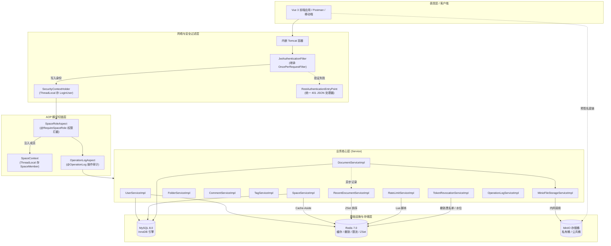
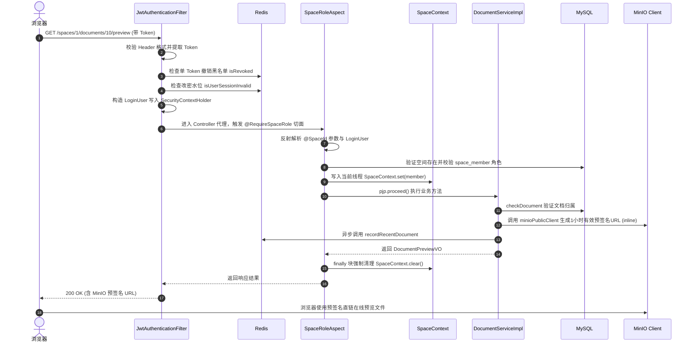
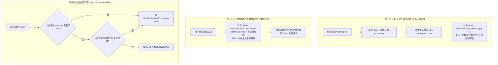
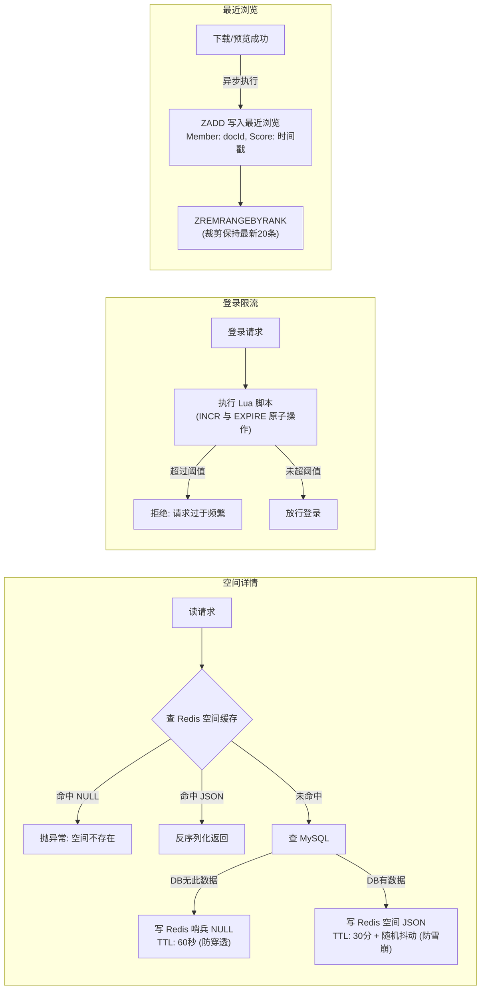

# TeamDocs 架构全景与核心源码深度剖析

> **文档属性**：本项目剖析**完全基于真实 Java 源码、SQL 脚本与配置文件提取**，不掺杂任何二手文档推断，供深度吃透底层逻辑、从容应对高难度技术面试。

---

## 目录
- [一、 系统总体技术架构与请求生命周期](#一-系统总体技术架构与请求生命周期)
  - [1.1 核心技术选型与版本一览](#11-核心技术选型与版本一览)
  - [1.2 系统分层全景架构图](#12-系统分层全景架构图)
  - [1.3 一次 HTTP 请求的真实执行链路图](#13-一次-http-请求的真实执行链路图)
- [二、 认证体系与双层 Token 失效机制](#二-认证体系与双层-token-失效机制)
  - [2.1 JWT 生成与双重验证机制](#21-jwt-生成与双重验证机制)
  - [2.2 Spring Security 与过滤器链定制](#22-spring-security-与过滤器链定制)
  - [2.3 修改密码的“数据库-缓存补偿事务”](#23-修改密码的数据库-缓存补偿事务)
- [三、 细粒度空间权限与 AOP 上下文透传](#三-细粒度空间权限与-aop-上下文透传)
  - [3.1 元注解组合：`@RequireSpaceRole` 与 `@SpaceId`](#31-元注解组合-requirespacerole-与-spaceid)
  - [3.2 `SpaceRoleAspect` 切面拦截与校验流程](#32-spaceroleaspect-切面拦截与校验流程)
  - [3.3 ThreadLocal 上下文传递与防内存泄漏设计](#33-threadlocal-上下文传递与防内存泄漏设计)
  - [3.4 细粒度资源越权控制：`ResourcePermissionHelper`](#34-细粒度资源越权控制-resourcepermissionhelper)
- [四、 MinIO 对象存储架构与端点隔离](#四-minio-对象存储架构与端点隔离)
  - [4.1 双 Client 架构：内网与公网端点解耦](#41-双-client-架构内网与公网端点解耦)
  - [4.2 预签名 URL（Presigned URL）与零中转流传输](#42-预签名-urlpresigned-url与零中转流传输)
  - [4.3 在线预览 vs 附件下载（RFC 5987 文件名编码）](#43-在线预览-vs-附件下载rfc-5987-文件名编码)
- [五、 Redis 高并发实战与故障优雅降级](#五-redis-高并发实战与故障优雅降级)
  - [5.1 空间详情：Cache-Aside + 哨兵防穿透 + 随机 TTL 防雪崩](#51-空间详情cache-aside--哨兵防穿透--随机-ttl-防雪崩)
  - [5.2 登录/注册限流：Lua 脚本原子窗口计数](#52-登录注册限流lua-脚本原子窗口计数)
  - [5.3 最近浏览：ZSet 排序截断 + 异步写入 + 读时惰性清理](#53-最近浏览zset-排序截断--异步写入--读时惰性清理)
  - [5.4 故障隔离与 Fail-Open 降级设计](#54-故障隔离与-fail-open-降级设计)
- [六、 MySQL 表结构与高级索引设计](#六-mysql-表结构与高级索引设计)
  - [6.1 核心表模型与关联关系](#61-核心表模型与关联关系)
  - [6.2 文档列表与回收站：消除 `Using filesort` 的联合索引](#62-文档列表与回收站消除-using-filesort-的联合索引)
  - [6.3 关系表 `document_tag`：双向覆盖索引（免回表）](#63-关系表-document_tag双向覆盖索引免回表)
  - [6.4 MySQL 8 ngram 全文检索与停用词排坑](#64-mysql-8-ngram-全文检索与停用词排坑)
  - [6.5 逻辑删除 `@TableLogic` 的双向封锁与破解](#65-逻辑删除-tablelogic-的双向封锁与破解)
- [七、 审计日志与系统健壮性](#七-审计日志与系统健壮性)
  - [7.1 `@OperationLog` + SpEL 动态解析与资源快照](#71-operationlog--spel-动态解析与资源快照)
  - [7.2 `Propagation.REQUIRES_NEW` 独立事务隔离](#72-propagationrequires_new-独立事务隔离)
- [八、 面试官高频深水区 10 连问（源码级对答策略）](#八-面试官高频深水区-10-连问源码级对答策略)
- [九、 面试高频题库全景通关清单（8组核心考点 + 必考场景题）](#九-面试高频题库全景通关清单8组核心考点--必考场景题)
  - [9.1 第一组：项目整体（开场与设计思想）](#91-第一组项目整体开场与设计思想)
  - [9.2 第二组：登录认证与 JWT](#92-第二组登录认证与-jwt)
  - [9.3 第三组：权限控制与防越权](#93-第三组权限控制与防越权)
  - [9.4 第四组：10GB 大文件与对象存储（MinIO）](#94-第四组10gb-大文件与对象存储minio)
  - [9.5 第五组：Redis 深度与高并发](#95-第五组redis-深度与高并发)
  - [9.6 第六组：MySQL 索引与底层原理](#96-第六组mysql-索引与底层原理)
  - [9.7 第七组：并发问题与线程安全](#97-第七组并发问题与线程安全)
  - [9.8 第八组：Spring 框架底层](#98-第八组spring-框架底层)
  - [9.9 第九组：必考高频实战场景题](#99-第九组必考高频实战场景题)

---

## 一、 系统总体技术架构与请求生命周期

### 1.1 核心技术选型与版本一览（源自 `pom.xml`）
- **JDK 版本**：Java 17
- **核心框架**：Spring Boot `3.5.14`（内嵌 Tomcat、Spring 6.x）
- **安全框架**：Spring Security + JJWT `0.12.5`（API采用 parser() / verifyWith() 最新规范）
- **持久层**：MyBatis-Plus `3.5.9` + MyBatis-Plus JSQLParser `3.5.9` + MySQL Connector/J
- **缓存与辅助**：Spring Data Redis（底层使用 Lettuce 驱动）+ Hutool `5.8.40`
- **对象存储**：MinIO Java SDK `8.6.0` + OkHttp `4.12.0`
- **切面框架**：Spring Boot Starter AOP（AspectJ Runtime）

---

### 1.2 系统分层全景架构图



---

### 1.3 一次 HTTP 请求的真实执行链路图

以调用 `GET /spaces/1/documents/10/preview`（获取文档预览地址）为例，代码内部流转流程如下：



---

## 二、 认证体系与双层 Token 失效机制

### 2.1 JWT 生成与双重验证机制
在 `JWTUtils.java` 中：
- 采用 JJWT `0.12.5` 规范，签发包含以下标准载荷：
  - `jti`：`UUID.randomUUID().toString()`，为每个 Token 赋予全局唯一 ID。
  - `issuedAt`：签发时刻。
  - `expiration`：过期时刻（由 `${jwt.expiration}` 配置，通常为 7 天）。
  - 自定义 Claims：`userId` 与 `username`。
  - 签名算法：基于 HMAC-SHA 密钥签名。

在 `TokenRevocationServiceImpl.java` 中设计了**双层失效体系**：



### 2.2 Spring Security 与过滤器链定制
查看 `SecurityConfig.java`：
1. **无状态会话**：`.sessionManagement(s -> s.sessionCreationPolicy(SessionCreationPolicy.STATELESS))`，彻底关闭 HttpSession。
2. **防重复注册排坑**：
   ```java
   @Bean
   public FilterRegistrationBean<JwtAuthenticationFilter> jwtFilterRegistration(JwtAuthenticationFilter filter) {
       FilterRegistrationBean<JwtAuthenticationFilter> registration = new FilterRegistrationBean<>(filter);
       registration.setEnabled(false); // 禁用 Servlet 容器默认自动注册
       return registration;
   }
   ```
   **面试考点**：Spring Boot 会将所有标注 `@Component` 的 Filter 自动注册到 Servlet 容器过滤链。而我们在 Security 中又配置了 `.addFilterBefore(jwtAuthenticationFilter, UsernamePasswordAuthenticationFilter.class)`。若不显式设置 `setEnabled(false)`，会导致一个请求被执行两次 Filter！
3. **白名单设计**：
   - 匿名放行：`POST /user/login`、`POST /user/register`、`GET /actuator/health/**`。
   - 其余请求统一要求认证；未通过者由 `RestAuthenticationEntryPoint` 返回统一格式 JSON：
     `{"code": 401, "message": "未登录或登录状态已失效", "data": null}`。

### 2.3 修改密码的“数据库-缓存补偿事务”
查看 `UserServiceImpl.java` 的 `changePassword` 方法：
```java
// 1. 业务校验：比对原密码 BCrypt，判断新旧密码一致性
// 2. 更新数据库为新密码哈希
int updated = userMapper.updateById(user);
if (updated != 1) throw new BusinessException("修改密码失败");

try {
    // 3. 设置 Redis 水位，使旧 Token 全部失效
    tokenRevocationService.invalidateAllForUser(loginUser.getUserId());
} catch (RuntimeException e) {
    // 4. 【异常补偿】：若 Redis 操作失败，将数据库密码恢复为 oldPasswordHash
    user.setPassword(oldPasswordHash);
    userMapper.updateById(user);
    throw new BusinessException("修改密码失败，请稍后重试", e);
}
```
**设计价值**：避免了“数据库改掉了、但缓存设置超时抛异常、导致用户旧会话依然能无限期盗刷”的双写不一致安全隐患。

---

## 三、 细粒度空间权限与 AOP 上下文透传

### 3.1 元注解组合：`@RequireSpaceRole` 与 `@SpaceId`
- `@RequireSpaceRole`：放在方法上，声明该操作允许哪些角色（`OWNER`、`ADMIN`、`MEMBER`，默认全选）。
- `@SpaceId`：放在参数上，显式指示切面哪一个参数是空间 ID。

### 3.2 `SpaceRoleAspect` 切面拦截与校验流程
源码见 `SpaceRoleAspect.java`：
1. 拦截 `@Around("@annotation(asia.creat.anno.RequireSpaceRole)")`。
2. 反射扫描方法参数注解，提取被 `@SpaceId` 修饰的 `Long` 参数，以及类型为 `LoginUser` 的参数。
3. 查 `spaceMapper.selectById(spaceId)` 验证空间合法性。
4. 查 `space_member` 联合唯一索引：
   ```java
   SpaceMember member = spaceMemberMapper.selectOne(
       new LambdaQueryWrapper<SpaceMember>()
           .eq(SpaceMember::getSpaceId, spaceId)
           .eq(SpaceMember::getUserId, loginUser.getUserId())
   );
   ```
5. 校验用户是否为成员，以及 `Arrays.asList(roles).contains(member.getRole())` 是否满足权限要求。

### 3.3 ThreadLocal 上下文传递与防内存泄漏设计
```java
SpaceContext.set(member); // 存入 ThreadLocal
try {
    return pjp.proceed(); // 放行进入具体业务 Service
} finally {
    SpaceContext.clear(); // 【核心防漏机制】
}
```
**面试深度考点**：
- **为什么使用 ThreadLocal？** 后续 Service（如删除文档、重命名）无需再次向数据库发起 `selectOne` 查询当前操作人的角色，直接通过 `SpaceContext.getSpaceMember()` 就能获取，减少数据库 RTT。
- **为什么必须在 finally 中 clear？** Tomcat 使用线程池处理请求，线程在请求结束后不会被销毁而是归还线程池。若不 clear：
  1. 下一次别的用户请求复用该线程时，可能读取到上一个用户的 `SpaceMember`，发生严重越权。
  2. `ThreadLocalMap` 的 Entry 对 Value（`SpaceMember` 对象）是强引用，导致即使请求结束，对象仍无法被垃圾回收器回收，发生**内存泄漏（Memory Leak）**。

### 3.4 细粒度资源越权控制：`ResourcePermissionHelper`
见 `ResourcePermissionHelper.java`：
- 空间层级的角色确定后，细粒度到文档/文件夹/评论的修改删除：
  ```java
  public void checkOwnerOrCreator(SpaceMember member, Long creatorId, Long currentUserId) {
      if (member.getRole() == SpaceRole.MEMBER && !creatorId.equals(currentUserId)) {
          throw new BusinessException("没有权限操作该资源");
      }
  }
  ```
- **业务规则**：`OWNER` 与 `ADMIN` 拥有空间内所有资源的最高管理权；而普通 `MEMBER` **只能修改或删除自己上传的文档/自己创建的文件夹/自己的评论**。

---

## 四、 MinIO 对象存储架构与端点隔离

### 4.1 双 Client 架构：内网与公网端点解耦
在 Docker 或 Kubernetes 部署中，后端与 MinIO 处于内部容器网络（如 `http://minio:9000`），而浏览器处于外网或宿主机网络（如 `http://localhost:19000`）。

源码见 `MinioConfig.java` 和 `MinioFileStorageServiceImpl.java`：
- `minioClient`：连接内网 `endpoint`，后端直连用于 `putObject`（上传头像/文件）和 `removeObject`（物理删除）。
- `minioPublicClient`：配置 `publicEndpoint`（对外的域名或IP端口），并**显式固定 region（"us-east-1"）**，专门用于后端调用 `getPresignedObjectUrl` 离线计算带 HMAC-SHA 签名的下载直链。
- **排坑点**：AWS S3/MinIO 的预签名算法会将 `Host` 请求头参与签名。如果用内网客户端签发，URL 里的 Host 是 `minio:9000`，前端浏览器使用 `localhost:19000` 访问时，MinIO 校验签名头不一致，会直接拒绝（`SignatureDoesNotMatch`）。双 Client 机制完美解决了此问题。

### 4.2 预签名 URL 与零中转流传输
- 下载与预览请求流程：
  1. 浏览器向后端发起 `GET /spaces/{id}/documents/{id}/download`。
  2. 后端仅校验数据库权限，耗时约 5ms。
  3. 后端调用 `minioPublicClient.getPresignedObjectUrl`，生成 1 小时内有效的签名直链并返回。
  4. 浏览器重定向或直接通过 MinIO URL 下载几百兆的文件流。
- **架构优势**：后端服务器网卡、JVM 内存和 Worker 线程完全不承担大文件数据流，并发吞吐量极大提升。

### 4.3 在线预览 vs 附件下载（RFC 5987 文件名编码）
见 `DocumentServiceImpl.java`：
通过 MinIO 预签名 API 传递 `extraQueryParams` 覆盖响应头：
- **预览**：`response-content-disposition: inline; filename*=UTF-8''...`（浏览器原生支持的 PDF、图片直接内嵌展示）。
- **下载**：`response-content-disposition: attachment; filename*=UTF-8''...`（强制弹出保存对话框）。
- **文件名编码细节**：
  ```java
  private String buildContentDisposition(String type, String filename) {
      String encodedFilename = URLEncoder.encode(filename, StandardCharsets.UTF_8)
              .replace("+", "%20");
      return type + "; filename*=UTF-8''" + encodedFilename;
  }
  ```
  Java 的 `URLEncoder` 会将空格转为 `+` 号，而在现代浏览器 RFC 6266 / RFC 5987 规范中，空格必须为 `%20`，否则下载的文件名会出现 `+` 号甚至乱码。

---

## 五、 Redis 高并发实战与故障优雅降级



### 5.1 空间详情：Cache-Aside + 哨兵防穿透 + 随机 TTL 防雪崩
源码见 `SpaceServiceImpl.java`：
1. **防缓存穿透（Cache Penetration）**：当黑客恶意刷不存在的 `spaceId` 时，若直接打到 DB 会压垮数据库。项目在 DB 查为空时，向 Redis 写入哨兵值 `"NULL"`，设置短超时 `NULL_TTL = Duration.ofSeconds(60L)`。下次再查命中 `"NULL"` 直接抛异常拦截。
2. **防缓存雪崩（Cache Avalanche）**：空间详情的基础缓存为 30 分钟，额外加上 `ThreadLocalRandom.current().nextLong(0, 301)` 秒的随机时间。让缓存在一个时间窗口内离散过期，防止大批热点 Key 同时失效造成数据库瞬间被打崩。
3. **Cache-Aside 双写**：更新或删除空间时，**先操作 MySQL 数据库，操作成功后显式调用 `cacheClient.delete(key)` 删除缓存**。

### 5.2 登录/注册限流：Lua 脚本原子窗口计数
源码见 `RateLimitServiceImpl.java` 及 `window_rate_limit.lua`：
```lua
local curr_count = redis.call('INCR', KEYS[1])
if curr_count == 1 then
    redis.call('EXPIRE', KEYS[1], ARGV[1])
end
return curr_count;
```
- **配置规则**：登录按 IP 每 60 秒限流 10 次；注册按 IP 每 60 秒限流 5 次。
- **为什么使用 Lua？** `INCR` 和 `EXPIRE` 必须是一个原子操作。如果分两步调用，在高并发或进程突然重启时，可能出现 `INCR` 执行成功但未能设置 `EXPIRE`，导致产生永不过期的死 Key。

### 5.3 最近浏览：ZSet 排序截断 + 异步写入 + 读时惰性清理
源码见 `RecentDocumentServiceImpl.java`：
- **Key 格式**：`teamdocs:user:recent:{userId}`，类型为 `Sorted Set (ZSet)`。
- **写入端**：
  - 触发时机：仅在文档详情、在线预览、文件下载**真正校验权限成功后**触发。
  - 使用 `@Async` 异步执行，主业务零等待。
  - `addZSet`：Member 为 `documentId.toString()`，Score 为 `System.currentTimeMillis()`。天然去重并刷新最后访问时间。
  - 范围修剪：`removeZSetRangeByRank(key, 0, -(MAX_RECENT_DOCUMENTS + 1))`，利用 Rank 将集合强制保留在最新的 20 条，不耗费多余内存。
- **读取端与惰性清理（Lazy Eviction）**：
  1. `ZREVRANGE WITHSCORES` 倒序取出前 20 个 `documentId` 与浏览时间。
  2. **元数据不放在 Redis**：仅在 Redis 存 ID，详情通过一次 MySQL `INNER JOIN space INNER JOIN space_member` 批量查询，保证只展示当前仍可访问且未删除的文档。
  3. **读时清理无用 Key**：若发现 Redis 里有的 ID 在 MySQL 中已经不存在或无权限了，将这些 ID 收集在 `invalid` 列表中，查询结束前批量执行 `cacheClient.removeZSetMembers(key, ...)`。
  - **为什么不在删除文档时主动删除所有用户的浏览记录？** 因为删除一个文档时，无法得知全系统成千上万个用户中谁浏览过它。若使用 `KEYS teamdocs:user:recent:*` 会引发 O(N) 的全库扫描，阻塞单线程 Redis 事件循环。读时惰性清理是轻量且优雅的解耦设计。

### 5.4 故障隔离与 Fail-Open 降级设计
查看 `CacheClient.java` 与 `RateLimitServiceImpl.java`：
- `CacheClient` 的 `get`、`set`、`delete` 均用 `try-catch` 包裹。Redis 连接超时或宕机时只打 `log.warn` 并返回 `null`。
- 空间详情在获取为 `null` 时自动回退查询 MySQL；
- 限流服务在捕获 Redis 异常后，`attempts` 保持为 `null`，逻辑返回 `false`（允许放行）。
- **核心哲学**：**辅助与旁路组件故障，决不能导致核心业务崩溃（Fail-Open 哲学）**。

---

## 六、 MySQL 表结构与高级索引设计

### 6.1 核心表模型与关联关系
数据库共计 8 张核心表：
1. `user`：用户身份表（用户名与邮箱具备 `UNIQUE` 索引）。
2. `space`：空间表（逻辑删除 `deleted`）。
3. `space_member`：空间成员关系表。
4. `folder`：文件夹表（树状模型，`parent_id=0` 表示根目录）。
5. `document`：文档元数据表（存储 MinIO 对象路径与元数据）。
6. `tag`：空间内的标签表。
7. `document_tag`：文档与标签多对多关联表。
8. `comment`：评论表（树状回复模型，`reply_to_id` 指向父评论）。
9. `operation_log`：AOP 审计日志记录表。

---

### 6.2 文档列表与回收站：消除 `Using filesort` 的联合索引

#### 场景 1：文件夹内文档列表分页
代码发起的查询 SQL（见 MyBatis-Plus 生成逻辑）：
```sql
SELECT * FROM document 
WHERE space_id = ? AND folder_id = ? AND deleted = 0 
ORDER BY updated_at DESC, id DESC 
LIMIT 0, 20;
```
- **建立的索引**：
  ```sql
  KEY idx_space_folder_updated (space_id, folder_id, deleted, updated_at, id)
  ```
- **底层原理**：
  1. `space_id`、`folder_id`、`deleted` 全是等值查找（`=`）。
  2. B+ 树叶子节点在满足这三列等值后，**数据本身就是严格按照 `updated_at DESC, id DESC` 排列的**。
  3. MySQL 存储引擎扫描叶子节点时直接输出有序流，**执行计划 Extra 为空或 `Using index condition`，彻底消除了 `Using filesort`**。

#### 场景 2：空间回收站列表
SQL（见 `DocumentMapper.xml` 的 `selectTrashedDocuments`）：
```sql
SELECT id, space_id, folder_id, name, ... FROM document 
WHERE space_id = #{spaceId} AND deleted = 1 
ORDER BY updated_at DESC, id DESC;
```
- **建立的索引**：
  ```sql
  KEY idx_space_deleted_updated (space_id, deleted, updated_at, id)
  ```
- **为什么不能复用第一个索引？**  
  根据**最左前缀原则（Leftmost Prefix Rule）**，回收站查询不包含 `folder_id`。如果强走行 `idx_space_folder_updated`，在第一列 `space_id` 之后由于缺少 `folder_id` 产生了断层，后面的 `deleted` 和 `updated_at` 将无法走索引，导致排序再次退化为代价昂贵的 `Using filesort`。因此专门为回收站定制了去掉了 `folder_id` 的联合索引。

---

### 6.3 关系表 `document_tag`：双向覆盖索引（免回表）
建表定义（见 `initDocument.sql`）：
```sql
CREATE TABLE document_tag (
    id          BIGINT NOT NULL AUTO_INCREMENT,
    document_id BIGINT NOT NULL,
    tag_id      BIGINT NOT NULL,
    PRIMARY KEY (id),
    UNIQUE KEY uk_doc_tag (document_id, tag_id),
    KEY idx_tag_document (tag_id, document_id)
);
```
- **两本反向目录的妙用**：
  - **按文档查标签**：`SELECT tag_id FROM document_tag WHERE document_id = ?`，走 `uk_doc_tag` 联合唯一索引。
  - **按标签查文档**：`SELECT document_id FROM document_tag WHERE tag_id = ?`，走 `idx_tag_document` 联合索引。
- **覆盖索引（Covering Index）**：整张表只用到这两个字段。索引树本身的叶子节点里已经包含了查询所需的全部数据，执行计划 Extra 显示 **`Using index`**，**完全不需要拿着主键 id 回表查询原数据行（零次回表）**。

---

### 6.4 MySQL 8 ngram 全文检索与停用词排坑
在 `fulltext_index.sql` 中：
```sql
SET PERSIST innodb_ft_enable_stopword = OFF;
ALTER TABLE document ADD FULLTEXT INDEX ft_name (name) WITH PARSER ngram;
ALTER TABLE document ADD FULLTEXT INDEX ft_description (description) WITH PARSER ngram;
```
- **为什么在 SQL 中使用 `MATCH(...) AGAINST(... IN BOOLEAN MODE)`？**
  - MySQL 全文检索默认是自然语言模式（Natural Language），存在 **50% 停用词阈值**（若某词在超过一半的行里出现则直接被判定为无效词返回空）。在小数据量开发测试时，极易搜不出数据。`IN BOOLEAN MODE` 可以强制关闭该阈值。
- **关于 `innodb_ft_enable_stopword = OFF` 的深刻踩坑故事**：
  - 现象：文档名带有英文单词 `"zip"` 怎么也搜不出来，但 `"md"`、`"txt"` 和中文却一切正常。
  - 根因：MySQL ngram 默认分词滑动窗口大小 `ngram_token_size=2`。"zip" 会被拆成 `"zi"` 和 `"ip"` 两个双字符分词（bigram）。然而 InnoDB 默认停用词表中包含单个英文字母 `"i"`。
  - **ngram 的致命规则：切出的分词只要包含了任何一个停用词，该分词就会被整词丢弃！**
  - 导致包含字母 i 的双字母组合（zi, ip, in, is 等）全部无法进入全文倒排索引！
  - 方案：执行 `SET PERSIST innodb_ft_enable_stopword = OFF` 彻底关闭全局停用词表，并在 Docker Compose 的启动参数中配置 `--innodb-ft-enable-stopword=OFF`。

---

### 6.5 逻辑删除 `@TableLogic` 的双向封锁与破解
在实体类中，`Space` 和 `Document` 标注了 `@TableLogic private Integer deleted;`。
- **踩坑现象**：在回收站调用恢复文档时：
  ```java
  doc.setDeleted(0);
  documentMapper.updateById(doc);
  ```
  更新行数居然始终返回 0，文档根本无法恢复。
- **底层原理**：MyBatis-Plus 的 `@TableLogic` 是**双向拦截**的：
  1. `SELECT` 查询时，自动在末尾追加 `AND deleted = 0`；
  2. `updateById(entity)` 更新时，同样会自动在 SQL 末尾追加 `WHERE id = ? AND deleted = 0`！
  3. 但回收站里的文档本身 `deleted` 已经是 `1` 了，导致 UPDATE 语句的 WHERE 条件永远不可能匹配，静默更新 0 行！
- **源码中的破局实现**：在 `DocumentMapper.xml` 中跳过 MyBatis-Plus 封装，手写原生更新 SQL：
  ```xml
  <update id="updateDeleted">
      UPDATE document SET deleted = 0, folder_id = #{FolderId} WHERE id = #{documentId}
  </update>
  ```

---

## 七、 审计日志与系统健壮性

### 7.1 `@OperationLog` + SpEL 动态解析与资源快照
源码见 `OperationLogAspect.java`：
- 注解使用示例：
  ```java
  @OperationLog(value = "更新空间", resourceType = "SPACE", resourceName = "#dto.name")
  ```
- **SpEL 动态求值**：切面利用 Spring 的 `SpelExpressionParser` 与 `DefaultParameterNameDiscoverer`，在方法执行前解析 `#dto.name`，精准抓取操作参数作为快照。
- **历史记录快照解析**：针对删除操作，删除后对象已经不存在，切面调用 `OperationResourceNameResolver` 调用底层 `selectNameIncludingDeleted`，即使已被软删除也能在日志中记录被删文档的真实名称。

### 7.2 `Propagation.REQUIRES_NEW` 独立事务隔离
源码见 `OperationLogServiceImpl.java`：
```java
@Override
@Transactional(propagation = Propagation.REQUIRES_NEW)
public void saveLog(OperationLogRecord log){
    operationLogMapper.insert(log);
}
```
**事务边界与异常隔离考点**：
1. **主业务失败，日志必须留存**：如果用户执行上传文档，业务抛出了 `BusinessException`。外层主事务回滚，切面捕获该异常，标记 `success = 0` 与 `errorMessage`。由于日志保存方法标注了 `REQUIRES_NEW`，Spring 会挂起当前事务并新建独立事务提交日志记录，确保失败操作依然能在数据库中审计留痕。
2. **日志写入失败，决不拖垮主业务**：在切面的 `finally` 中写入日志包裹在 `try-catch` 中并打 `log.error`。若数据库死锁或磁盘写满导致日志插入失败，切面绝不向外抛出异常，原本成功的用户业务依然能正常响应。

---

## 八、 面试官高频深水区 10 连问（源码级对答策略）

#### Q1：你的项目用了 Spring Security，为什么还要手写 `JwtAuthenticationFilter`？
> **答**：Spring Security 原生体系偏向有状态的 Cookie-Session 模式（如 `UsernamePasswordAuthenticationFilter`），其默认过滤器无法自动解析 HTTP 请求头里的 `Authorization: Bearer <token>`。  
> 我们通过继承 `OncePerRequestFilter` 自定义了 `JwtAuthenticationFilter`，嵌入在 `UsernamePasswordAuthenticationFilter` 之前。它的核心作用是拦截请求、提取并解析 JWT、到 Redis 校验注销黑名单和修改密码时间戳水位；校验合法后构建 `LoginUser` 填入 `SecurityContextHolder`，从而无缝接入 Spring Security 后续的上下文生命周期。

#### Q2：为什么不在 Controller/Service 里直接拿用户，而要用 `@AuthenticationPrincipal`？
> **答**：因为我们在 `JwtAuthenticationFilter` 中完成鉴权后，将携带 `LoginUser` 的 `UsernamePasswordAuthenticationToken` 存入了 `SecurityContextHolder`。Spring MVC 的参数解析器（`AuthenticationPrincipalArgumentResolver`）能自动识别控制器方法入参上的 `@AuthenticationPrincipal`，直接将凭证对象注入进来。这种方式代码无侵入，完全避免了在每个 Controller 里手动从 Request Header 提取和解析 Token。

#### Q3：为什么权限切面 `SpaceRoleAspect` 里，ThreadLocal 清理要写在 `finally`？如果不写会有什么严重后果？
> **答**：因为生产环境下内嵌的 Tomcat 会维护一个 HTTP 请求工作线程池。当一个请求处理完毕后，线程不会销毁而是放回池中复用。  
> 如果不在 `finally` 里显式调用 `SpaceContext.clear()`：  
> 1. **权限串号（安全事故）**：下一个请求若恰好复用了该线程，可能读取到上一个用户的 `SpaceMember` 导致越权漏洞；  
> 2. **内存泄漏**：ThreadLocal 的实现中，虽然 `ThreadLocalMap` 的 Key 是弱引用，但 Value（即我们存入的 `SpaceMember`）是强引用。只要线程长久存活，这个对象就永远无法被 GC 回收，长期积累会导致 JVM 内存溢出。

#### Q4：MinIO 签发预签名 URL 是怎么保证安全性的？前端拿到后可以无限期访问吗？
> **答**：预签名 URL 采用的是 AWS S3 兼容的 HMAC-SHA256 签名机制。URL 路径中包含了访问的 Bucket、ObjectKey、过期时间戳（Expires）、以及由服务端的 `SecretKey` 计算出的签名值（X-Amz-Signature）。  
> 1. **防篡改**：任何人若擅自修改 URL 里的参数或试图访问其他文件，MinIO 重新计算 HMAC 签名不匹配，会直接返回 403 Access Denied；  
> 2. **有限生命周期**：在代码中我们在 `GetPresignedObjectUrlArgs` 中强制设置了过期时间为 1 小时（`expiry(1, TimeUnit.HOURS)`），过期后链接自动失效，最大程度保障私有文件的安全性。

#### Q5：Redis 的 Cache-Aside 模式中，为什么更新数据时是“先更数据库，再删缓存”，而不是“先删缓存，再更数据库”？
> **答**：如果“先删缓存，再更数据库”：  
> - 线程 A 删除了缓存，还未来得及更新数据库；  
> - 此时高并发下线程 B 发起读请求，发现缓存为空，去查数据库拿到了旧值，并回填进 Redis；  
> - 随后线程 A 更新数据库成功。此时数据库是新值，而 Redis 永久停留了旧值，出现严重的脏数据。  
> 而采用“先更数据库，再删缓存”，只有在“读请求未命中查出旧值、且写请求在读请求回填之前完成更新和删除”的极罕见交错下才会发生脏数据（由于数据库写锁和内存写速度差异，概率极低）。另外我们在缓存上还配置了 30 分钟随机 TTL，具备最终一致性兜底。

#### Q6：最近浏览功能为什么不在用户点击时直接写 MySQL，而是用 Redis ZSet 做中转？
> **答**：  
> 1. **写性能与高频更新**：用户在线阅读或频繁切换预览时，最近浏览是高频写操作。如果每次都写 MySQL，涉及频繁的 `INSERT/UPDATE`、事务提交以及索引分裂，数据库磁盘 I/O 压力大。  
> 2. **天生支持去重与排序**：Redis ZSet 的 Member 是唯一的，重复浏览同一文档只需执行 `ZADD` 更新 Score（时间戳），不需要我们在业务中写复杂的“判断是否存在、存在则更新时间、不存在则插入”的代码。  
> 3. **容量受控**：利用 `ZREMRANGEBYRANK 0 -21` 可以由 Redis 底层以 O(log(N)+M) 的极高效率直接将集合裁剪为最近 20 条，不产生历史数据堆积。

#### Q7：Redis 做登录限流时，固定窗口与滑动窗口有什么区别？为什么当前选择固定窗口？
> **答**：固定窗口在时间窗口的交界处可能会出现“双倍突发流量”（例如 0:59 来 10 次，1:01 来 10 次，两秒内承受了 20 次）。滑动窗口（如 ZSet 实现）能更精准地控制任意时间跨度内的频率，但实现复杂度高，且需要存储每个请求的时间戳，内存消耗更大。  
> 针对团队文档平台“防暴力破解登录密码”的业务场景，主要目标是防止黑客用字典持续爆破账号。固定窗口结合 Lua 脚本单 Key 计数器（内存仅几十字节，单次耗时 < 1ms），能以极低资源消耗达成防爆破目的，是贴合业务体量的工程性价比最优解。

#### Q8：如果批量给 100 个文档打标签，怎么做数据库优化？
> **答**：在 `teamdocs-backend` 中，给文档打标签涉及 `document_tag` 关联表。  
> 1. **禁止循环逐条 Insert**：如果在 for 循环里调用 Mapper 的 `insert`，会产生 100 次网络 RTT 和 100 次数据库事务开销。  
> 2. **优化方案**：在 XML 中使用 `<foreach>` 拼接一条批量插入 SQL：`INSERT INTO document_tag (document_id, tag_id) VALUES (...), (...)...`。将 100 次网络折返压缩为 1 次，批量提交事务，减少 MySQL redo log 刷盘次数。

#### Q9：在 Spring AOP 中，切面的执行顺序是怎么保证的？
> **答**：在我们的项目中，既有安全权限切面 `SpaceRoleAspect`，又有日志审计切面 `OperationLogAspect`。  
> 权限检查必须先于日志切面执行（若无权限，应直接由权限切面阻断并抛异常，不应触发业务方法的 SpEL 解析）。  
> 我们通过在切面类上标注 `@Order` 注解来精确控制优先级：数值越小，优先级越高。在请求进入时，优先级高的切面先执行前置增强（Around 前半部分）；在方法返回后，优先级高的切面后执行后置增强。

#### Q10：为什么项目初期全文搜索选 MySQL ngram 而不是搭建 Elasticsearch？
> **答**：这是一个典型的**根据业务发展阶段进行架构选型权衡（Trade-off）**的体现：  
> 1. **运维与资源成本**：Elasticsearch 运行基于 JVM，单节点至少需要 2~4G 内存，对于面向中小团队的轻量级文档协作平台，引入 ES 会大幅拉高服务器部署门槛和容器编排复杂度。  
> 2. **数据一致性复杂度**：引入 ES 必须解决 MySQL 与 ES 之间的数据双写一致性问题（需要搭建 Canal 监听 Binlog 或引入 MQ 异步同步），增加了系统故障点。  
> 3. **业务体量匹配度**：在十万级文档元数据规模下，MySQL 8 原生支持的 ngram 解析器配合覆盖索引与布尔检索，查询耗时稳定在 10ms 以内，完全能满足现阶段全文检索需求。当未来文档量突破百万级或需要对大文件正文进行深度倒排检索时，再平滑重构演进至 ES 集群。

---

## 九、 面试高频题库全景通关清单（8组核心考点 + 必考场景题）

> 本清单汇总了 TeamDocs 项目面试中最核心、最常被深挖的 88 道硬核面试题。我们将按顺序逐题击破，吃透每个问题背后的设计权衡、代码实现与答题模板。

### 9.1 第一组：项目整体（开场与设计思想）
- [ ] **Q1：你先介绍一下这个项目。**
- [ ] **Q2：这个项目解决了什么问题？**
- [ ] **Q3：【重点】项目整体架构是怎么样的？**
- [ ] **Q4：为什么使用 Spring Boot？**
- [ ] **Q5：项目中为什么使用 MySQL、Redis、MinIO？它们分别负责什么？**
- [ ] **Q6：【重点】项目中最有技术含量的地方是什么？**
- [ ] **Q7：你在这个项目中具体负责了什么？**
- [ ] **Q8：【重点】如果让你重新设计这个项目，你会怎么改？**

### 9.2 第二组：登录认证与 JWT
- [ ] **Q9：用户登录之后，JWT 是怎么生成和验证的？**
- [ ] **Q10：一次请求进入项目之后，JWT 具体在哪里被解析？**
- [ ] **Q11：JWT 为什么要放在请求头里？**
- [ ] **Q12：JWT 和 Session 有什么区别？**
- [ ] **Q13：JWT 本身是无状态的，那用户退出登录以后，之前的 Token 怎么办？**
- [ ] **Q14：为什么不用数据库保存 Token 吊销信息，而使用 Redis？**
- [ ] **Q15：如果 Redis 挂了，Token 吊销功能怎么办？**
- [ ] **Q16：JWT 泄露了怎么办？**

### 9.3 第三组：权限控制与防越权
- [ ] **Q17：你们项目是怎么做权限控制的？**
- [ ] **Q18：为什么使用 AOP 做权限控制？**
- [ ] **Q19：`@RequireSpaceRole` 是怎么工作的？**
- [ ] **Q20：AOP 和 Spring Security 分别负责什么？**
- [ ] **Q21：为什么不直接在每个 Service 方法里面写权限判断？**
- [ ] **Q22：用户属于多个 Space 怎么处理？**
- [ ] **Q23：OWNER、ADMIN、MEMBER 三种角色有什么区别？**
- [ ] **Q24：如果用户有 Space 的权限，但是访问了另一个 Space 的文档怎么办？**
- [ ] **Q25：【重点】为什么既要检查 Space，又要检查 Document？（水平越权防御）**

### 9.4 第四组：10GB 大文件与对象存储（MinIO）
- [ ] **Q26：为什么文件放 MinIO，不放 MySQL？**
- [ ] **Q27：如果文件有 10GB 怎么上传？**
- [ ] **Q28：为什么不能让 Spring Boot 中转 10GB 文件？**
- [ ] **Q29：什么是分片上传？**
- [ ] **Q30：上传到一半服务器挂了怎么办？**
- [ ] **Q31：上传到一半网络断了怎么办？**
- [ ] **Q32：怎么实现断点续传？**
- [ ] **Q33：怎么保证文件没有被重复上传（秒传机制）？**
- [ ] **Q34：MinIO 上传成功了，但是 MySQL 写入失败怎么办？**
- [ ] **Q35：如果删除 MinIO 也失败了怎么办（孤儿文件治理）？**

### 9.5 第五组：Redis 深度与高并发
- [ ] **Q36：Redis 在你项目里面具体用了哪些地方？**
- [ ] **Q37：为什么最近访问记录使用 Redis？**
- [ ] **Q38：为什么最近访问记录适合使用 ZSet？**
- [ ] **Q39：ZSet 的底层结构是什么（跳表 + 压缩列表/哈希）？**
- [ ] **Q40：Redis 为什么比 MySQL 快？**
- [ ] **Q41：Redis 数据丢失怎么办（AOF / RDB 持久化）？**
- [ ] **Q42：Redis 挂了怎么办（集群高可用与系统降级）？**
- [ ] **Q43：Redis 缓存和数据库数据不一致怎么办？**
- [ ] **Q44：什么是缓存穿透？项目是怎么解决的？**
- [ ] **Q45：什么是缓存击穿？怎么解决？**
- [ ] **Q46：什么是缓存雪崩？项目是怎么解决的？**
- [ ] **Q47：Redis 分布式锁怎么实现（SetNX + Redisson 机制）？**
- [ ] **Q48：Redis 的 Lua 脚本为什么能够解决并发问题？**

### 9.6 第六组：MySQL 索引与底层原理
- [ ] **Q49：为什么 MySQL 使用 B+ 树作为索引？**
- [ ] **Q50：什么是聚簇索引？**
- [ ] **Q51：什么是二级索引？**
- [ ] **Q52：什么情况下会回表？**
- [ ] **Q53：联合索引为什么有最左匹配原则？**
- [ ] **Q54：什么情况下索引会失效？**
- [ ] **Q55：你会怎么看一条 SQL 有没有使用索引？**
- [ ] **Q56：EXPLAIN 怎么看？（type, possible_keys, key, Extra）**
- [ ] **Q57：MySQL 事务的四个特性是什么？**
- [ ] **Q58：MySQL 的隔离级别有哪些？**
- [ ] **Q59：为什么 MySQL 默认使用 RR（可重复读）？**
- [ ] **Q60：什么是 MVCC（多版本并发控制）？**
- [ ] **Q61：什么是当前读和快照读？**
- [ ] **Q62：MySQL 为什么会出现死锁？如何排查？**
- [ ] **Q63：如果项目中的文档查询突然变慢，你怎么系统排查？**

### 9.7 第七组：并发问题与线程安全
- [ ] **Q64：如果两个用户同时修改一个文档怎么办（乐观锁版本号）？**
- [ ] **Q65：两个用户同时删除同一个文件怎么办？**
- [ ] **Q66：两个请求同时上传同一个文件怎么办？**
- [ ] **Q67：Redis 中的操作为什么需要保证原子性？**
- [ ] **Q68：Lua 脚本为什么可以保证多个 Redis 操作一起执行？**
- [ ] **Q69：Java 中 synchronized 是怎么实现的（锁升级过程）？**
- [ ] **Q70：volatile 有什么作用（可见性与有序性/内存屏障）？**
- [ ] **Q71：CAS 是什么？底层原理和 ABA 问题怎么解决？**
- [ ] **Q72：ConcurrentHashMap 为什么线程安全？**
- [ ] **Q73：线程池的 7 个核心参数是什么？拒绝策略有哪些？**

### 9.8 第八组：Spring 框架底层
- [ ] **Q74：Spring IOC 是什么？控制反转反转了什么？**
- [ ] **Q75：Spring AOP 是什么？在项目里起到了什么作用？**
- [ ] **Q76：AOP 的底层原理是什么（JDK 动态代理 vs CGLIB）？**
- [ ] **Q77：Spring Bean 的生命周期是什么？**
- [ ] **Q78：`@Transactional` 是怎么实现的？**
- [ ] **Q79：为什么 `@Transactional` 有时候会失效？**
- [ ] **Q80：你项目里面哪些地方使用了事务？**
- [ ] **Q81：如果 MinIO 成功，但是数据库失败，`@Transactional` 能不能回滚 MinIO？**

### 9.9 第九组：必考高频实战场景题
- [ ] **Q82：现在有 1000 个人同时上传文件，你这个系统会发生什么？怎么扛住？**
- [ ] **Q83：一个 10GB 文件上传到 90% 的时候网络断了，你怎么处理？**
- [ ] **Q84：用户已经退出登录，但是他的 JWT 还没过期，怎么保证他不能继续访问？**
- [ ] **Q85：用户 A 有 Space A 的权限，但是拿到了 Space B 的文档 ID，直接调用接口怎么办？**
- [ ] **Q86：MinIO 已经有文件了，但是 MySQL 没有记录（数据孤岛），你怎么处理？**
- [ ] **Q87：Redis 挂掉以后，最近访问记录还能不能正常工作？系统如何降级？**
- [ ] **Q88：1000 个请求同时访问一个不存在的文档，你的数据库会不会被打爆？如何防御？**

